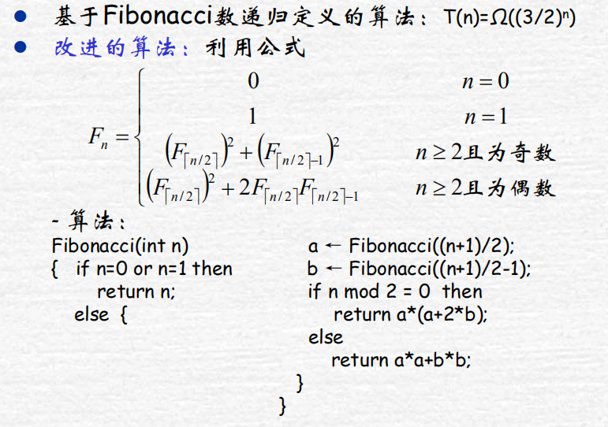
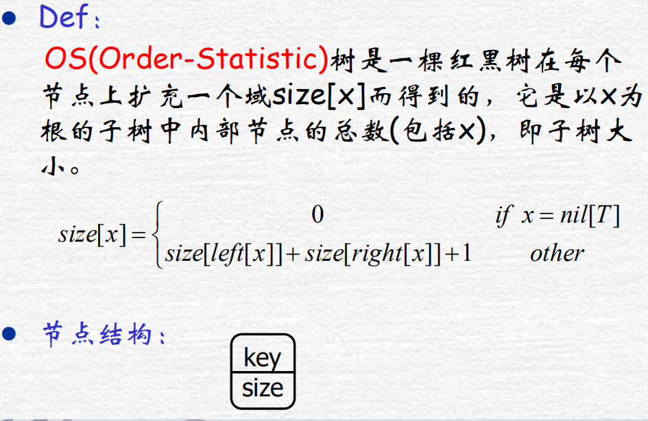
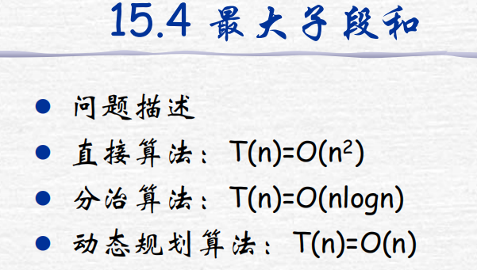
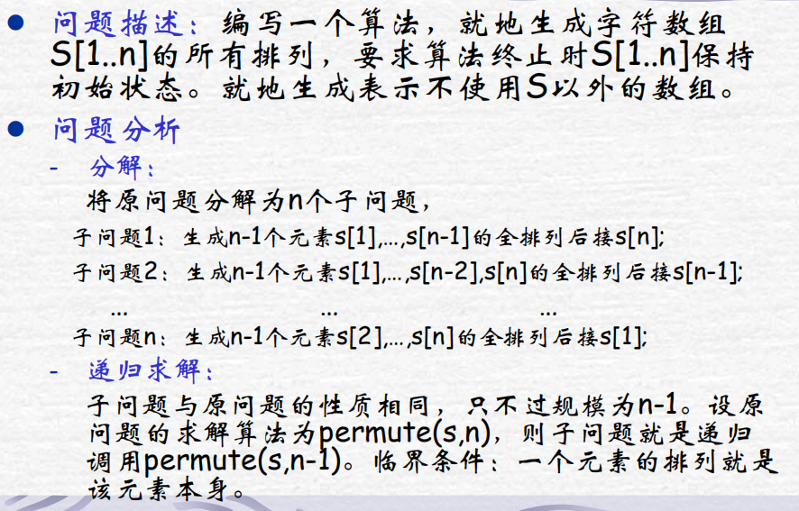
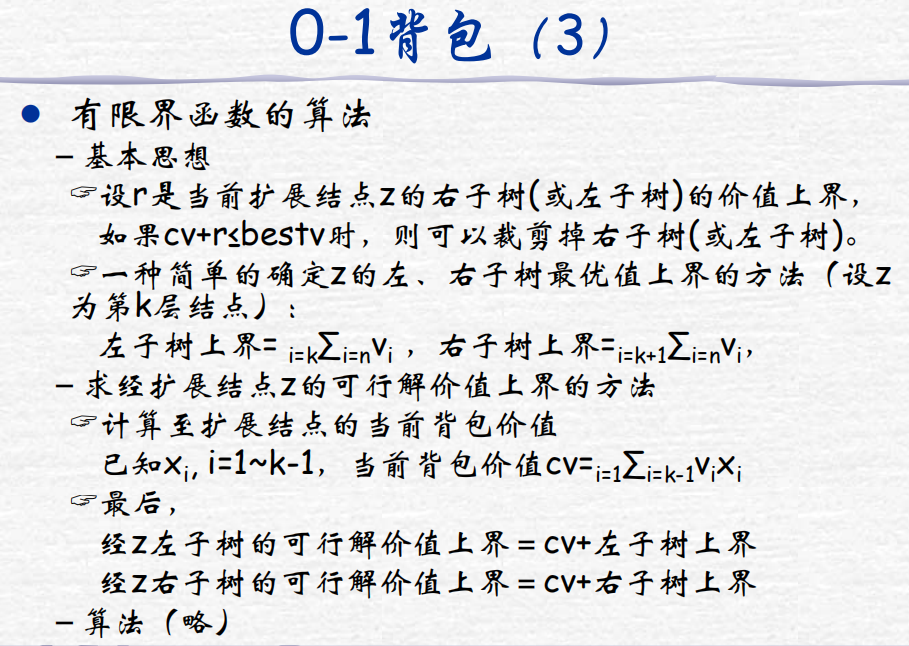

# 算法和编程注意

算法策略：先根据题目搭建框架，拆解出各个步骤，然后往各个部分里面填写需要的代码

### 相关变量定义

```
开始、结束：from/to、start/end
检查：check
发现/查找：find/get/search
```

### 编程注意事项---bug记录：

1. 指针使用之前都需要初始化为NULL，否则其指向一个未知的空间

2. 数组未初始化的时候，默认为0， 一般使用之前也需要做初始化设置

3. **数组**(bool型， int型）的初始化默认值问题：
   
   + 数组为**局部变量且未初始化**时：结果是**系统随机赋值**
   + 数组为**局部变量且初始化赋值为false或者0**时：值全为false或者0，能够起到赋值为0或者false的效果
   
   int temp[MAXN] = { 0}; 或者 bool temp[MAXN]  =  {false};
   
   + 数组为**局部变量且初始化为true或者非0数值**时：除了第一个为true或者非0数，其他值全为false或0， 起不到赋目标值的效果
   + 数组为**全局变量且未做初始化**时，默认为false或者0；
   
   java中局部变量使用之前一定需要初始化，而全局变量和成员变量如果未初始化，则默认为0， null或者false

4. ​    fill(edge[0], edge[0]+MAXN*MAXN, inf);  //二维数组使用fill初始化注意，应该这样使用，因为fill默认只能对一维数组使用
   
   或者直接使用memset(edge, 0, sizeof(edge)); 直接赋值为0或者-1

```
//循环违反其中条件之一， 即跳出循环
cnt = 0;
while(cnt < n && !checkPlin(a)){
    bign temp = reverse(a);
    a = add(temp, a);
    cnt++;
}
类似于下面的：
for(int i = 0; i < n; i++){
    bign temp = reverse(a);
    a = add(temp, a);
    if(checkPlin(a))  break;
}
```

5. 合并两个数组时（将a数组合并到b数组中），如果从前往后复制每个数字则需要重复移动数字（或者字符）多次，那么我们可以考虑从后往前复制，这样减少移动次数，提高效率------从后往前复制元素可以预留空间
6. 面试技巧：掌握查找（顺序查找、二分查找、哈希查找、二叉排序树查找）和排序相关算法、递归与循环、二维数组搜索路径可以使用回溯法、某个问题的最优解可以考虑动态规划、分解子问题时有特殊选择可以考虑贪心算法。
7. 大数增1 的操作代码：----算法导论中的代码

```c++
//算法思想：如果为9则置0，并且前移一位，直到不为9或者超过最大位数，如果没有超过最后一位将最后一位增1
void increment(A){  //A存着一个大整数的数组，个位存放在下标为0的位置
    int i = 0;  //设置当前的位号
    while(i < A.length() && A[i] == 9){  //如果位号小于最高位，且等于9
        A[i] == 0;
        i++;
    }
    if(i < A.length())
        A[i]++;
}
```

8. 寻找主要元素（这里的主要元素是指重复次数大于n/2的元素）---代码方法：
   1. 使用额外的数组记录所有元素出现的次数，统计得到最大次数的元素 ---- 两次遍历，空间复杂度为O(n)； 
   2. 先排序，然后取下标n/2处的元素，然后统计这个元素的次数是否大于n/2 -----时间复杂度为O(nlgn)； 
   3. 利用一个定理：如果一个数组中有两个不同的数，将数组去掉这两个数，得到一个新数组，那么这个新数组依然和老数组一样存在相同的众数 。遍历一遍之后得到的数，然后再来一遍遍历统计这个数的次数是否大于n/2

```c++
int find(int *a, int len){　　　　
    int i, num = -1, times = 0;
     for(i=0;i<len;i++) {
         if(times > 0) {
              if(num == a[i]) times++;
              else times--;
         } else {  //这是边界设置条件
             num = a[i];
             times = 1;
         }
     }
    //则num只是可能为候选元素。需要再扫一遍数组确认一下
    times = 0;
    for(int i = 0; i < len; i++){
        if(a[i] == num) times++;
    }
    if(times > len/2) return num;
    return -1;
}
```

9. 寻找众数：传统方式1：计算每一个元素的次数---时间复杂度为O(n^2^), 空间复杂度为O(1)，如下。 
   传统方式2：使用额外的一个计数数组，计算每一个元素的次数，找出最大次数的元素记录下来 -----时间复杂度为O(n)，空间复杂度为O(n)

```c++
#include <stdio.h>
int main()
{
    int a[50];
    int i,j,maxCount=0,index=0,nCount=0;
    int n;
    scanf("%d",&n);            //输入数据元素
    for(i=0;i<n;i++)
    {
        scanf("%d",&a[i]);
    }
    for(i=0;i<n;i++)           //双循环记数
    {
        for(j=0;j<n;j++)
        {
            if(a[j]==a[i])
                nCount++;
        }
        if(nCount>maxCount)
        {
            maxCount=nCount;
            index=i;
        }
        nCount=0;
    }
    printf("%d\n%d",a[index],maxCount);         //输出
}
```

9. 如何使得一个元素中既可以用作整数使用，也可以用作字符使用，可以使用一个节点，然后在节点中设置一个flag，表明这个节点是存放整数还是字符----简单计算器的设计
10. 如何判断整数计算后溢出：可以先用比整数更大的类型--比如long long型sum保存计算结果， 然后比较sum与整数最大值INT_MAX值比较大小，如果sum>INT_MAX，表示溢出
11. 循环的设计：在一个循环中，先设置边界条件，然后处理当前节点（循环体），在考虑未来步进大小和如何步进
12. vector容器可以预分配空间，而且这种预分配空间的运行效率还要更高
13. 数组中循环遍历的方法--- 自增通过取模运算的方式：

```java
for(int i = 0; i< nums.length; ){
    visit(nums[i]);
    i = (i+1) % nums.length;  //取模运算实现循环遍历
}
```

14. 编程中的if-else判断语句，如果把**都不为null**条件在前面判断过了，那么后面只有至少一个为null情况（只有一个null或者都为null），这个隐含条件在后面可以不写出来，后面的判断直接是基于这个隐含条件细分判断的。示例代码如下：

```java
if(temp1.left != null && temp2.right != null){
     que.offer(temp1.left); que.offer(temp2.right);
}
//判断到这下面，则left和right至少有一个null
else if(temp1.left != null || temp2.right != null)
    return false;  //这里是其中有一个不为null的情况（隐含排除都不为null的情况，因为上面已经判断过了）
else{  
    //剩下的情况就是全部为null
}
```

### 算法题的规律

1. 递增的负数序列，其平方和序列为递减；递增的正数序列，其平方和序列为递增。https://leetcode-cn.com/problems/squares-of-a-sorted-array/

对于两个函数相似可以复合成一个函数，如下：

```java
class Solution {
    public int[] searchRange(int[] nums, int target) {
        int n = nums.length;
        if(n == 0) return new int[]{-1, -1};
        int left = 0, right = n-1;
        int left_bound = get_bound(nums, target, false);
        int right_bound = get_bound(nums, target, true);
        return new int[]{left_bound, right_bound};
    }
    public int get_bound(int[] nums, int target, boolean isright_bound) {
        int left = 0, right = nums.length-1;
        while(left < right) {
            int mid = (left + right)/2;
            if((!isright_bound && nums[mid] >= target) || (isright_bound && nums[mid] > target)) right = mid;
            else left = mid + 1;
        }
        int ret = left;
        if(nums[left] != target) ret = -1;
        if(isright_bound) {
            ret = left-1;
            if(nums[left] == target) ret = left;
            else if(left != 0 && nums[left-1] != target) ret = -1;
        } 
        return ret;
    }
}
```

### 常用判断条件

判断两区间是否重叠


```java
// 对于两个区间[start1, end1), [start2, end2)
public boolean isOverlap(start1, end1, start2, end2){
    // int max_start = Math.max(a1, b1);
    // int min_end = Math.min(a2, b2);
    // return max_start < min_end;
    if(start1 < end2 && start2 < end1)  return true;  // 重叠
    else return false;   // 不重叠
}
```

### 多点测试循环输入输出

反复执行循环的三种方式

1. while...EOF型 ---输入为Ctrl + Z时才跳出输入循环

```c
while( scanf("%d", &n) != EOF ) {

}
while( scanf("%s", &str) != EOF ) {

}
while( gets(str) != NULL ) {

}
while(cin>>str){ //表示连续输入多个字符串，不输入时即可结束循环

}
#include <stdio.h>
int main(){
    int a, b;
    while( scanf("%d", &n) != EOF ) {
        printf("%d\n", a + b);
    }
    return 0;
}
//输入特定字符如”#“才跳出输入循环
while (getline(cin, str), str != "#") {  //逗号运算符的值 == 后面一个数的值
        long long temp = hashfun(str);
        v.push_back(temp);
}
```

2. while...break型---某变量达到或满足某种条件才跳出循环

```c
//a,b同时为0时，跳出循环
#include <stdio.h>
int main(){
    int a, b;
    while(scanf("%d%d", &a, &b) != EOF){
        if(a == 0 && b == 0)   break;
        printf("%d\n", a + b);
    }
    return 0;
}
//可以直接把条件改进到括号中去
while(scanf("%d%d", &a, &b) != EOF && !(a == 0 && b == 0)){
    printf("%d\n", a+b);
}

#include <stdio.h>
int main(){
    int a, b;
    while(scanf("%d%d", &a, &b), a||b){  //逗号运算符取值后面一个
        printf("%d\n", a + b);
    }
    return 0;
}
```

3. while(T--)型----- 常用于循环固定的次数， 可以直接改成for循环

```c
#include <stdio.h>
int main(){
    int T, a, b;
    scanf("%d", &T);
    while(T--){  //输入T个a、b值
        scanf("%d%d", &a, &b);
        printf("%d\n", a + b);
    }
    return 0;
}
```

三种输出类型：

    1. 正常输出
    2. 每组数据输出之后都额外加一个空行

```c
#include <stdio.h>
int main(){
    int a, b;
    while(scanf("%d%d", &a, &b) != EOF){
        printf("%d\n", a + b);
        printf("\n");
    }
    return 0;
}
```

3. 两组输出数据之间有一个空行，最后一组数据后面没有空行----加上一个判断，通过记录个数来判断控制

```
#include <stdio.h>
int main(){
    int T, n, b;
    scanf("%d", &T);
    while(T--){
        int sum = 0;
        scanf("%d", &n);
        for(int i = 0; i < n; i++){
            scanf("%d", &a);
            sum += a;
        }
        printf("%d\n", sum);
        if(T > 0)  printf("\n");   
    }
    return 0;
}
```

```c
//要求输出一行n个整数，每两个整数之间用空格隔开，最后一个整数后面不允许空格,需要换行
for(int i = 0; i < n; i++){
    printf("%d", a[i]);
    if(i < n-1) printf(" ");
    else printf("\n")
}
//二叉树的遍历，实现两组输出数据之间有一个空格，最后一组数据后面没有空格
int k = 0;
void postorder(Node* root) {
    if (root != NULL) {
        postorder(root->lchild);
        postorder(root->rchild);
        cout << root->data;
        k++;
        if (k < cnt1) cout << " "; //此处加上结点个数判断，cnt表示整个树中结点的个数
    }
}
```

### 多值返回

java中函数形参只有值传递，如何使函数返回多种值？

```java
1) 使用集合或者数组的方式返回多个值, 如int[], map，list等   
2）使用Pair来返回两个值   // import javafx.util.Pair;    ---- JAVA10之后jdk中就没有javafx了，需要自己下载
        Pair<String,String> ss=new Pair("name","value");
        ss.getKey();
        ss.getValue();
2) 使用封装对象 + 对象引用作为函数形参传入----返回多个值时常用class Result来封装返回的多个值
       值得注意的是，包装类和String类虽然是引用，但是传入函数中的还是值传递
3) 采用成员变量（全局变量）的方式
4) 如果想要同时返回一个整数值，一个布尔型的值，可以复合返回一个整型值，该整型值的含义如下：
        //如果平衡，返回高度（表示true），如果不平衡返回-1表示false
    public int recur(TreeNode root){
        if(root == null) return 0;
        int left, right;
        if((left = recur(root.left)) == -1 || (right = recur(root.right)) == -1) return -1;
        else if(Math.abs(left-right) > 1) return -1;
        else return Math.max(left, right) + 1;
    }
```

# C/C++基础

helloworld程序

```c++
#include <iostream> 
using namespace std;
int main() {
    cout<<"hello world"<<endl;
    return 0;
}
```

### 输入输出

输入处理：

```c++
--- acm模式下四种基本输入形式
// 1. 一组输入数据
// C语法：
#include <stdio.h>
int main() {
    int a,b;
    scanf("%d %d",&a, &b);
    printf("%dn",a+b);
}
// c++语法：
#include<iostream>
using namespace std;
int main() {
    int a ,b;
    cin>>a>>b;
    cout<<a+b<<endl;
    return 0;
}
// 2 多组输入数据，不说明多少组，直到读至输入文件末尾为止
// C语法：
#include <stdio.h>
int main() {
    int a,b;
    while (scanf("%d %d",&a, &b) != EOF)
        printf("%dn",a+b);
}
// C++语法：
#include<iostream>
using namespace std;
int main() {
    int a ,b;
    while (cin>>a>>b)  // cin是一个对象，表达式cin >> m >> n在读入发生错误返回0，否则返回cin的地址。
        cout<<a+b<<endl;
    return 0;
}
// 3. 多组输入数据，不说明多少组，以某特殊输入为结束标志。
// C语法：
#include <stdio.h>
int main() {
    int a,b;
    while(scanf("%d %d",&a, &b) &&(a||b))
         printf("%dn",a+b);
}
// C++语法：
#include<iostream>
using namespace std;
int main() {
    int a ,b;
    while(cin>>a>>b&&(a||b))
    {cout<<a+b<<endl;}
    return 0;
}
// 4. 多组输入数据，开始输入一个N，接下来是N组数据
// C语法：
#include<stdio.h>
int main() {
    int a ,b,n;
    scanf("%d",&n);
    while(n--) {
        scanf("%d %d",&a, &b);
        printf("%dn",a+b);
    }
    return 0;
}
// C++语法：
#include<iostream>
using namespace std;
int main() {
    int a ,b,n;
    cin>>n
    while(n--) {
     cin>>a>>b;
     cout<<a+b<<endl;
    }
    return 0;
}

--- 字符串输入
// 1、每个字符串中不含空格、制表符及回车
char str1[1000], str2[1000];
scanf("%s%s", str1, str2);  // c语法，scanf用空格、制表符及回车作为字符串的分界符

string s;
cin>>s;  // c++语法，直接用cin读取
// 2、字符串中含有空格、制表符，但不含回车
char str[1000];
gets(str);  // c语法，gets函数用回车作为字符串的分界符

string s;
getline(cin, s)  // c++语法，使用cin读取
注意：
    gets识别换行符"\n"作为输入结束，因此scanf一个整数后，如果要使用gets，需要先用getchar接收整数后的换行符
    puts用来输出一行字符串(字符数组)，并紧跟一个换行

// 3、字符串中含回车
// 在这种情况下，如果没有题目的说明，程序无法知道哪里是字符串的分界。那么，用scanf("%c",&ch)来读，一边读，一边判断分界条件是否满足，如果满足，则把当前读到的东西存到一个字符串中。

// 使用getchar()和putchar()输入输出字符
#include <stdio.h>
int main(){
    char c1, c2, c3;
    c1 = getchar();
    getchar();
    c2 = getchar();
    c3 = getchar();
    putchar(c1);
    putchar(c2);
    putchar(c3);
    return 0;
}
//getchar()可以识别换行符<enter>键（意思是getchar可以存放回车符），同时putchar()也可以输出换行效果
```

输出处理：

```c++
// 每个测试结果之间用空格或者换行隔开（最后一个结果不要空格或者换行）
int i;
for (i = 0; i < 10; i++) {
    printf("%d\n", a);
    if (i != 9)
        printf("\n");
}
// 有时候我们并不知道测试数据有几组（比如测试数据是以EOF结束的），用上面的方法就不行了
int a;
bool bFirst = true;
while (scanf("%d", &a) == 1) {
    if (!bFirst)
        puts(" ");
    else
        bFirst = false;
    printf("%dn", a);
}
```

输入输入操作符 ----格式化输出需要

1. 需要头文件#include<iomanip>
2. 输入输入操作符常见如下：fixed, setfill(n),  setprecision(n)
3. setw(n) ---- 只有一次作用，设置域宽
4. setfill(n) --- 设置填充字符，默认为空格
5. setprecision(n)前面使用fixed表示保留小数点后面多少位，没有fixed的话表示保留多少位有效数字


```c++
 cout<<fixed<< setprecision(2)<<sum;//控制小数点后两位输出
```

### 常用math函数

```c
需要在程序开头加上math.h头文件
//fabs(double x) 用于对double 变量取绝对值
//floor(double x) 和ceil(double x) 向下取整和向上取整  返回类型为double，如果按整数输出需要强转或者%.0f输出
//pow(double r, double p) 用于计算r的p次方
//sqrt(double x) 用于计算√x,
//log(double x)  用于计算lnx
//sin(double x), cos(double x)和tan(double x)  计算正弦值，余弦值和正切值， 参数要求弧度制
//asin(double x), acos(double x)和atan(double x) 计算反三角值
//round(double x)  用于将double值四舍五入，返回类型为double
```

```c++
#include <math.h>
#include <iostream>
using namespace std;
int main(){
    double d1 = -5.2, d2 = 5.5;
    cout<<"绝对值: "<<fabs(d1)<<endl;
    cout<<"向上取整和向下取整"<<endl<<floor(d1)<<" "<<ceil(d1)<<endl;
    cout<<floor(d2)<<" "<<ceil(d2)<<endl;
    cout<<"d2的2次方："<<pow(d2, 2)<<endl;
    cout<<"d2的开方："<<sqrt(d2)<<endl;
    cout<<"d2的自然对数："<<log(d2)<<endl; 
    cout<<"d2四舍五入为："<<round(d2)<<endl; 
    return 0;
}
```

### 数组注意及memset()的使用

**定义较大数组注意：**如果数组大小较大（超过了1000000级别），则需要将其定义在主函数外面，否则会使程序异常退出，原因是函数内部申请的局部变量来自系统栈，允许的空间较小；而函数外边申请的全局变量允许空间较大

```
#include <stdio.h>
int a[1000000];
int main(){
    for(int i = 0; i < 1000000; i++){
        a[i] = i;
    }
    return 0;
}
```

**memset()使用**

* 给数组每个元素赋值相同的两种方法：memset和fill函数
+ 使用memset需要添加string.h头文件 ----- string.h文件是用于字符数组的

+ 只建议初学者使用memset赋值0或-1，因为memset是按字节赋值，即每个字节赋同样值

+ 如果使用数组赋其他值，请使用fill()，但memset速度较快

+ 函数格式：**memset（数组名，值， sizeof（数组名））；**

```
#include <iostream>
#include <string.h>
using namespace std;
int main(){
    int a[] = {23, 76, 21, 9, 72, 129, 1, 98, 2345, 124, -5, -1274, 87};
    int n = sizeof(a)/sizeof(a[0]); 
    memset(a, 0, sizeof(a));
    for(int i = 0; i< n; i++){
        cout<<a[i];
        if(i < n-1) cout<<" "; 
    }
    cout<<endl;
    memset(a, -1, sizeof(a));
    for(int i = 0; i< n; i++){
        cout<<a[i];
        if(i < n-1) cout<<" "; 
    }
    return 0;
}
```

### 字符数组char数组

**初始化方式**：普通数组大括号直接赋值初始化（仅限于初始化，其他位置不允许用大括号直接赋值）、直接赋值字符串初始化（仅限于初始化，程序其他位置不允许直接赋值字符串）

字符数组与字符数组指针初始化区别和注意：char str1[] = "hello world";  char str2[] = "hello world"; 分配的是两个空间

而 char * str3 = "hello world" ; char* str4 = "hello world"; 指向的是同一片空间

**输入输出方式：**以下三种方式都是对字符数组使用的，而不是对string类型使用的，注意！

+ scanf和printf，有%c和%s两种格式  ,通过空格或者换行来识别字符串的结束

+ getchar和putchar输入输出单个字符

+ gets/puts输入输出一行字符串： 在VS2015中已经过时，推荐使用该函数的安全版本gets_s(char *buffer, size_t sizeInCharacters)
  
  buffer就是待储存的变量名，  size_t sizeInCharacters是表示缓存区大小
  
  注意：
  
  + gets识别换行符"\n"作为输入结束，因此scanf一个整数后，如果要使用gets，需要先用getchar接收整数后的换行符
  
  + puts用来输出一行字符串(字符数组)，并紧跟一个换行
  
  使用格式：gets(字符数组名)、puts(字符数组名)

string类型的输入输出：

+ getline(cin, str)——可读入整行，包括前导和嵌入的空格，并将其储存在**字符串对象str**中，而不是字符数组中，需要加上头文件<string> 
+ getline效果和cin>>str的区别----getline是读入整行，无论字符有没有用空格分隔开。而cin>>str对于空格分隔的字符串不起作用，只能读到前半段
+ getline常用用法是：从文件中读入整行字符串，然后配合使用字符串相关函数进行修剪掉多余东西----- 简易计算器的设计那里

```
#include <iostream>
#include <string.h>
using namespace std;
int main(){
    int a;
    cin>>a;
    getchar();
    char str1[20];
    char str2[5][10];
    gets(str1);
    for(int i = 0; i < 3; i++){
        gets(str2[i]);
    }
    puts(str1);
    for(int i = 0; i < 3; i++){
        puts(str2[i]); 
    }
    return 0;
}
```

**字符数组存放方式**

+ 注意在一维字符数组的末尾都有个空字符\0，表示存放字符串的结尾，并占用一个字符位，空字符\0在gets和scanf输入字符串时会自动添加在字符串后面，而puts和printf就是通过识别\0来输出的

+ 开字符数组时千万记得字符数组长度至少要比存储的字符串长度多1；

+ 如果不是使用scanf的%s格式或gets函数输入字符串，如使用getchar，请一定要在输入的每个字符串后加上\0，否则用printf和puts输出时可能会有乱码(不是一定的)
  
  ```
  #include <stdio.h>
  using namespace std;
  int main(){
      char str1[20];
      for(int i = 0; i < 4; i++){
          str1[i] = getchar();
      }
      puts(str1);
      return 0;
  }
  ```

### string.h头文件

以下函数都是**面向字符数组**的函数，不是面向字符串的函数

```
//strlen(字符数组) 得到字符数组中第一个\0前的字符个数
//strcmp(字符数组1， 字符数组2) 返回两个字符串大小的比较结果：1<2 返回一个负整数；1>2 返回一个正整数； 1==2 返回0
//strcpy(字符数组1, 字符数组2)  把字符数组2复制给字符数组1， 包括\0结束符
//strcat(字符数组1, 字符数组2)  ba字符数组2接到字符数组1后面
一般都是以第一个参数为主的
#include <iostream>
#include <string.h>
using namespace std;
int main(){
    char str1[20];
    gets(str1);
    int length = strlen(str1);
    cout<<length<<endl;

    char str2[20];
    gets(str2);
    if(strcmp(str1, str2) > 0)  cout<<"str1 > str2"<<endl;
    else if(strcmp(str1, str2) < 0)  cout<<"str1 < str2"<<endl;
    else cout<<"str1 = str2"<<endl;

    strcpy(str1, str2);
    puts(str1); 

    strcat(str1, str2);
    puts(str1);
    return 0;
}
```

### sscanf与sprintf

理解为string + scanf 和string + printf， 均在stdio.h文件下

一般用于整数和字符串/字符数组之间的转化，使用如下：

```
//sscanf(str, "%d", &n);  把字符数组str中内容以"%d"格式写到n中,从左至右
//sprintf(str, "%d", n);  把n以”%d"格式写到字符数组str中，从右至左
#include <stdio.h>
#include <string.h>
using namespace std;
int main(){
    int n; 
    char str[100] = "124";
    sscanf(str, "%d", &n);
    printf("%d\n", n);

    n = 233;
    sprintf(str, "%d", n);
    puts(str);
    //还可以进行复杂格式输入输出
    //将字符串分割，写到相应的数据中 
    double d;
    char str1[100] = "2018:3.14,hello", str2[100];
    sscanf(str1, "%d:%lf,%s", &n, &d, &str2);
    printf("n = %d, d = %.2f, str2 = %s\n", n, d, str2);
    //将相应的数据写到整个字符串中
    sprintf(str1, "%d:hello %s, %.2f", n, str2, d);
    puts(str1); 
    return 0;
}
```

### 结构体的三种定义方式和初始化方式

三种定义方式：

+ 直接定义：struct  结构体名{   }；

+ 定义同时定义变量：struct  结构体名{  } 变量1， 变量2， 变量3；

+ 直接定义变量：struct  {   }变量1， 变量2， 变量3；

初始化方式：

采用. 作用符直接赋值：str.id = 1;

先建立构造函数，对结构体变量赋值：student stu = student(1002, "yang")；

或者构造好默认构造函数，一开始声明就可以进行一些初始化操作

直接用大括号逐项赋值：student stu = {1002, "yang"}

### string---常见用法详解

1. 使用string，需要添加#include （注意string.h 和string是不一样的头文件）
2. string的定义：string str；
3. 初始化，可以直接给string类型的变量赋值：string str = "abcd";
4. string中的访问方式：
   1. 下标访问 str[i];
   2. 如果要读入和输出整个字符串，则只能用cin和cout；
   3. 可以使用c_str()函数将string类型转化为字符数组，再使用printf，或者puts输出
   4. 通过迭代器访问：迭代器的定义：string::iterator it；
   5. 说明：string和vector一样，支持直接对迭代器进行加减某个数字，如str.begin()+3的写法是可行的

**string常用函数说明**：

```c++
- operator+= ——这是string的加法，可以将两个string直接拼接起来。
- compare operator ——两个string类型可以直接使用 ==、!=、<、<=、>、>=比较大小，比较规则是字典序；
- length()/size()——返回string的长度，时间复杂度为O(1)
- insert(pos, string) ——在pos位置插入字符串string
- insert(it, it2, it3)——it为原字符串的欲插入位置，it2和it3为待插入字符串的首位迭代器，用来表示串[it2, it3)插在it的位置。
- erase(it)——用于删除单个元素，it为需要删除的元素的迭代器
- erase(first, last) ——用于删除一个区间的元素， first和last都是迭代器，删除[first, last)的元素
- erase(pos, length)——pos为需要开始删除的起始位置，length为删除的字符个数
- clear()——用于清空string中的数据
- substr(pos，len)——返回从pos位置开始，长度为len的子串，时间复杂度为O(len)
- find(str2)——当str2是str的子串是，返回其在str中第一次出现的位置；如果str2不是子串，那么返回string::npos----等于-1或者4294967295
- find(str2, pos) ——从str的pos位开始匹配str2，返回值和上面相同
- replace(pos, len , str2) ——把str从pos位开始，长度为len的子串替换str2
- replace(it1, it2, str2) —— 把str的迭代器[it1, it2）范围的子串替换为str2
```

### vector---向量（变长数组）

**常见用法：**

1. 需要添加头文件#include <vector>; 和语句 using namespace std;

2. 定义：vector <typename> name;   
   
   typename 可以是任何基本类型，如int /double /char/ 结构体等，也可以是STL容器 ，如vector、set、queue等
   
   需要注意的是定义时，要在**> >之间加上空格**，防止被编译器认为是移位运算符，导致编译错误
   
   如：vector <int> name;   vector <double> name;  vector <char> name;  vector <node> name;
   
   vector <vector < int >   >  name;  ——这种可以认为是一个两个维度都能变长的二维数组

3. 另一种定义二维数组的方法  ： vector <typename> arrayname[Maxn];   //这种表示，数组中的每一个元素都是一个typename（可以是容器）——这种定义和上面的区别是，这种有一维已经固定大小Maxn了

4. vector中的元素的两种访问方式： 通过下标访问和迭代器访问 
   
   下标访问： vi[0], vi[1], .....

5. 迭代器访问：1， 定义迭代器 vector <typename> :: iterator   it;                 2,  使用该迭代器指向一个容器的地址 , 可以通过*it来访问地址中的元素

6. 容器vector变量之间可以直接使用赋值=号：vector<int> v1, v2;                       v1 = v2;

```
#include <iostream>
#include <vector>
#include <algorithm> 
using namespace std;
void print(int a){
    cout<<a<<" ";
} 
int main(){
    vector<int> vi;
    for(int i = 0; i < 10; i++){
        vi.push_back(i);
    }
    //遍历方法1
    for(int i = 0; i < 10; i++)
        cout<<vi[i]<<"  "; 
    cout<<endl;
    //遍历方法2 
    vector<int>::iterator it = vi.begin();
    for(int i = 0; i < 10; i++)
        cout<<*(it++)<<"  ";    //迭代器可以使用自增运算符++或自减运算符——
    cout<<endl;
    //遍历方法3:
    for(vector<int>::iterator it = vi.begin(); it != vi.end(); it++)
        cout<<*it<<" ";
    //另一种迭代器遍历的方法---for_each()函数的使用
    for_each(vi.begin(),vi.end(),print);  //for_each()方法在algorithm中 
    return 0;
}
```

6. begin()和end()函数：也是迭代器，begin()指向首元素地址， end()指向尾元素地址的下一个地址，美国人思维习惯左闭右开
7. 最后说明： 常见STL容器中，只有在vector和string中，才允许使用begin()+3这种迭代器加整数的方式
8. vector可以预先分配空间，像数组一样：---而且预先分配空间比每次push_back()逐步扩展使用起来速度要快

```c++
vector<int> v(length, 初始值);
例：vector<int> v(10, 0); 
vector<vector<int> > v(10, vector<int>(5, 0)); ---二维容器的预分配空间
```

**vector常用函数**

1. push_back(x)——vector后面添加一个元素x，时间复杂度为O(1)
2. pop_back()  ——vector后面删除一个元素, 时间复杂度为O(1)
3. size() ——返回vector容器的元素个数，时间复杂度为O(1)
4. clear()——清空vector容器的元素，时间复杂度为O(N)
5. insert(it,  x) —— 将元素x 插入到it迭代器处，时间复杂度为O(N)
6. erase(it)  ——删除迭代器为it处的元素 ,时间复杂度为O(N)
7. erase(first,  last) ——删除first, last区间内的元素， 删除区间元素 ,时间复杂度为O(N)

**vector的常见用途**

1. 储存数据
2. 用邻接表储存图

### set的常见用法---集合

1. set--- 翻译为集合，是一个内部自动有序且不含重复元素的容器

2. 需要添加头文件#include <set>; 和语句 using namespace std;

3. 定义：set <typename> name;   
   
   typename 可以是任何基本类型，如int /double /char/ 结构体等，也可以是STL容器 ，如vector、set、queue等
   
   需要注意的是定义时，要在**> >之间加上空格**，防止被编译器认为是移位运算符，导致编译错误
   
   如：set<int> name;   set <double> name;  set <char> name;  set <node> name;
   
   set <vector < int >   >  name;  ——这种可以认为是一个两个维度都能变长的二维数组

4. 另一种定义二维数组的方法  ：set <typename> arrayname[Maxn];   //这种表示，数组中的每一个元素都是一个typename（可以是容器）——这种定义和上面的区别是，这种有一维已经固定大小Maxn了

5. set中元素的访问方式----只能通过迭代器（iterator)访问
   
   1， 定义迭代器 set <typename> :: iterator   it;                 2,  使用该迭代器指向一个容器的地址 , 可以通过*it来访问地址中的元素
   
   注：除开vector和string之外的STL容器都不支持*(it + i) 的访问方式

```
#include <iostream>
#include <set>
using namespace std; 
int main() {
    set<int> st;
    st.insert(10);
    st.insert(28);
    st.insert(2);
    st.insert(28);
    st.insert(90);
    for (set<int>::iterator it = st.begin(); it != st.end(); it++) {
        cout << *it << " ";
    }
    return 0;
}
```

**set常用函数介绍：**

1. insert(x) --- 将x插入到set容器中，并自动递增排序和去重，时间复杂度为O(log N)
2. find (value) ---返回set中对应置为value的迭代器，时间复杂度为O(log N)
3. erase(it) --- 删除迭代器为it的单个元素，时间复杂度为 O(1)， 可以结合find函数使用获取迭代器
4. erase(value) --- 删除数值为value的单个元素，时间复杂度为 O(log N)
5. erase (first, last) --- 删除区间为[first , last) 区间的所有元素，其中first和last都是迭代器， 时间复杂度为O(first - last)
6. size() ---获取set中的元素个数, 时间复杂度为O(1)
7. clear() --- 用来清空set中的所有元素，时间复杂度为O(N)
8. begin()和end() ---- 用于返回set容器中起始元素和最后元素后一位的迭代器

**set容器的延伸和注意：**

set中元素是唯一地， 如果需要处理不唯一的情况，则需要multiset。

另外C++11标准中增加了unorder_set。以散列代替set内部的红黑树实现，使其能够用来处理只去重但不排序的需求，速度比set要快的多

### map的常用用法

1. map---翻译为映射、键值对， 可以将任何基本类型（包括stl容器）映射到任何基本类型（包括stl容器）

2. 需要添加头文件#include <map>，使用“using  namespace std；”

3. map的定义： map <typename1, typename2> mp;——

4. 注：如果是字符串到整型的映射，必须使用string而不能用char数组，因为char数组作为数组，是不能作为键值的

5. map的键和值，也可以是stl容器，如：map < set<int>, string> mp;

6. 说明：map会以键从小到大的顺序自动排序，这是因为map内部使用红黑树来实现的（和set一样），在建立映射的时候自动实现从小到大的排序功能

7. map容器内元素的访问方式：
   
   + 通过下标访问----mp[键]，来访问mp中的值
   
   + 通过迭代器访问：
     
     + 迭代器的定义----map<typename1, typename2>::iterator  it;
     + map可以使用it->first来访问键， 使用it->second 来访问值

**map的常用函数**

1. find(key)——返回键为key的映射的迭代器，时间复杂度为O(log N)，如果数据没有时，返回的迭代器等于end()函数的迭代器
2. erase(it)——删除迭代器为it的单个元素，时间复杂度为O(1)
3. erase(key) —— 删除键为key的单个元素，时间复杂度为O(log N)
4. erase(first, last)——删除一个区间的所有元素，时间复杂度为O(first - last)
5. size()——用来获得map中键值对的对数，时间复杂度为O(1)
6. clear()——用来清空map中的所有元素，时间复杂度为O(N)

**延伸：**map中的键值对是唯一地，如果一个键需要对应多个值，只能用multimap，另外C++11中增加了unorder_map，以散列代替map中的红黑树实现，用来处理只映射而不排序的需求，速度比map快得多

```
#include <iostream>
#include <map>
using namespace std; 
int main() {
    map<char, int> mp;
    mp['a'] = 123;
    mp['y'] = 67;
    mp['r'] = 35;
    mp['r'] = 56;
    mp['e'] = 78;
    mp['u'] = 892;
    mp['s'] = 28;
    for (map<char, int>::iterator it = mp.begin(); it != mp.end(); it++) {
        cout << it->first << " --- " << it->second << endl;
    }
    map<char, int>::iterator it = mp.find('y');
    cout << it->second << endl;
    mp.erase(it);
    mp.erase('a');
    cout << mp.size() << endl;
    for (map<char, int>::iterator it = mp.begin(); it != mp.end(); it++) {
        cout << it->first << " --- " << it->second << endl;
    }
    mp.clear();
    cout << mp.size();
    return 0;
}
```

编程技巧----实现键值对（或者实现hash）的方法：

+ 使用一个大数组表示，数组下标涵盖整个定义域（键）范围；----数组来实现hash
+ 使用map键值对；
+ 使用一个结构体将一对数据绑定一起
+ 使用pair键值对

### queue的常用用法

1. 翻译为队列，主要是实现了一个先进先出的限制性数据结构（这和vector、set、map都不一样，这三个不是限制性的数据结构）
2. 需要添加头文件#include <queue>  和使用“using namespace std;"
3. 定义方式：queue < typename> name;
4. queue容器内元素的访问方式：限制性数据结构，只能通过front()来访问队首元素，通过back()来访问队尾元素

**queue常见的函数**

1. push(x)——将想进行入队，入队尾，时间复杂度为O(1)
2. front()、back()——可以分别获得队首元素和队尾元素，时间复杂度为O(1)
3. pop()——令队首元素出队，时间复杂度为O(1)
4. empty()——检测queue是否为空，返回true为空，false为非空。时间复杂度为O(1)
5. size()——返回queue中的元素个数

注意：使用 front()/back() 和 pop() 之前，必须使用empty()判断队列是否是空，否则可能因为队空而出现错误

延伸：还有两个容器和队列有关，分别是双端队列deque和优先队列priority_queue，前者是首尾皆可插入和删除的队列，后者是使用堆实现的默认大根堆的容器

```
#include <iostream>
#include <queue>
using namespace std; 
int main() {
    queue <int> qu;
    for (int i = 0; i < 10; i++) {
        qu.push(i);
    }
    for(int i = 0; i < 5; i++)
        qu.pop();
    cout << "queue中个数为" << qu.size() << endl;
    if(!qu.empty())
        cout << qu.front() << "  " << qu.back();
    return 0;
}
```

### priority_queue常见用法

1. 称为优先队列，其底层是用堆来实现的，在优先队列中，队首元素是当前队列中优先级最高的那一个。默认是大根堆（元素越大优先级越高）
2. 需要添加头文件#include <queue> 和使用：using namespace std;
3. 定义：priority_queue <typename>  name;
4. 元素的访问：和队列不一样的是，优先队列没有front()函数和back()函数，而只能通过top()函数来访问队首元素，也就是优先级最高的元素

**priority_queue的常用函数**

1. push(x)——将x入队， 时间复杂度O(log N)，需要动态调整堆形态
2. top()——获取堆顶元素，时间复杂度为O(1)
3. pop()——令堆顶元素出队，时间复杂度为O(log N)，出队后需要动态调整堆形态
4. empty()——检测队列是否为空，时间复杂度为O(1)
5. size()——返回队列中元素的个数，时间复杂度为O(1)

**priority_queue内元素的优先级设置**

1. 基本数据类型的优先级设置----int/double/char等直接使用的数据类型

默认设置——大根堆，数字大的优先级越高，char型则是字典序的最大的优先级越高

两种定义方式：

```
priority_queue <int> q;  //默认设置，大根堆
priority_queue <int, vector<int>, less<int> > q;
//int就是需要存的数据类型
//vector<int>是用来承载底层数据结构堆的容器，容器中的元素类型和队列中元素一致
//less<int> 表示数字大的优先级高，greater<int>表示数字小的优先级高
```

2. 结构体类型的优先级设置

方式一：建立一个结构体，重载＜运算符，然后定义一个结构体元素的优先队列

```
#include <iostream>
#include <queue>
#include <string>
using namespace std; 
struct fruit
{
    string name;
    int price; 
    friend bool operator< (fruit f1, fruit f2) {  //重载＜运算符，重载＞号会发生编译错误
        return f1.price > f2.price;  //小根堆形式
        //return f1.price < f2.price;   //默认大根堆形式
    }
}f1, f2, f3;
//注：此处对＜号的重载和排序函数sort中的cmp函数相似，不过效果看上去是“相反的”，因为在排序中，默认是从小到大排序，小的值优先级高；优先队列中，默认是大根堆，大的值优先级高
int main() {
    priority_queue<fruit> q;
    f1.name = "桃子";
    f1.price = 8;
    f2.name = "梨子";
    f2.price = 4;
    f3.name = "苹果";
    f3.price = 6;
    q.push(f1);
    q.push(f2);
    q.push(f3);
    cout<< q.top().name << "  " << q.top().price << endl;
    return 0;
}
```

方式二：跟sort函数一样，将cmp函数写在结构体外面，将friend去掉，把小于号改成一对小括号

```
struct cmp{
    bool operator()(fruit f1, fruit f2){
        return f1.price > f2.price;
    }
}
```

优先队列的定义方式： priority_queue <fruit, vector<fruit>, cmp>  q;

最后，如果结构体内的数据较为庞大（如出现了字符串或者数组），建议使用引用来提高效率，此时比较类的参数中需要加上“const"和”&"

注：使用top()函数前，必须用empty()判断优先队列是否为空，否则可能因为队空而出现错误

```
#include <iostream>
#include <queue>
#include <string>
using namespace std; 
struct fruit
{
    string name;
    int price; 
    friend bool operator< (fruit f1, fruit f2) {
        return f1.price > f2.price;  //小根堆形式
        //return f1.price < f2.price;   //大根堆形式
    }
}f1, f2, f3;
struct cmp
{
    bool operator()(const fruit &f1, const fruit &f2) {
        return f1.price < f2.price;
    }
};

int main() {
    priority_queue<fruit, vector<fruit>, cmp> q;
    f1.name = "桃子";
    f1.price = 8;
    f2.name = "梨子";
    f2.price = 4;
    f3.name = "苹果";
    f3.price = 6;
    q.push(f1);
    q.push(f2);
    q.push(f3);
    if(!q.empty())
        cout<< q.top().name << "  " << q.top().price << endl;
    while (!q.empty())
        q.pop();
    cout << q.size();
    return 0;
}
```

### stack的常见用法

1. 翻译为栈，STL中表示后进先出的容器
2. 添加头文件#include <stack> 和使用：using namespace std；
3. 定义方式： stack <typename> name;
4. stack中元素的访问，只能通过top（）函数访问栈顶元素

常见函数说明：

1. push(x)——将x压入栈中，时间复杂度为O(1)
2. top()——获得栈顶元素，时间复杂度为O(1)
3. pop()——弹出栈顶元素，时间复杂度为O(1)
4. empty()——判断检测stack中是否为空，时间复杂度为O(1)
5. size()——返回栈内的元素个数，时间复杂度为O(1)

### pair的常用用法

1. pair将两个元素绑在一起作为一个合成元素，可以看做一个内部有两个元素的结构体，且这两个元素的类型是可以指定的

2. 需要添加头文件#include<utility> 或者#include <map> 

3. pair的定义：pair <typename1, typename2> name;

4. pair的初始化，初始化时只需要跟上一个小括号，里面填写两个想要初始化的元素即可：
   
   pair <string, int> p("haha",  56);

5. 想要在代码中临时构件一个pair，有如下两种方式：1. pair <string, int> ("haha",  5);          2. 使用自带的make_pair函数：make_pair("haha", 5);

6. pair中元素的访问：只有两个元素，分别是first和last，只需要按照正常的结构体的方式去访问即可：p.first、p.second；

7. ---pair不是容器，里面不能无限存储很多元素，只能存储一个键值对

**常用的函数**

1. 两个pair类型的数据可以直接使用 ==、!= 、<、<=、>、>=比较大小，比较规则先比较first，只有first相等时才去判别second大小
2. 使用用途：1. 用来代替二元结构体及其构造函数，可以节省编码时间   2. 作为map的键值来对其进行插入，使用insert(pair变量名)

```
#include <iostream>
#include <string>
#include <map>
using namespace std; 
int main() {
    pair<string, int> p("haha", 6);
    cout << "1. "<<p.first << "  " << p.second << endl;
    p = make_pair("mama", 78);
    cout << "2. " << p.first << "  " << p.second << endl;
    pair<string, int> p2("mama", 87);
    if (p > p2)
        cout << "p大" << endl;
    else
        cout << "p2大" << endl;
    map<string, int> mp;
    mp.insert(p);
    mp.insert(p2);
    mp.insert(make_pair("helloworld", 42));
    for (map<string, int>::iterator it = mp.begin(); it != mp.end(); it++)
        cout << it->first << "  " << it->second << endl;
    return 0;
}
```

### algorithm中的常用函数

1. 使用#include <algorithm>  和使用：using namespace std;

2. max(a, b)、min(a, b)----返回两个数中的最大值，和最小值可以是整型和浮点型； 
   
   abs(x)-----返回x的绝对值，x必须是整型，浮点型的绝对值请用math头文件中的fabs()

3. swap(x, y)----交换x和y的值

4. reverse(it, it2)----可以将数组指针在[it, it2)之间的元素 或者容器的迭代器在[it, it2)范围内的元素进行反转

5. next_permutation(a, a+3) -----给出一个序列在全排列中的下一个序列

6. fill ( a, a+5, 233) ---- 将数组或者容器的某一段区间内赋值为相同的值

7. binary_search(arr[],arr[]+size , index)：查找某个元素是否出现，在数组中以二分法检索的方式查找，若在数组(要求数组元素非递减)中查找到index元素则真，若查找不到则返回值为假。

8. lower_bound(first, last, val) ---用来寻找在数组或者容器的[first， last）范围内的**第一个值大于等于val的元素的位置，**如果是数组，则返回该位置的指针， 如果是容器，则返回该位置的迭代器（此函数是采用二分查找得到的）

9. upper_bound(first, last, val) ---- 用来寻找在数组或者容器的[first， last）范围内的**第一个值大于val的元素的位置**，如果是数组，则返回该位置的指针， 如果是容器，则返回该位置的迭代器（此函数是采用二分查找得到的）

10. for_each(first, last, fun)  -----将[first,  last) 区间内的元素，放入到fun() 函数中执行，遍历执行

11. sort(a, a+n, cmp)  ----- 排序函数，另外在STL容器中,只有vector，string， deque是可以使用sort的，这是因为像set、map中是已经排好序了的，使用方式如下：sort(vi.begin(),  vi.end(),  cmp)；

12. patition(first,  last, fun) 和  stable_patition(first,  last, fun) ----- 对[first, last)元素进行处理，使得满足fun的元素移到[first, last)前部，不满足的移到后部，返回第一个不满足fun元素所在的迭代器，如果都满足的话返回last。

```
举例：
  从键盘输入n(n<100) 个整数（以0 结束），存放在一个一维数组中，将它们按奇数在前、偶数在后， 奇数或偶数按从小到大的顺序排序， 并输出排序后的结果。
输入： 10 2 7 9 11 5 4 3 6 8 20 0
输出： 3 5 7 9 11 2 4 6 8 10 20
#include<iostream>
#include <algorithm>
using namespace std;
bool f(int n) { return n%2;}
int main()
{ int n,a[100],*p=a;
  while(cin>>*p && *p!=0) p++; 
  n=p-a;    sort(a,p);    stable_partition(a,a+n,f); 
  for(int *p=a;p<a+n;p++) cout<<*p<<" ";
  return 0;
}
```

# Java基础

helloworld程序

```java
import java.util.*;
public class Test {
    public static void main(String[] args) {
        System.out.println("hello world");
    }
}
```

其他说明：

1，java中100_000_000 等价于 100000000，使用下划线分割只是为了可读性更强——Java7引入的新特性

2，计算算法运行时间，毫秒级

```java
        long startTime0 = System.currentTimeMillis();
        for(int i=0;i<50000;i++){
            variables[i] = "hello";
        }
        long endTime0 = System.currentTimeMillis();
        System.out.println("直接使用字符串： "+ (endTime0 - startTime0)  + " ms" );
```

3，随机数生成

```java
- //方法1，生成随机数：Math.random()，返回值类型double; 返回值在[0,1) 之间
        int temp2 = (int)(Math.random()*100 + 12); //生成12 —— 112之间的随机数
        System.out.println(temp2);

// 方法2，Java.util.Random类，可以通过实例化一个Random对象创建一个随机数生成器
        Random r=new Random();
        r.nextInt()：返回一个随机整数(int)
        r.nextInt(int n)：返回大于等于0、小于n的随机整数(int)
        r.nextLong()：返回一个随机长整型值(long)
        r.nextBoolean()：返回一个随机布尔型值(boolean)
        r.nextFloat()：返回一个随机浮点型值(float)
        r.nextDouble()：返回一个随机双精度型值(double)
        nextGaussian()：概率密度为高斯分布的双精度值(double)
```

4，java中整型的最大值，最小值表示

```java
最大值为Integer.MAX_VALUE = 2147483647
最小值为Integer.MIN_VALUE = -2147483648

或者设置前提最大值为 const int MAX = 0x3fffffff;
如果某个变量有溢出风险，可以设置该变量取余1e9+7

溢出判断和处理
1，采用long或者double类型来接受结果，如果结果大于Integer.MAX_VALUE或者小于Integer.MIN_VALUE则溢出
2，采用
```

### 输入输出

输入处理：

```java
---- 通过 Scanner：常用
Scanner scan = new Scanner(System.in);
// .... 读取操作
scan.close();  // 关闭输入

--- 数字处理：
// 读取int类型
int i = scan.nextInt();
// 读取Long类型
long l = scan.nextLong();
// 读取小数
float f = scan.nextFloat();
double d = scan.nextDouble();

// 查看是否还有输入, 读取到EOF（文件结束标识符）终止循环，使用快捷键ctrl+Z(windows)，ctrl+D(linux)
scan.hasNext();  // 是否还有输入
scan.hasNextInt();  // 是否还有int类型输入
// 循环输入
while (in.hasNextInt()) { // 注意 while 处理多个 case
     int a = in.nextInt();
     int b = in.nextInt();
     //处理
}


// 多组空格分隔的两个正整数，输入组数不确定
public class Main {
    public static void main(String[] args) {
        Scanner in = new Scanner(System.in);
        while (in.hasNextInt()) { // 注意 while 处理多个 case
            int a = in.nextInt();
            int b = in.nextInt();
            //处理
            Main main = new Main();
            main.process(a, b);  // 主要处理函数
            // .... 
        }
    }
}
// 第一行输入数据个数，后面输入数据；
public class Main {
    public static void main(String[] args) {
        Scanner in = new Scanner(System.in);
        int num = in.nextInt();
        for(int i = 0; i < num; i++) { // 注意 while 处理多个 case
            int a = in.nextInt();
            int b = in.nextInt();
            //处理
        }
    }
}
// 输入包括两个正整数a,b(1 <= a, b <= 10^9), 如果输入为0 0则结束输入；
import java.util.Scanner;
public class Main {
    public static void main(String[] args) {
        Scanner in = new Scanner(System.in);
        while (in.hasNextInt()) { // 注意 while 处理多个 case
            int a = in.nextInt();
            int b = in.nextInt();
            if(a ==0 && b == 0) break;
            //处理
        }
    }
}
// 每行第一个为个数，后带空格分割整数，个数为0结束
public class Main {
    public static void main(String[] args) {
        Scanner in = new Scanner(System.in);
        while (in.hasNextInt()) { // 注意 while 处理多个 case
            int n = in.nextInt();
            if(n == 0) break;
            int sum = 0;
            for (int i = 0; i < n; i++) {
                sum += in.nextInt();
            }
            System.out.println(sum);
        }
    }
}
// 机试中自己处理输入语句时，如果各个数用逗号分割（不是用空格），最好使用String接收scan.nextLine()，然后在用split拆分，分别接收


--- 字符串和字符处理
// 读取字符串
String s1 = scan.next();   
// 只能读取到空格之前的字符串，使用前判断 scan.hasNext()
String s2 = scan.nextLine();  
// 可以读取包含空格的字符串（包括空格、Tab，结束符为Enter回车)，读取一整行，使用前判断 scan.hasNextLine()
注意：在使用Scanner.nextInt()或Scanner.next()时，会读取到”\n”之前结束，这个”\n”会被下一个扫描器接收，如Scanner.nextLine ()，导致直接跳过此步；
解决办法：在下一步输入之前使用Scanner.nextLine();吸收多余的”\n”

// 读取字符，java中没有对单个字符的读取，可以先用字符串接收，再分割成字符数组
public class Test1 {
    public static void main(String[] args) {
        Scanner in = new Scanner(System.in);
        int n = in.nextInt();
        String s = in.next();  // yang
        char[] arr1 = s.toCharArray();  // 方式1
//        char[] arr = new char[n];
//        for(int i = 0; i < n; i++) {  // 方式2
//            arr[i] = s.charAt(i);
//        }
        System.out.println(arr1);
    }
}

// 第一行个数,第二行字符串组（用空格分割）
public class Main {
    public static void main(String[] args) {
        Scanner in = new Scanner(System.in);
        int n = in.nextInt();
        in.nextLine();  // 需要加这一行来会读取n读取后的换行符
        while (in.hasNext()) { // 注意 while 处理多个 case
            String[] s = in.nextLine().split(" ");
            //处理
        }
    }
}
// 或者使用next()对单个字符串接收
public class Main {
    public static void main(String[] args) {
        Scanner in = new Scanner(System.in);
        int n = in.nextInt();
        String[] s = new String[n];
        for(int i = 0; i < n; i++) {
            s[i] = in.next();
        }
        System.out.println(Arrays.toString(s));
    }
}
// 多行空格或者逗号分割的字符串
public class Main {
    public static void main(String[] args) {
        Scanner in = new Scanner(System.in);
        while (in.hasNextLine()) { // 注意 while 处理多个 case
            String[] s = in.nextLine().split(" ");
            // String[] s = in.nextLine().split(",");
            //处理
        }
    }
}

----- 通过 BufferedReader
BufferedReader input = new BufferedReader(new InputStreamReader(System.in));
String s = input.readLine();
```

输出处理：

```java
输出有两种方式：String str=String.format(示例) 或 System.out.printf(示例)；
向上取整用：Math.ceil(1.01)
向下取整用：Math.floor(1.01)；
// 转换符
转换符    说明                示例                                        输出
%s         字符串        “Hi,%s:%s.%s”, “王南”,“王力”,“王张”        Hi,王南:王力.王张
%c         字符        “字母a的大写是：%c %n”, ‘A’                字母a的大写是：A
%b         布尔        “3>7的结果是：%b %n”, 3>7                    3>7的结果是：false
%d         整数(10进制)     “100的一半是：%d %n”, 100/2            100的一半是：50
%x         整数(16进制)    “100的16进制数是：%x %n”, 100            100的16进制数是：64
%o         整数(8进制)    “100的8进制数是：%o %n”, 100                100的8进制数是：144
%f         浮点        “50元的书打8.5折扣是：%f 元%n”, 50*0.85    50元的书打8.5折扣是：42.500000 元
%a         浮点(16进制)    “上面价格的16进制数是：%a %n”, 50*0.85    上面价格的16进制数是：0x1.54p5
%e         指数        “上面价格的指数表示：%e %n”, 50*0.85        上面价格的指数表示：4.250000e+01
%h         散列码          “字母A的散列码是：%h %n”, ‘A’            字母A的散列码是：41
%%         百分比          “上面的折扣是%d%% %n”, 85                上面的折扣是85%
%n         换行符        
%tx         日期与时间    

//搭配转换符的标志
标志            说明                        示例                        输出
.        后接保留多少位小数(四舍五入)    (“%.2f”,3.555)            3.56
+        为正数或者负数添加符号            (“%+d”,15)                +15
−            左对齐                    (“%-5d”,15)                |15 |
0        数字前面补0                    (“%04d”, 99)            0099
空格        在整数之前添加指定数量的空格        (“% 4d”, 99)            | 99|
,        以“,”对数字分组                (“%,f”, 9999.99)        9,999.990000
(        使用括号包含负数                (“%(f”, -99.99)            (99.990000)
#        如果是浮点数则包含小数点，如果是16进制或8进制则添加0x或0    (“%#x”, 99) (“%#o”, 99)    0x63 0143
<        格式化前一个转换符所描述的参数    (“%f和<3.2f”, 99.45)    99.450000和99.45
$        被格式化的参数索引                (“%1$d,%2$s”, 99,“abc”)    99,abc

// 示例
public static void main(String[] args) {
    double d = 32.12522;
    System.out.printf("%.2f%n", d);  // 方式1
    String s = String.format("%.2f", d);  // 方式2
    System.out.println(s);
}
```

### 字符转化和判断

java 中大写字母和小写字母转为int型时，对应的就是ASCII码的大小

```java
//java中大小写转化的两种方法：
//1.传统的ASCII码转化方法：先计算偏移值，在加上大小写的首字母 ----注意java中使用的多处强制转换：char直接相加减得到的是int型（类型由低到高，自动隐式转换），然后必须强制转化为char型（int转char需要强制转化，显式转换必须强制），才能赋值
char tempc = (char)('H' - 'A' + 'a');  //大写转小写
char tempc = (char)('h' - 'a' + 'A');  //小写转大写

//2.使用Character包装类中的大小写转化方法：char Character.toLowerCase(char temp1); 
//char Character.toUpperCase(char temp1);
char temp1 = 'B';
temp1 = Character.toLowerCase(temp1);
System.out.println(temp1);
char temp2 = 'a';
temp2 = Character.toUpperCase(temp2);
System.out.println(temp2);


// 3.字符包装类——Character有很多函数用于判断字符：
下面所说的均是静态方法，也就是可以不创建对象直接调用，例：Character.isLetter(char c);
Character.isLetter('a')   //判断参数是否为字母（不分大小写），返回结果
Character.isDigit('1')    //判断参数是否为数字，返回结果
Character.isSpaceChar(' ')  //判断参数是否为空格，返回结果
Character.isLowerCase('a')  //判断参数是否为小写字母，返回结果
Character.isUpperCase('A')  // 判断参数是否为大写字母，返回结果
Character.toUpperCase(‘a’)); //转换为大写
Character.toLowerCase(‘A’)); //转换为小写
Character.isLetterOrDigit('a') //判断输入的是否是英文或数字或者其他字符
```

字符串和数字的互转：

```java
关于字符串对象的一些常用套路(方法)
将数字转换成字符串:任何基本类型包装类都有toString() ,将数字转换成字符串

将字符串转成数字: 每个基本类型包装类 都有：(注意：如果字符串格式不正确，则转换为数字不会成功，报异常)
Integer.parseInt(s)
Long.parseLong(s);
Byte.parseByte(s)
Float.parseFloat(s);
```

### 基本类型、包装类型、字符串互相转化


```java
基本数据类型包装成包装类的实例 ---装箱
// 通过包装类的构造器实现：
int i = 500; Integer t = new Integer(i);
// 还可以通过字符串参数构造包装类对象：
Float f = new Float(“4.56”);
Long l = new Long(“asdf”); //NumberFormatException

获得包装类对象中包装的基本类型变量 ---拆箱 
// 调用包装类的.xxxValue()方法：
boolean b = bObj.booleanValue();
// JDK1.5之后，支持自动装箱，自动拆箱。但类型必须匹配

字符串转换成基本数据类型 -- 都用valueOf方法就行
// 通过包装类的构造器实现：
int i = new Integer(“12”);
// 通过包装类的parseXxx(String s)静态解析方法：
Float f = Float.parseFloat(“12.1”);
// 包装类型.valueOf(s)
Integer i = Integer.valueOf("12");

基本数据类型转换成字符串 --都用valueOf方法就行
// 调用字符串重载的valueOf()方法：
String fstr = String.valueOf(2.34f);
// 数据包装类型.toString(num)
String s = Integer.toString(12);
// 更直接的方式：
String intStr = 5 + “”;


// 示例
    public static void main(String[] args) {
        double a = 892.2837;
        String s = String.valueOf(a);
        System.out.println(s);
        double b = Double.valueOf(s);
        System.out.println(b);
    }
```

注意：**即包装类和String作为函数的形参时，和其对应的基本类型作为形参效果一样，都是传递值，对于该对象本身并不会改变**。

> 原理：包装类和String的值都是**final** 不可变的，对于++b 或者b++ ，只是新创建了一个对象，然后把引用传给了原对象句柄，在函数中操作，只是形参的临时句柄改变了指向，实参的句柄还是指向原来的对象。所以实参的值不会改变。

### Math包

java.lang.Math提供了一系列静态方法用于科学计算;

```java
abs 绝对值
acos,asin,atan,cos,sin,tan 三角函数
sqrt 平方根
pow(double a,double b) a的b次幂
log 自然对数
exp e为底指数

max(double a,double b)
min(double a,double b)
random() 返回0.0到1.0的随机数
long round(double a) 四舍五入取整，double型数据a转换为long型
floor(double a) 向下取整
ceil(double a) 向上取整

toDegrees(double angrad) 弧度—>角度
toRadians(double angdeg) 角度—>弧度
```

### 数组

遍历

```java
// for循环遍历
for(int i = 0; i < arr.length; i++) {

}

// foreach循环
for( int x : arr){  

}
// 二维数组的foreach循环
for(行对象的类型  行对象名 : 二维数组名){
    for(元素的类型   临时变量 ： 行对象名){
            临时变量代表每一行中的某个具体元素
    }
}
```

6. Arrays工具类的使用：调用----Arrays. equals(a, b);

```java
public static boolean equals(int[] a,int[] b) //判断两个数组是否相等（里面的数值元素是否都相同）

public static int binarySearch(int[] a,int key) //a数组必须是排好序的，找到了返回对应下标，否则返回-(index + 1), index是key应该在的位置。

public static void fill(int[] a,int val) // 给a数组的每一个元素填充为val
public static void fill(int[] a,int fromIndex,int toIndex,int val)
    // 给数组a中fromIndex到toIndex之间的元素填充为val
public static int[] copyOf(int[] original, int newLength)
    复制original数组，得到一个新的数组，新的数组的长度是newLength
    如果newLength<original数组的长度，相当于 复制了 original数组的[0,newLength-1]
    如果newLength>original数组的长度，相当于  新的数组的前面的元素都是和original数组一样的，剩下的元素都是默认值
public static int[] copyOfRange(int[] original,int from,int to)
    从original数组的from开始复制到to这个部分的元素，产生一个新的数组
    from必须在original数组的[0, original数组长度]范围之内
    to可以在original数组下标范围内，也可以超过，如果超过，超过的部分使用默认值

public static void sort(int[] a) //排序
public static String toString(int[] a) //输出数组信息
public static <T> List<T> asList(T... a) //传进去的参数必须为引用型的数组

/*
 * System类中也声明了一个数组复制的方法
 * System.arraycopy(src, srcPos, dest, destPos, length);
 * 第一个参数：源数组 （被复制的数组）
 * 第二个参数：从源数组的srcPos这个下标开始复制
 * 第三个参数：目标数组
 * 第四个参数：从目标数组的destPos位置开始放
 * 第五个参数：一共复制几个
 */
```

注意：

- 其中Arrays工具类中的equals( )函数判断两数组是否相等，是逐个判断数组中每个元素是否相等，而不是判断数组地址是否相等（因为已经被重写过了）

- java中纯数组没有实现直接实现toString函数，调用System.out.println(arr); 只能输出地址，如果想输出数组信息，得调用Arrays.toString(arr)；才行。所以有两种方式直接输出信息：1. 将其转化为list集合，2. 调用Arrays.toString(arr)函数

- 但是System.out.println(list); 是可以的，因为list集合在内部实现了toString函数

sort函数加入比较器comparator的使用如下（采用匿名内部类较为方便）： --- 定制排序，这时候必须要求数组中的元素**必须是引用对象才行，不能是基本数据类型**

```java
Arrays.sort(a, new Comparator<Integer>(){
            @Override
            public int compare(Integer o1, Integer o2) {
                return o1 - o2; //表示升序
                // return o2-o1;  表示降序
            }
        });
// lambda表达式
Arrays.sort(a, (a, b) -> a-b);   // 升序
Arrays.sort(a, (a, b) -> b-a);  // 降序
```

数组的实例使用

```java
1. 数组排序
    Arrays.sort(array);
    Arrays.sort(a, new Comparator<Integer>(){  //定制排序，a数组必须是引用对象数组，不能是基本类型数组
            @Override
            public int compare(Integer o1, Integer o2) {
                return (int)o1 - o2;
            }
        });
    Array.sort(a, (o1, o2) -> {return o1-o2;});   // 或者采用lambda表达式的快捷方式
    元素二分查找：采用二分法，需要数组先排序好
    int index = Arrays.binarySearch(array, 2); //二分法在array数组中检索2的位置，如果没有，则返回负数(此数为二分查找位置low+1的负数)

    //数组打印
    System.out.println(Arrays.toString(array));
    private static void printArray(String message, int array[]) {
        System.out.println(message
        + ": [length: " + array.length + "]");
        for (int i = 0; i < array.length; i++) {
            if(i != 0){
                System.out.print(", ");  //这里的输出设置，可以作为代码参考
            }
            System.out.print(array[i]);
        }
        System.out.println();
    }
2. 数组添加插入元素：在original数组的index位置插入element元素
    private static int[] insertElement(int original[],int element, int index) {
      int length = original.length;
      int[] destination = new int[length + 1];
      System.arraycopy(original, 0, destination, 0, index);  
    //数组复制函数arraycopy的使用，将原数组从0位置，目标数组从0开始，复制index个元素过去
    //使用System.arrayCopy(arr1, start1, arr2, start2, len);
      destination[index] = element;
      System.arraycopy(original, index, destination, index+ 1, length - index);
      return destination;
   }
3. 数组中获取最大值、最小值元素
    int max = (int)Collections.max(Arrays.asList(arr));
    int min = (int)Collections.min(Arrays.asList(arr));
4. 数组合并：先转为ArrayList,再使用addAll()函数合并
    Integer[] arr1 = new Integer[]{12,23,11,1};
    Integer[] arr2 = new Integer[]{-1,89,67, 10, 23};
    List list1 = new ArrayList(Arrays.asList(arr1));  //使用ArrayList构造函数+asList函数，将数组转化为新的list集合
    list1.addAll(Arrays.asList(arr2));
    Object[] res = list1.toArray();
    System.out.println(Arrays.toString(res));
5. 数组填充：
    Arrays.fill(arrayname,value)
    Arrays.fill(arrayname ,startingindex ,endingindex ,value) 
6. 数组扩容
    String[] names = new String[] { "A", "B", "C" };
    String[] extended = new String[5];
    extended[3] = "D"; extended[4] = "E";
    System.arraycopy(names, 0, extended, 0, names.length);
7. 查找数组中的重复元素
    public static void findDupicateInArray(int[] a) {
        int count=0;
        for(int j=0;j<a.length;j++) {
            for(int k =j+1;k<a.length;k++) {
                if(a[j]==a[k]) {
                    count++;
                }
            }
            if(count==1)
               System.out.println( "重复元素 : " +  a[j] );
            count = 0;
        }
    }
8. 删除数组中的元素：Java 的数组是固定长度的，无法直接删除，我们可以通过创建一个新数组，把原始数组中要保留的元素放到新数组中即可
    或者直接从删除位置num开始把后一个元素移动到前一个中去。
    public static void main(String[] args) {
        int[] oldarray = new int[] {3, 4, 5, 6, 7};// 原始数组
        int num = 2;   // 删除索引为 2 的元素，即删除第三个元素 5
        int[] newArray = new int[oldarray.length-1];// 新数组，长度为原始数组减去1

        for(int i=0;i<newArray.length; i++) {
            // 判断元素是否越界
            if (num < 0 || num >= oldarray.length) {
                throw new RuntimeException("元素越界... "); 
            } 
            // 
            if(i<num) {
                newArray[i] = oldarray[i];
            }
            else {
                newArray[i] = oldarray[i+1];
            }
        }
    }
9. 计算两个数组的差集，使用collection集合中的removeAll()函数
   Integer[] arr1 = new Integer[]{12,23,11,1};
   Integer[] arr2 = {12,78,90, 1};
   ArrayList<Integer> list1 = new ArrayList<>(Arrays.asList(arr1));  //要使用removeAll函数，必须转化为真正的list集合，可以采用构造函数实现
   list1.removeAll(Arrays.asList(arr2));
   System.out.println(list1);
10. 计算两个数组的交集：retainAll () 方法来计算两个数组的交集
   Integer[] arr1 = new Integer[]{12,23,11,1};
   Integer[] arr2 = {12,78,90, 1};
   ArrayList<Integer> list1 = new ArrayList<>(Arrays.asList(arr1));
   list1.retainAll(Arrays.asList(arr2));
   System.out.println(list1);
11. 数组中查找指定元素: 集合中的contains()函数
12. 判断两数组内容是否相等：Arrays中的equals()函数
    Integer[] arr1 = new Integer[]{12,23,11,1};
    Integer[] arr2 = {12,78,90, 1};
    Integer[] arr3 = {12, 23, 11, 1};
    System.out.println(Arrays.equals(arr1, arr2));
    System.out.println(Arrays.equals(arr1, arr3));
13. 数组并集： // 求两个字符串数组的并集，利用set的元素唯一性
    public static String[] union(String[] arr1, String[] arr2) {
        Set<String> set = new HashSet<String>();
        for (String str : arr1) {
            set.add(str);
        }
        for (String str : arr2) {
            set.add(str);
        }
        String[] result = {  };  
        return set.toArray(result); //注意这个集合set直接转数组的函数
    }
```

### String

不同于C++，java中String是不可变的

1，String构造器: ---------深入了解不同String构造器实现的不同String对象的具体存储方式

```java
String str = "hello"; //引用指向字符串常量池中的字符串常量

//本质上this.value = new char[0];
String s1 = new String(); //引用指向堆中

////char[] value = new char[]{'a','b','c'};
String s2 = new String("abc"); //引用指向堆中，堆中值指向常量池中的“abc"字符数组
String s3 = new String(s2);  //s3和s2指向不同的对象，但是s2和s3指向的对象中的字符数值是相同的

//this.value = Arrays.copyOf(a, a.length);
String s3 = new String(char[] a); 
String s4 = new String(char[] a,int startIndex,int count);

String(byte[])：通过使用平台的默认字符集解码指定的 byte 数组，构造一个新的 String。
String(byte[]，int offset，int length) ：用指定的字节数组的一部分，即从数组起始位置offset开始取length个字节构造一个字符串对象。
```

2，String类中常用方法：String对象之间使用==号，是判断引用地址是否相等；使用s1. equals(s2)可以判断内容是否相等；使用+号可以直接拼接字符串

```java
 int length()：返回字符串的长度： return value.length           -----重要
 char charAt(int index)： 返回某索引处的字符return value[index]  -----重要
 boolean isEmpty()：判断是否是空字符串：return value.length == 0  -----重要

字符串大小写转换
 String toLowerCase()：使用默认语言环境，将 String 中的所有字符转换为小写
 String toUpperCase()：使用默认语言环境，将 String 中的所有字符转换为大写
字符串副本转换，忽略前后导空白    
 String trim()：返回字符串的副本，忽略前导空白和尾部空白

字符串比较相等
 boolean equals(Object obj)：比较字符串的内容是否相同             -----重要
 boolean equalsIgnoreCase(String anotherString)：与equals方法类似，忽略大小写

字符串连接
直接使用"+"号
 String concat(String str)：将指定字符串连接到此字符串的结尾。 等价于用“+” 
使用StringBuffer.append()连接：StringBuffer append(String str)

字符串比较大小
 int compareTo(String anotherString)：比较两个字符串的大小,并返回字符串中第一个不同的字母ASCII的差值  -----重要
 int compareToIgnoreCase(String anotherString)：忽略大小写，比较两个字符串的大小,并返回字符串中第一个字母ASCII的差值

求子串/字符串删除字符 ---删除操作就用这个代替
 String substring(int beginIndex)：返回一个新的字符串，它是此字符串的从beginIndex开始截取到最后的一个子字符串-----重要
 String substring(int beginIndex, int endIndex) ：返回一个新字符串，它是此字符串从beginIndex开始截取到endIndex(不包含)的一个子字符串。                                               -----重要，可以执行类似删除操作
    删除字符串中一个字符：
    public static String removeCharAt(String s, int pos) {
      return s.substring(0, pos) + s.substring(pos + 1);
   }

测试字符串的前缀后缀
 boolean endsWith(String suffix)：测试此字符串是否以指定的后缀结束
 boolean startsWith(String prefix)：测试此字符串是否以指定的前缀开始
 boolean startsWith(String prefix, int toffset)：测试此字符串从指定索引开始的子字符串是否以指定前缀开始

字符串查找，字符串匹配位置 
 boolean contains(CharSequence s)：当且仅当此字符串包含指定的 char 值序列时，返回true
 int indexOf(String str)：返回指定子字符串在此字符串中第一次出现处的索引，如果没有出现则返回-1
 int indexOf(String str, int fromIndex)：返回指定子字符串在此字符串中第一次出现处的索引，从指定的索引开始
 int lastIndexOf(String str)：返回指定子字符串在此字符串中最右边出现处的索引----返回的是最后出现的第一个字符的位置索引
 int lastIndexOf(String str, int fromIndex)：返回指定子字符串在此字符串中最后一次出现处的索引，从指定的索引开始反向搜索
注：indexOf和lastIndexOf方法如果未找到都是返回-1
使用： 
    int lastIndex = strOrig.lastIndexOf("Runoob");
      if(lastIndex == - 1){
         System.out.println("没有找到字符串 Runoob");
      }else{
         System.out.println("Runoob 字符串最后出现的位置： "+ lastIndex);
      }

字符串替换 ---更新操作可以使用这些函数
 String replace(char oldChar, char newChar)：返回一个新的字符串，它是通过用 newChar 替换此字符串中出现的所有 oldChar 得到的。
 String replaceAll(String regex, String replacement) ： 使用给定的replacement 替换此字符串中所有匹配的regex子字符串。 
 String replaceFirst(String regex, String replacement) ： 使用给定的replacement 替换此字符串中第一个匹配的regex子字符串。

字符串分割 
 String[] split(String regex)：根据给定regex（分割字符串）拆分此字符串。返回子字符串数组 
 String[] split(String regex, int limit)：根据匹配给定的正则表达式来拆分此字符串，最多不超过limit个，如果超过了，剩下的全部都放到最后一个元素中。返回子字符串数组 

char[] toCharArray(); 将字符串转化为字符数组
byte[] getBytes(); 将字符串转化为字节数组，使用通用字符编码    

1. split使用实例：
    public static void main(String[] args) {
        String str = "he-l.lo,--hel.l-od";
        String[] temp = str.split("--");
        for(String s: temp){
            System.out.print(s + "     ");
        }
        System.out.println();
        temp = str.split("\\.");   // 指定分割字符， . 号需要转义
        for(String s: temp){
            System.out.print(s + "     ");
        }
        System.out.println();
        temp = str.split("\\.", 2);
        for(String s: temp){
            System.out.print(s + "     ");
        }
    }
 2. Java 中我们可以使用 StringTokennizer 设置不同分隔符来分隔字符串，默认的分隔符是：空格、制表符（\t）、换行符(\n）、回车符（\r），也可以自己设置其他的分割符。使用用法如下
        String str = "This is String , split by StringTokenizer, created by runoob";
        StringTokenizer st = new StringTokenizer(str);
        while (st.hasMoreElements()){
            System.out.print(st.nextElement() + "////");
        }
        System.out.println();
        StringTokenizer st2 = new StringTokenizer(str, ","); //设置逗号，作为分割串
        while(st2.hasMoreElements()){
            System.out.print(st2.nextElement() + "////");
        }

字符串反转
利用StringBuffer类中的reverse函数将字符串反转：String str2 = new StringBuffer(str).reverse().toString();

regionMatches() 测试两个字符串区域是否相等
public static void main(String[] args) {
        String first_str = "Welcome to Microsoft";
        String second_str = "I work with microsoft";
        boolean flag1 = first_str.regionMatches(11, second_str, 12, 9);
        System.out.println(flag1); //输出false
        boolean flag2 = first_str.regionMatches(true, 11, second_str, 12, 9);
        //第一个参数设置为true表示比对时忽略大小写
        System.out.println(flag2);  //输出true
}  
first_str.regionMatches(11, second_str, 12, 9) 表示将 first_str 字符串从第11个字符"M"开始和 second_str 字符串的第12个字符"M"开始逐个比较，共比较 9 对字符，由于字符串区分大小写，所以结果为false。
如果设置第一个参数为 true ，则表示忽略大小写区别，所以返回 true
```

### StringBuffer

1，说明：StringBuffer类不同于String，其**对象必须使用构造器生成**。有三个构造器：

```java
StringBuffer()：**初始容量为16**的字符串缓冲区
StringBuffer(int size)：构造指定容量的字符串缓冲区
StringBuffer(String str)：将内容初始化为指定字符串内容
```

2，StringBuffer类的常用方法：

```java
StringBuffer append(xxx)：提供了很多的append()方法，用于进行字符串拼接----重要
StringBuffer delete(int start,int end)：删除指定位置的内容, 这里的end是要删除末尾的下一位----重要
StringBuffer deleteCharAt(int index) :删除指定位置的字符
StringBuffer replace(int start, int end, String str)：把[start,end)位置替换为str----重要
StringBuffer insert(int offset, xxx)：在指定位置插入xxx----重要
StringBuffer reverse() ：把当前字符序列逆转----重要
-----当append和insert时，如果原来value数组长度不够，可扩容。
-----如上这些方法支持方法链操作，也就是操作的时候，主体的StringBuffer字符串就已经被同步修改了                  
```

3，还定义了如下的方法：

```java
public int indexOf(String str)----重要
public String substring(int start,int end)----重要
public int length()----重要
public char charAt(int n)----重要
public void setCharAt(int n ,char ch)  -----修改单个字符
```

5. 总结

```java
总结：
        增：append(xxx)
        删：delete(int start,int end)
        改：setCharAt(int n ,char ch) / replace(int start, int end, String str)
        查：charAt(int n)
        插：insert(int offset, xxx)
        长度：length();
        遍历：for() + charAt() / toString()
```

### String、StringBuffer、char[]转化

```java
// String --> StringBuffer
StringBuffer sb = new StringBuffer(s);  // 构造函数
StringBuffer sb = new StringBuffer(); sb.append(s);  // append函数

// StringBuffer --> String
String s = sb.toString();  // toString函数
String s = new String(sb);  // 构造函数

// String --> char[]
char[] ch = s.toCharArray(); // toCharArray函数
// 或者直接遍历取每个字符

// char[] --> String
String s = new String(ch);   // 构造函数
String s = String.valueOf(ch);  // valueOf函数

// StringBuffer与char[]的相互转换，没有直接转化函数，需要利用String作为转化中间态
```

### 集合Collection

Collection接口方法：

```java
1、添加
 add(Object obj)   ----重要
 addAll(Collection coll)  ----重要
2、获取有效元素的个数
 int size()  ----重要
3、清空集合
 void clear()  ----重要
4、是否是空集合 
 boolean isEmpty()  ----重要
5、是否包含某个元素
 boolean contains(Object obj)：是通过元素的equals方法来判断是否是同一个对象  ----重要
 boolean containsAll(Collection c)：也是调用元素的equals方法来比较的。拿两个集合的元素挨个比较
6、删除
 boolean remove(Object obj) ：通过元素的equals方法判断是否是要删除的那个元素。只会删除找到的第一个元素 ----重要
 boolean removeAll(Collection coll)：取当前集合的差集
7、取两个集合的交集
 boolean retainAll(Collection c)：把交集的结果存在当前集合中，不影响c 
8、集合是否相等
 boolean equals(Object obj)  
9、转成对象数组
 Object[] toArray()  ----重要
10、获取集合对象的哈希值
 int hashCode();
11、遍历
 Iterator<E> iterator();：返回迭代器对象，用于集合遍历 ----重要
```

**结论：向Collection接口的实现类的对象中添加数据obj时，要求obj所在类要重写equals(). ------ 因为collection中包含set接口，要求不重复元素，判断依据就是equals方法**

Iterator接口的方法

```java
boolean hasNext()   //如果迭代具有下一个元素，则返回 true 。  
E next()  //①指针下移 ②将下移以后集合位置上的元素返回。  
void remove() //从底层集合中删除此迭代器返回的最后一个元素（可选操作） 
注：在调用it.next()方法之前必须要调用it.hasNext()进行检测。若不调用，且下一条记录无效，直接调用it.next()会抛出NoSuchElementException异常
//例子：
//hasNext():判断是否还有下一个元素
while(iterator.hasNext()){
    //next():①指针下移 ②将下移以后集合位置上的元素返回
    System.out.println(iterator.next());
}
//remove()方法
 注意：Iterator可以删除集合的元素，但是是遍历过程中通过迭代器对象的remove方法，不是集合对象的remove方法。 
 如果还未调用next()或在上一次调用 next 方法之后已经调用了 remove 方法，再调用remove都会报IllegalStateException。
Iterator iter = coll.iterator();//回到起点
while(iter.hasNext()){
    Object obj = iter.next();
    if(obj.equals("Tom")){
        iter.remove();
    } 
}
```

常用遍历查看方法

```java
//几种遍历查看方法总结：
//方式0:直接输出，因为coll中实现了toString的方法，可用于查看
System.out.println(coll);
//方式一：不推荐
Iterator iterator = coll.iterator();
System.out.println(iterator.next());
System.out.println(iterator.next());
System.out.println(iterator.next());
System.out.println(iterator.next();
System.out.println(iterator.next());
//报异常：NoSuchElementException
System.out.println(iterator.next());

//方式二：迭代器，不推荐
Iterator iterator = coll.iterator();
for(int i = 0;i < coll.size();i++){
      System.out.println(iterator.next());
}

//方式三：迭代器 --- 推荐
////hasNext():判断是否还有下一个元素
Iterator iterator = coll.iterator();
while(iterator.hasNext()){
//next():①指针下移 ②将下移以后集合位置上的元素返回
    System.out.println(iterator.next());
}
//方式四：foreach---推荐
for(Object obj: coll){
    System.out.println(obj);
}
//方式五：---推荐, 只有list可以用
for(int i = 0; i < coll.size(); i++){
    System.out.println(coll.get(i));
}
```

### List

1. List接口方法：List除了从Collection集合继承的方法外，List 集合里添加了一些根据索引来操作集合元素的方法

```java
void add(int index, Object ele):在index位置插入ele元素
boolean addAll(int index, Collection eles):从index位置开始将eles中的所有元素添加进来

Object get(int index):获取指定index位置的元素

int indexOf(Object obj):返回obj在集合中首次出现的位置
int lastIndexOf(Object obj):返回obj在当前集合中末次出现的位置

Object remove(int index):移除指定index位置的元素，并返回此元素

Object set(int index, Object ele):设置指定index位置的元素为ele

List subList(int fromIndex, int toIndex):返回从fromIndex到toIndex位置的子集合

总结：常用方法
增：add(Object obj)
删：remove(int index) / remove(Object obj)
改：set(int index, Object ele)
查：get(int index)
插：add(int index, Object ele)
长度：size()
清空：clear()
遍历：① Iterator迭代器方式
     ② 增强for循环
     ③ 普通的循环 + list.get(i)
```

数组和集合之间的转化：

```java
//Arrays.asList(…) 方法返回的 List 集合，既不是 ArrayList 实例，也不是Vector 实例。 Arrays.asList(…) 返回值是一个固定长度的List集合
重要：aslist()函数中传入的数组必须是对象型数组，不能是基本类型数组，否则会认为int[] 是一个对象引用
对象数组转化为集合：
Arrays.asList(arr);    -- asList返回的不是List集合类型，需要转换成ArrayList
ArrayList<Integer> list1 = new ArrayList<>(Arrays.asList(arr1));
基本类型要转化为集合：先转化为相应的包装类数组，再转化为集合### 

对象集合转化为数组：list.toArray();  ---- 转化的数组为包装类的数组
```

**LinkedList类**：

对于频繁的插入或删除元素的操作，建议使用LinkedList类，效率较高-----底层是：一个双向链表

**实现了Deque接口和List接口，可以用作队列和栈**

```java
新增方法：
 void addFirst(Object obj) 
 void addLast(Object obj) 

 Object getFirst()
 Object getLast()

 Object removeFirst()
 Object removeLast()
```

### Set

1，Set 集合不允许包含相同的元素，Set接口是Collection的子接口，set接口没有提供额外的方法

2，常见实现类：HashSet、LinkedHashSet、TreeSet

3，遍历的方式：**增强型遍历foreach / 迭代器方式** ------但是这种遍历的顺序没有规律

```java
Iterator iterator = set.iterator();
while(iterator.hasNext()){
    System.out.println(iterator.next());
}
for(Element e: set){
    System.out.println(e);
}
```

TreeSet类 -----TreeSet底层使用红黑树结构存储数据，如果有排序或者求最大值、最小值需求可以考虑使用TreeSet

```java
TreeSet 是 SortedSet 接口的实现类，TreeSet 可以确保集合元素处于排序状态。
要求对象必须是同一类型

 新增的方法如下： (了解) 
    Comparator comparator()
    Object first()
    Object last()
    Object lower(Object e)
    Object higher(Object e)
    SortedSet subSet(fromElement, toElement) 
    SortedSet headSet(toElement) 
    SortedSet tailSet(fromElement) 
 遍历的方式：迭代器访问

TreeSet 两种排序方法：自然排序（实现Comparable接口）和定制排序（Comparator）。默认情况下，TreeSet 采用自然排序
    3.自然排序中，比较两个对象是否相同的标准为：compareTo()返回0.不再是equals().
    4.定制排序中，比较两个对象是否相同的标准为：compare()返回0.不再是equals().
说明：自然排序，直接将排序对象实现Comparable接口；定制排序，是将Comparator对象加入到TreeSet构造器中,如下：
    Comparator com = new Comparator() { 。。。。 };
    TreeSet set = new TreeSet(com);
```

### Map

1. map接口常见方法：

```java
 添加、删除、修改操作：
 Object put(Object key,Object value)：将指定key-value添加到(或修改)当前map对象中
 void putAll(Map m):将m中的所有key-value对存放到当前map中 
 Object remove(Object key)：移除指定key的key-value对，并返回value
 void clear()：清空当前map中的所有数据
 元素查询的操作：
 Object get(Object key)：获取指定key对应的value， 如果没有相应的key值，则返回null值 ---一般来说，我们使用这一特性来代替使用contains函数
 boolean containsKey(Object key)：是否包含指定的key
 boolean containsValue(Object value)：是否包含指定的value
 int size()：返回map中key-value对的个数
 boolean isEmpty()：判断当前map是否为空
 boolean equals(Object obj)：判断当前map和参数对象obj是否相等
 元视图操作的方法：
 Set keySet()：返回所有key构成的Set集合
 Collection values()：返回所有value构成的Collection集合  
 Set entrySet()：返回所有key-value对构成的Set集合 //entry.getKey() 、 entry.getValue()获取其键和值
 Object getOrDefault(key,0) 要么返回key对应的value值，要么返回0

 *总结：常用方法：
 * 添加：put(Object key,Object value)
 * 删除：remove(Object key)
 * 修改：put(Object key,Object value)
 * 查询：get(Object key)
 * 长度：size()
 * 遍历：keySet() / values() / entrySet()
 示例：
    public void test5(){
        Map map = new HashMap();
        map.put("AA",123);
        map.put(45,1234);
        map.put("BB",56);
        //遍历所有的key集：keySet()
        Set set = map.keySet();
            Iterator iterator = set.iterator();
            while(iterator.hasNext()){
                System.out.println(iterator.next());
        }
        System.out.println();
        //遍历所有的value集：values()
        Collection values = map.values();
        for(Object obj : values){
            System.out.println(obj);
        }
        System.out.println();

        //遍历所有的key-value   -----Map中不能生成迭代器直接访问键值对，需要利用entrySet或者keySet函数先转换为                                            set,然后再使用迭代器遍历
        //方式一：keySet()方式 ----迭代器方式
        Set keySet = map.keySet();
        Iterator iterator2 = keySet.iterator();
        while(iterator2.hasNext()){
            Object key = iterator2.next();
            Object value = map.get(key);
            System.out.println(key + "=====" + value);
        }
        //方式二：entrySet()---迭代器方式
        Set entrySet = map.entrySet();
        Iterator iterator1 = entrySet.iterator();
        while (iterator1.hasNext()){
            Object obj = iterator1.next();
            //entrySet集合中的元素都是entry
            Map.Entry entry = (Map.Entry) obj;
            System.out.println(entry.getKey() + "---->" + entry.getValue());
        }
        System.out.println();

        //方式三：keySet()方式 ----增强型for循环方式  ------ 简单，推荐！
        Set<String> set = map.keySet();
          for (String s : set) {
             String key = s;
             String value = map.get(s);
             System.out.println(key + " : " + value);
          }
        //方式四：entrySet()---增强型for循环方式
        Set<Entry<String, String>> set = map.entrySet();
          for (Entry<String, String> entry : set) {
         String key = entry.getKey();
         String value = entry.getValue();
         System.out.println(key + " : " + value);
          }

    }
```

Collections工具类

1. 常用方法：这里的方法既可以对collection集合对象使用，也可以对Arrays.Aslist()转化过来的list使用

```java
Collections 是一个操作 Set、List 和 Map 等集合的工具类
Collections 中提供了一系列静态的方法对集合元素进行排序、查询和修改等操作，
还提供了对集合对象设置不可变、对集合对象实现同步控制等方法

排序操作：（均为static方法）
reverse(List)：反转 List 中元素的顺序
shuffle(List)：对 List 集合元素进行随机排序 ----常用来打乱集合的顺序
void rotate(List list, int distance)  旋转。当distance为正数时，将list后distance个元素整体移到前⾯。当distance为负数时，将 list的前distance个元素整体移到后⾯

sort(List)：根据元素的自然顺序对指定 List 集合元素按升序排序
sort(List，Comparator)：根据指定的 Comparator 产生的顺序对 List 集合元素进行排序

swap(List，int， int)：将指定 list 集合中的 i 处元素和 j 处元素进行交换

查找元素的位置、最大、最小元素
int binarySearch(List list, Object key)//对List进⾏⼆分查找，返回索引，查找不到返回负值，注意List必须是有序的
Object max(Collection)：根据元素的自然顺序，返回给定集合中的最大元素
Object max(Collection，Comparator)：根据 Comparator 指定的顺序，返回给定集合中的最大元素
Object min(Collection)
Object min(Collection，Comparator)

查找子集合的位置
int indexOfSubList(List list, List target)//统计target在list中第⼀次出现的索引，找不到则返回-1，类⽐int lastIndexOfSubList(List source, listtarget).
int frequency(Collection，Object)：返回指定集合中指定元素的出现次数

替换
void fill(List list, Object obj)//⽤指定的元素代替指定list中的所有元素。
void copy(List dest,List src)：将src中的内容复制到dest中 
boolean replaceAll(List list，Object oldVal，Object newVal)：使用新值替换List 对象的所有旧值
```

### 栈、队列、堆

Deque接口实现了Queue接口，所以Queue接口的方法，Deque也可以用，但是Deque接口还有些其他的常见方法：

1，此接口定义在**双端队列两端访问元素的方法**。提供插入、移除和检查元素的方法。每种方法都存在两种形式：一种形式在操作失败时抛出异常，另一种形式返回一个特殊值（null 或 false，具体取决于操作）。插入操作的后一种形式是专为使用有容量限制的 Deque 实现设计的；在大多数实现中，插入操作不能失败。


2，Deque接口扩展(继承)了 Queue 接口。在将双端队列用作队列时，将得到 FIFO（先进先出）行为。将元素**添加到双端队列的末尾**，**从双端队列的开头移除元素**。从 Queue 接口继承的方法完全等效于 Deque 方法，如下表所示：


3，双端队列也可用作 LIFO（后进先出）堆栈。应优先使用此接口而不是遗留 Stack 类。在将双端队列用作堆栈时，元素被推入双端队列的开头并从双端队列开头弹出。堆栈方法完全等效于 Deque 方法，如下表所示：


栈的实现：

------ 可以使用Stack类，但是官方建议使用Deque（双端队列）接口

Deque有两个常用实现类，分别为ArrayDeque（底层数组）和LinkedList（底层链表）

- LinkedList每次在插入或删除一个元素时都涉及到一个Node的创建和销毁，效率较低，并且LinkedList存储结构是不连续的，访问是不能很好的利用CPU缓存。**可以插入null**。

- ArrayDeque因为底层是数组因此在插入或删除一个元素时效率较高。但当数组装满也需要重新拷贝。**不可以插入null**.

1）ArrayDeque实现类-----建议使用

```java
Deque<Integer> stack = new ArrayDeque<>();
stack.push(1); //入栈——stack.offerFirst(1)
stack.pop(); //出栈——stack.pollFirst()
Integer a1 = stack.peek(); //返回栈顶元素，但不出栈
stack.size(); //返回栈的大小
stack.isEmpty(); //判断栈是否为空
示例：
Deque<Integer> deq = new ArrayDeque<>();
deq.push(123);
deq.push(456);
deq.push(789);
int n = deq.size();
for(int i = 0; i < n; i++){ //注意不能直接写成 i < deq.size(); 因为deq.size()随着出栈是在变化的
     int temp = deq.peek(); deq.pop();   //也可以直接int temp = deq.pop();
     System.out.println(temp);
}
System.out.println(deq.isEmpty());
```

2）LinkedList类实现了Deque接口，因此我们可以把LinkedList当成Deque来用，所以既可以当栈使用，也可以当队列使用，只是调用函数不一样

```java
Deque<Integer> stack = new LinkedList<>();
stack.push(1); //入栈
Integer a1 = stack.peek(); //返回栈顶元素，但不出栈
stack.size(); //返回栈的大小
stack.isEmpty(); //判断栈是否为空
```

队列的实现：

------- 利用Queue接口

1）LinkedList类实现了Deque接口（Deque实现了Queue的接口），因此我们可以把LinkedList当成Queue来用

```java
Queue<Integer> queue = new LinkedList<> ();
queue.offer(123); //插入
queue.poll(); //删除
queue.peek(); //取栈顶元素
queue.size(); //大小
queue.isEmpty(); //判断是否为空
```

2）使用ArrayDeque类-----此类既可用作栈，也可以用作队列（此类很可能在用作堆栈时快于 Stack，在用作队列时快于 LinkedList）

```java
Queue<Integer> queue = new ArrayDeque<> ();
queue.offer(123); //插入   ---注意和栈使用上，方法有所区分
queue.poll(); //删除
queue.peek(); //取栈顶元素
queue.size(); //大小
queue.isEmpty(); //判断是否为空
```

**3）无论是使用LinkedList还是ArrayDeque，使用的函数都是offer()/poll()、push()/pop()**

**注：poll和pop()都是从队首位置(下标为0）出队，不同的是push是从队首进行插入，offer是从队尾进行插入，因而产生栈和队列的效果**

堆的实现

------- 使用PriorityQueue类实现

注意存储的元素一定要是可以自然排序（Comparable）或定制排序（Comparator）的。不可以存储null值。**默认是小顶堆**。底层是数组，默认大小是11；扩容：如果数组大小小于64，满了则扩容两倍，否则扩容50%。

```java
PriorityQueue<Integer> heap = new PriorityQueue<>();
heap.offer(123); //插入，只有插入操作堆才会更新元素顺序。
// 如果在使用过程中外界更新了堆中的元素数据，堆不会自动更新元素顺序，这时候需要先删除，然后再加入堆中才会调整顺序
heap.poll(); //删除堆顶
heap.peek(); //取堆顶元素
heap.size(); // 堆大小
heap.isEmpty();  //判断堆是否为空
public void test1() {
        //小顶堆
        PriorityQueue<Integer> heap = new PriorityQueue<>();
        heap.addAll(Arrays.asList(6, 3, 8, 9, 1));
        System.out.println(heap);//[1, 3, 8, 9, 6]
        //入堆
        heap.offer(2);
        System.out.println(heap);//[1, 3, 2, 9, 6, 8]
        //出堆
        Integer poll = heap.poll();
        System.out.println(poll);//1
        //查看堆顶元素但不出堆
        Integer peek = heap.peek();
        System.out.println(peek);//2
        //大顶堆
        PriorityQueue<Integer> heap2 = new PriorityQueue<>(new Comparator<Integer>() {
            @Override
            public int compare(Integer o1, Integer o2) {
                return o2-o1;  //大根堆
            }
        });
        // PriorityQueue<Integer> heap2 = new PriorityQueue<>((o1, o2) -> Integer.compare(o1, o2));
        // PriorityQueue<Integer> heap2 = new PriorityQueue<>((o1, o2) -> o2-o1);
        heap2.addAll(Arrays.asList(6, 3, 8, 9, 1));
        System.out.println(heap2);//[9, 8, 6, 3, 1]
    }
```

# 算法分类

### 散列

散列的目的：实际上就是把待查询元素，通过hash散列函数直接计算出hash值或者地址，从地址中直接能得到想要的结果（事先存放好了的），也就是**待查询元素----> 目标结果**的映射

**1. 散列的定义和整数散列**

例题：给出N个正整数，再给出M个正整数，问这M个数中每个数是否在N个数中出现过？其中N,M  <= 100000, 且所有正整数不超过100000。

直观思路：对M个数中每个欲查询的正整数x，遍历N个数，看是否有一个数与x相等，时间复杂度为O(M*N)

步骤：先根据已有的信息构建hashtable数组/散列表，根据这散列结果判断得到最后的结果

散列的思想(空间换时间)：两种方式

1. 设定bool型数组hashtable[100000], 其中hashtable[x] = true表示正整数x出现过，false表示没有出现过，这样一开始读入N个正整数就进行hashtable[]的预处理，然后一遍遍历M个数，同时查询hashtable数组就可以判断是否出现过。时间复杂度为O(N+M)
2. 使用一个hashset数据结构，遍历这N个数，将其放到set集合中，然后遍历这M个数，判断是否在set中出现----底层也是使用hash散列原理

```
#include <iostream>
using namespace std;
bool hashtable[100000] = {false};
int main(){
    int n, m, x;
    cout<<"input n & m:";
    cin>>n>>m;
    cout<<"input "<<n<<" ints："<<endl;
    for(int i = 0; i < n; i++){
        cin>>x;
        hashtable[x] = true;
    }
    cout<<"input "<<m<<" ints:" <<endl;
    for(int i = 0; i < m; i++){
        cin>>x;
        if(hashtable[x] == true)
            cout<<x<<"  yes！"<<endl; 
        else cout<<x<<"  no!"<<endl;
    }
    return 0;
}
```

注：同样的如果题目要求M个欲查询的数中每个数在N个数中出现的**次数**，那么可以将hashtable[]数组替换成int型，用于记录次数，当输入一个x时，就把hashtable[x]++ 。或者使用hashmap结构，保存键值对到次数的映射。

**散列基本思路**：将待查询元素通过一个函数转换为整数，**使得该整数可以尽量唯一地代表这个元素**，然后将该整数作为数组的下标，数组中存的就是待查询的东西（上面的例子就是存的是“是否包含”）。上面的算法是直接把key值作为数组下标了，也可以自定义散列函数。key值可以是很大的数 (> 10<sup>9</sup> )甚至是字符串，散列目的就是要把乱七八糟的元素转化为一个能接受的整数

**常用散列函数：直接定址法(直接把关键字值作为hash地址），除留余数法（常用）、平方取中法（关键字平方后取中间几位数字）**

**解决冲突方法：线性探查法、双散列法、链地址法(拉链法）、平方探查法（则当冲突发生时，它接下来需要探测的位置为h+1, h+4, h+9, ……, h+i^2^,……直到冲突得到解决）**

**查询的过程：**先将待查询元素通过hash函数，转变为地址，进入该地址，查找到该元素对应的结果

**2. stl中map映射的使用：**

一般来说，除非可以像上面的可以直接把key值作为下标；-----也就是数组当做hash的形式

否则我们可以使用map容器来直接使用hash的功能。因此除非必须模拟这些方法或是对算法的效率要求高，一般不需要自己构建散列函数和解决冲突

**3. 字符串hash初步** -----自己构建hash散列函数（从字符串到唯一散列数的映射）

例子：如何将一个二维整点P的坐标映射为一个整数，使得整点P可以由该整数唯一地代表？其中0 <= x, y <= range。 可以令hash函数为H(P) = x*range + y;

如果key是一个字符串呢？如何将字符串s 映射为一个整数，就是字符串hash

处理1：由字母构成

+ 假设字符串都是大写字母A—Z组成，不妨设为0~25，就可以将26个大写字母对应到了二十六进制——> 然后将二十六进制转为十进制；
+ 若字符串中允许小写字母，不妨将a—z作为26~51， 问题就变成了五十二进制转化为十进制了。

```c++
int hashfun1(char s[], int len){  //字符串转化为整数---这种形式为：字符串下标为0的低位对应hash值的最高位
    int id = 0;
    for(int i = 0; i < len; i++)
        id = id * 26 + (s[i] - 'A');  //二十六进制转化为十进制
    return id;
}
int hashfun2(char s[], int len){
    int id;
    for(int i = 0; i < len; i++){
        if(s[i] >= 'A' && s[i] <= 'Z'){
            id = id * 52 + (s[i] - 'A');
        }else if(s[i] >= 'a' && s[i] <= 'z'){
            id = id * 52 + (s[i] - 'a') + 26;
        }
    }
    return id;
}
```

处理2：如果出现了数字

+ 按照小写字母的处理方法，增大进制到62
+ 如果保证在字符串的末尾是个确定个数的数字，就可以将前面的英文字母按照52进制转化为数字，然后在将末尾的数字拼接上去：BCD21 ——> 731+21——> 73121

```
//下面演示的是，数字位只有一位的情况
int hashfun(char s[], int len){
    int id = 0;
    for(int i = 0; i < len-1; i++){
        id = id * 26 + (s[i] - 'A');
    }
    id = id + (s[len-1] - '0');
    return id;
}
```

例题

```
//给出N个字符串(恰好三位大写字母组成），再给出M个查询字符串，问每个查询字符串在N个字符串中出现的次数 
#include <iostream>
using namespace std;
int hashtable[26*26*26+10] = {0};
int hashfun(char s[], int len){
    int id;
    for(int i = 0; i < 3; i++){
        id = id * 26 + (s[i] - 'A');
    }
    return id;
} 
int main(){
    int n, m;
    cout<<"请输入n、m值："; 
    cin>>n>>m; 
    char s1[n][5], s2[5]; 
    int id;
    cout << "请输入n个字符串："<<endl; 
    for(int i = 0; i < n; i++){
        cin>>s1[i];
        id = hashfun(s1[i], 3);
        hashtable[id]++;
    }
    cout<<"请输入m个字符串："<<endl; 
    for(int i = 0; i < m; i++){
        cin>>s2;
        id = hashfun(s2, 3);
        cout<<s2<<"  "<<hashtable[id]<<endl;
    }
    return 0;
}
```

处理3：对于一个字符串来说，如何判断两个字符串是“兄弟字符串”（即不区分顺序）？将其每一种类型的字符对应一个质数，整体的字符串的散列值就是所有的素数的乘积，这种散列值对于兄弟字符串来说是相同的，非兄弟字符串时不同的。可以根据散列值大小判断是否是“兄弟字符串”

### 分治、递归与循环（迭代）

**分治法：** 将原问题划分为若干个规模较小，而结构与原问题相同或相似的子问题，然后分别解决这些子问题，最后合并子问题的解，即可得到原问题的解 ----- 利用子问题的求解结果计算来得到原问题的结果

**常见的形式：**——结合二叉树来理解

先序（先处理当前结点情况，后处理子问题）——一般来说当前节点的处理不依赖于子问题的结果，可以采用先序

后序（先处理子问题，再根据子问题处理当前结点情况）——一般来说当前节点的处理依赖于子问题的结果

但是总的来说，无论是先序还是后序都是分治，因为都需要把子问题处理了原问题（是指整个问题）才能得到解决。

**分治算法针对于那些能够根据综合子问题的答案，可以得到原问题的结果的一类问题， 在链表、二叉树中尤其常见**

**分治法思考的要点：**  先假设子问题已经处理过了得到结果了，在此基础上考虑，如何利用子问题得到的结果（子问题函数返回的值或者传递进子问题函数中得到修改的结果），合并得到当前的问题的结果。 ------ > 然后考虑最小子问题的大小和如何解决（递归边界的处理）

**分治法三步骤：**

分解：将原问题分解为若干个和原问题相同或相似的子问题 ---- 拆分子问题

解决：递归求解所有子问题。如果子问题规模小到可以直接解决，就直接解决 ----递归边界处理

合并：将子问题合并为原问题的解  ---- 合并子问题的解得到原问题的解

说明：

1. 一般来说，分治法分解出的子问题应当是相互独立，没有交叉的。
2. 严格定义上来说，分解出来的子问题个数为1成为减治（只是把规模变小），子问题个数大于1情况成为分治，分治法思想常常和递归手段结合使用

**递归：**  反复调用自身函数，但是每次调用问题规模都在缩小直到缩小到边界范围可以处理，然后再逐层返回对应的每层结果

**递归三要素：**

1. 确定递归函数**参数和返回值**----如何确定参数？根据分治之后子问题的具体情况分析哪些变量递归过程中需要改变？如何确定返回值？根据分成的子问题是否需要返回相应的值，用于原问题中的合并步骤

确定哪些参数是递归的过程中需要处理或者要用到的，那么就在递归函数里加上这个参数， 并且还要明确每次递归的返回值是什么进而确定递归函数的返回类型。
我认为这个是最重要的，这个想明白了，那么单层递归的逻辑就很自然的出来了

2. 确定**终止条件（递归边界）**---用于递归函数返回，终止，**一般在函数起始位置进行递归边界判断**，然后在函数后面说明如果不是递归边界如何分治操作

写完了递归算法, 运行的时候，经常会遇到栈溢出的错误，就是没写终止条件或者终止条件写的不对，操作系统也是用一个栈的结构来保存每一层递归的信息，如果递归没有终止，操作系统的内存栈必然就会溢出。

3. 确定**单层递归逻辑（递归表达式）**----一个原问题可以分解成哪些子问题，子问题如何操作合并成原问题的解（子问题的解如何在合成原问题时起作用）

确定每一层递归需要处理的信息。原问题分解为哪几个子问题？----如何分治？

**递归问题求解步骤：** 1、 分析问题确定原问题可分成哪几种子问题及其规模。 2、分析确定递归边界 ，根据子问题类型和规模、递归边界写出递归方程。 3、 确定递归函数参数和返回值。 4、写出递归程序

**递归的两种方案：**

- "自顶向下” 的解决方案：首先得到最顶层的值，每递归一层计算中间结果，最终结果在递归到最下面一层函数运行完得到；---dfs深度优先遍历
- "自底向上” 的解决方案：首先递归到最下面一层得到基准值，然后从最下面一层函数开始计算中间结果并逐步退出递归，最终结果在最顶层函数计算完得到。-----常见的分治法思想（合并子问题得到原问题）

理解：

**1、是否可以通过遍历一遍二叉树得到答案**？如果可以，用一个 `traverse` 函数配合外部变量来实现。——遍历法、先序、代码执行自顶向下、对应回溯框架

**2、是否可以定义一个递归函数，通过子问题（子树）的答案推导出原问题的答案**？如果可以，写出这个递归函数的定义，并充分利用这个函数的返回值。——分治法、后序、代码执行自底向上、对应动态规划框架

**递归与循环**（迭代）

----递归方式代码简洁，循环方式性能较好

----说明：理论情况下，如果算法思路理解清楚，几乎所有的算法都可以用递归实现，无论是数组、链表、二叉树、图等数据结构。所以递归和迭代，只是算法实现的方式而已（理论上只要算法想清楚了，两种方式都能实现目的）。

**如何将递归改成非递归（循环）？**-----三种方法：

1. 利用栈来消除递归；——一般用栈保存中间结果
2. 利用迭代法消除递归（从小问题到大问题）---一般是用于后序遍历（先递归处理子问题，后处理当前节点）；
3. 尾递归优化（先序遍历情况）---尾递归函数是指函数的最后一个动作是调用函数本身的递归函数，是递归的一种特殊情形。尾递归具有两个主要的特征：**1. 最后一步调用自身函数(Self-called)； 2. 计算仅占用常量栈空间(Stack Space)。**

递归是一个函数调用自身。而循环是需要设置**计算初始值**、**步进大小**以及**终止条件**、**循环体**的，从递归改为循环过程中，可以考虑如何设置初始值、步进大小和终止条件判断，以及循环体内容

**递归的优缺点**：代码简洁容易理解； 函数反复调用产生额外的时间、空间开销 ----需要额外的内存空间存储形参、返回值等，子问题可能重复计算（采用动态规划优化）、调用层级太多可能造成栈溢出

**递归的应用：**

递归的数据结构（链表、二叉树等）----- 树的先序、中序、后序遍历

递归问题的递归解法：（汉罗塔问题）

反向输出时使用（先递归后处理当前节点） ----- 相当于减治（每次规模减1）

分治法使用 ---- 每次规模减半

DFS深度优先搜索遍历----相当于自顶向下的递归（即每次的处理结果，在叶子结点处理，不是根节点处理）

```c++
 //如何打印最短路径的整条路径？---反向输出实例
 void DFS_print(int s, int v){  //s为起点编号，v为当前访问的顶点编号（从终点开始递归）
     if(v == s){    //这里是递归边界
         cout<<s<<endl;
         return;
     }
     DFS_print(s, pre[v]); //递归表达式
     cout<<v<<endl;   //访问并操作当前结点。
 }
 说明：递归中对当前节点的操作代码原则上可以放在任何位置，只不过呈现出来的遍历顺序有所不同 ---- 但是如果对当前结点的处理操作，需要处理子问题的结果，那就只能采用后序遍历的方式。
 访问当前节点操作放在递归式的后面相当于后序遍历的顺序；放在递归式的前面相当于先序遍历的顺序
```

引申题目：斐波那契数列的计算方法总结：

1. 普通递归算法
2. 使用循环计算 ----也就是迭代的方式
3. 动态规划----记忆化搜索、填表的方式----使用到一个额外的数组dp[]
4. 公式求法---见下图：



```c++
int fib(int n){
    if(n == 0 || n == 1) return n;
    return fib(n-1)+fib(n-2);
}
int fib(int n){
    if(n==0 || n==1) return n;
    int sum1 = 0; int sum2 = 1;
    for(int i = 2; i <= n; i++){
        sum = sum1 + sum2;
        sum1 = sum2;
        sum2 = sum;
    }
    return sum;
}
```

有关分治法优化的问题：大整数乘法优化、Strassen矩阵乘法优化----算法导论课件中

**例题1：递归计算全排列**

1. hashtable表记录候选值然后递归----如下代码：
2. 交换法然后递归 ---  算法思想如下图：

```
//输出1-n的全排列，
#include <iostream>
using namespace std;
const int maxn = 30;
int n, a[maxn], hashtable[maxn] = {false};
int count = 0;//用于记录全排列的个数 
void print(int a[]){
    cout<<"{";
    for(int i = 1; i <= n; i++){
        cout<<a[i];
        if(i < n) cout<<", ";
    }
    cout<<"}"<<endl;
}
//这个递归实际上就是DFS深度搜索遍历
void generate(int index){
    if(index == n+1){   //如果想要对最后一个节点index == n也进行加入到a[]数组中，那这里的边界判断就应该是index == n+1
        print(a);
        count++; 
        return;
    }
    for(int x = 1; x <= n; x++){
        if(hashtable[x] == false){  //这个限制条件，尽可能的靠近下一层的递归中
            a[index] = x;
            hashtable[x] = true;
            generate(index+1);
            hashtable[x] = false;  //需要恢复原样，方便下次循环时使用hashtable数组的情况
        }  
    }
}
int main()
{    
    n = 4;
    generate(1);
    cout<<endl<<count;
    return 0;
} 
```

```go
var arr []int
const MAXN = 10000
var hash [MAXN]bool
var cnt = 0
func generate(index int, t int) {
    if index > t {
        fmt.Println(arr)
        cnt++
        return
    }
    for i := 1; i <= t; i++ {
        if hash[i] == false {
            hash[i] = true
            arr = append(arr, i)
            generate(index+1, t)
            hash[i] = false
            l := len(arr)
            arr = arr[:l-1]
        }
    }
}
```

**例题2：N皇后问题**

描述：在一个N*N的棋盘上防止n个皇后，要求这n个皇后不在同一行同一列同一对角线上，求合法的方案数

```c++
//n皇后暴力解法 
#include <iostream>
#include <stdlib.h>
using namespace std;
const int maxn = 30;
int n, a[maxn], hashtable[maxn] = {false};
int cnt = 0;   //用于记录合法的方案数 
void generate(int index){
    if(index == n+1){
        bool flag = true;
        for(int i = 1; i <= n; i++){
            for(int j = i+1; j <= n; j++){
                if(abs(i-j) == abs(a[i]-a[j])){  //检查是否在同一对角线上
                    goto label;
                }
            }
        }
        cnt++;
        label: return;
    }
    for(int x = 1; x <= n; x++){
        if(hashtable[x] == false){
            a[index] = x;
            hashtable[x] = true;
            generate(index+1);
            hashtable[x] = false;
        }  
    }
}
int main()
{    
    n = 5;
    generate(1);
    cout<<endl<<cnt;
    return 0;
} 
```

```go
var arr []int
var hash [1000]bool
var cnt = 0
func generate(index int, n int) {
    if index > n {
        if islegal(arr) {
            cnt++
        }
        return
    }
    for i := 1; i <= n; i++ {
        if hash[i] == false {
            hash[i] = true
            arr = append(arr, i)
            generate(index+1, n)
            arr = arr[:index-1]
            hash[i] = false
        }
    }
}
func islegal(arr []int)bool {
    for i := 0; i < len(arr); i++ {
        for j := i+1; j < len(arr); j++ {
            if arr[i] - arr[j] == i-j || arr[i] - arr[j] == j-i {
                return false
            }
        }
    }
    return true
}
```

递归回溯法：如果到达递归边界前的某层，由于一些事实导致已经不需要往任何一个子问题递归，就可以直接返回上一层

```
//n皇后递归回溯法 
#include <iostream>
#include <stdlib.h>
using namespace std;
const int maxn = 30;
int n, a[maxn], hashtable[maxn] = {false};
int cnt = 0;   //用于记录合法的方案数 
void generate(int index){
    if(index == n+1){
        cnt++;
        return;
    }
    for(int x = 1; x <= n; x++){
        if(hashtable[x] == false){
            bool flag = true;
            for(int i = 1; i < index; i++){
                if(abs(i-index) == abs(a[i]-x)){
                    flag = false;
                    break;
                }
            } 
            if(flag){
                a[index] = x;
                hashtable[x] = true;
                generate(index+1);
                hashtable[x] = false;                
            }

        }  
    }
}
int main()
{    
    n = 5;
    generate(1);
    cout<<endl<<cnt;
    return 0;
} 
```

例题3：集合划分

```java
//可以使用递归，可以使用动态规划求解划分个数
//如何遍历出这K个子集？
```

### 二分查找及其拓展

**基本二分查找**：要求数组 + **有序排列**。递归代码和非递归代码（如下）

```c++
#include <iostream>
using namespace std;
//以下代码应对于数组递增有序，递减的话修改a[mid] < key为a[mid] > key即可
int binary_search(int a[], int n, int key){
    int low = 0, high = n-1, mid;
    while(low <= high){  //直到low>high时跳出循环
        mid = (low+high)/2;
        if(a[mid] == key) return mid;
        else if(a[mid] > key) high = mid - 1;
        else low = mid + 1; 
    }
    return -1;
}
//递归版本
int BinaryRec(int arr[], int left, int right, int key)
{
    int mid = -1;
    if (left <= right){
        mid = (left + right) / 2;
        if (arr[mid] == key)
            return mid;
        else if (arr[mid] < key)
            return BinaryRec(arr, mid + 1, right, key);
        else
            return BinaryRec(arr, left, mid - 1, key);
    }
    return mid;
}
int main()
{    
    int a[] = {23, 82, 92, 123, 179, 223, 347,456, 562,1029};
    int n = sizeof(a)/sizeof(a[0]);
    int key;
    while(true){
        cout<<"请输入要查找的数（-1结束）："<<endl;
        cin>>key;
        if(key == -1) break;
        else{
            int index = binary_search(a, n, key);
            if(index == -1) cout<<"查找失败，查找数不存在"<<endl;
            else cout<<"查找成功，查找位置为："<<index+1<<endl; 
        }
    } 
    return 0;
} 
```

**二分法变形（整数二分）**：寻找有序序列中第一个满足某条件的元素的位置

```c++
//固定模板：寻找有序序列中第一个满足某条件的元素的位置
int solve(int a[], int n, int key){
    int low = 0, high = n-1, mid;
    while(low < high){  //low=high 时跳出循环 
        mid = (low+high)/2;   //mid是向下取整的，意味着下面的low必须要是mid+1，这样才能每轮都有步进。否则有可能发生死循环
        if(条件成立) high = mid;  //条件成立，第一个满足条件的元素位置<=mid 
        else low = mid+1;     //条件不成立，第一个满足该条件的元素位置>mid 
    }
    if(条件(a[low])成立) return low;  //返回夹出来的位置 
    return -1; //否则，找不到第一个满足这个条件的元素
}
//利用上面模板，可以创建两个函数返回key值在数组存在的左闭右开区间 [L, R)
//寻找第一个大于等于key的元素下标 
int lower_bound(int a[], int n, int key){
    int low = 0, high = n-1, mid;
    while(low < high){  //low=high 时跳出循环，最后得到的low= high= 目标值 
        mid = (low+high)/2;
        if(a[mid] >= key) high = mid;//如果a[mid] >= key, 则在左区间（并且有可能mid位置） ---体会临界点到底应该在哪里
        else low = mid+1;  //否则如果a[mid] < key则在右区间，不包含mid位置
    }
    if(a[low] < key) return -1; //如果找到的元素还是小于key，说明数组中没有大于等于key的元素（全部是小于key的元素）--无解
    return low;
}
//寻找第一个大于key的元素下标----即为区间[L, R)右边临界边
int upper_bound(int a[], int n, int key){
    int low = 0, high = n-1, mid;
    while(low < high){  
        mid = (low+high)/2; 
        if(a[mid] > key) high = mid; //如果a[mid] > key, 则在左区间（并且包含mid位置）
        else low = mid+1; ////如果a[mid] <= key, 则在左区间（并且包含mid位置）
    }
    if(a[low] <= key) return -1; //如果找到的元素还是<= key，说明数组中无大于key的元素（全部是小于等于key的元素）-无解
    return low;
} 
```

**二分法拓展（浮点数二分）**：应用在浮点数double上

```c++
const double eps = 1e-5;
double f(double x){
    return x*x;
} 
//二分法计算√2的近似值 
double cal_sqt(){
    double low = 1, high = 2, mid;
    while(high - low > eps){
        mid = (low+high)/2;
        if(f(mid) > 2) high = mid; 
        else low = mid;
    } 
    return mid;
} 
int main()
{    
    cout<<setprecision(10)<<fixed<<cal_sqt()<<endl;
    return 0;
} 
```

问题推广：计算计算√2的近似值 实际上是这种问题的特例：给定一个定义在[L, R]上的单调函数f(x)，计算方程f(x) = 0 的根

```
const double eps = 1e-5;
double f(double x){
    return ....;
} 
//固定模板：二分法计算方程f(x) = 0 的根,假设f(x)单调递增
double solve(double L, double R){
    double low = L, high = R, mid;
    while(high - low > eps){
        mid = (low+high)/2;
        if(f(mid) > 0) high = mid;
        else low = mid;
    } 
    return mid;
} 
```

**快速幂的两种方法：** 递归写法和迭代写法

问题描述：给定三个正整数a、b、m（a<10<sup>9</sup>, b<10<sup>18</sup>, 1 < m < 10<sup>9</sup>)， 求 a<sup> b</sup> % m的值

### 双指针思想

双指针思想：广义上的双指针，是利用问题本身与序列数组的特性，使用两个下标i， j对序列进行扫描（可以同向，也可以反向），以较低的时间复杂度（一般是O(n))解决问题)-----**首先是发现问题或者序列的特性**

相关问题类型：

merge合并---双指针对两个数组操作

两数之和、盛最多水的容器---- 双指针相向移动

滑动窗口问题----双指针同向移动

**例题1-两数之和：**给定一个递增的正整数序列和一个正整数M，求序列中两个不同位置的数a和b，使得他们的和恰好为M值，输出所有满足条件的方案 

暴力法：使用二重循环遍历序列中的整数a和b，判断他们的和是否为M

双指针法：使用i, j分别指向第一个元素和最后一个元素，接下来根据a[i] + a[j] 与M的大小进行下面三种选择

+ 如果a[i] + a[j]  == M 则 i++， j--
+ 如果a[i] + a[j]  < M 则 i++
+ 如果a[i] + a[j]  > M 则 j--

```c++
while(i < j){
  if(a[i] + a[j] == M){
    cout<<a[i]<<"  "<<a[j]<<endl;
    i++;
    j--;            
  }
  else if(a[i] + a[j] < M)
    i++;
  else j--; 
}
```

**例题2：盛最多水的容器**

给你 n 个非负整数 a1，a2，...，an，每个数代表坐标中的一个点 (i, ai) 。在坐标内画 n 条垂直线，垂直线 i 的两个端点分别为 (i, ai) 和 (i, 0) 。找出其中的两条线，使得它们与 x 轴共同构成的容器可以容纳最多的水。


```java
public int maxArea(int[] height){
  int maxCap = 0;
  int left = 0; int right = height.length-1;
  while(left < right){
    int cap = Math.min(height[left], height[right]) * (right-left);
    maxCap = Math.max(maxCap, cap);
    if(height[left] < height[right]){
      int temp = height[left];
      while(left < right && height[left] <= temp) left++; //比原来还小的不考虑
    }else{
      int temp = height[right];
      while(left < right && height[right] <= temp) right--;
    }
  }
  return maxCap;
}
//官方题解
public class Solution {
    public int maxArea(int[] height) {
        int l = 0, r = height.length - 1;
        int ans = 0;
        while (l < r) {
            int area = Math.min(height[l], height[r]) * (r - l);
            ans = Math.max(ans, area);
            if (height[l] <= height[r]) {
                ++l;
            }
            else {
                --r;
            }
        }
        return ans;
    }
}
```

**盛最多水的容器例题证明**

为什么双指针的做法是正确的？

> 双指针代表了什么？

​        双指针代表的是 **可以作为容器边界的所有位置的范围**。在一开始，双指针指向数组的左右边界，表示 数组中**所有的位置都可以作为容器的边界**，因为我们还没有进行过任何尝试。

​        在这之后，我们每次将 **对应的数字较小的那个指针** 往 **另一个指针** 的方向移动一个位置，就表示我们认为 **这个指针不可能再作为目标容器的边界了。**

> 为什么对应的数字较小的那个指针不可能再作为容器的边界了？

我们可以断定，如果我们保持左指针的位置不变，那么无论右指针在哪里，这个容器的容量都不会超过 x * tx∗t 了。注意这里右指针只能向左移动，因为 我们考虑的是第一步，也就是 指针还指向数组的左右边界的时候。

即无论我们怎么移动右指针，得到的容器的容量都小于移动前容器的容量。也就是说，这个左指针对应的数不会作为容器的边界了，那么我们就可以丢弃这个位置，将左指针向右移动一个位置，此时新的左指针于原先的右指针之间的左右位置，才可能会作为容器的边界。

这样以来，我们将问题的规模减小了 1，被我们丢弃的那个位置就相当于消失了。此时的左右指针，就指向了一个新的、规模减少了的问题的数组的左右边界，因此，我们可以继续像之前 考虑第一步 那样考虑这个问题：

+ 求出当前双指针对应的容器的容量；

+ 对应数字较小的那个指针以后不可能作为容器的边界了，将其丢弃，并移动对应的指针。

> 最后的答案是什么？

答案就是我们每次以双指针为左右边界（也就是「数组」的左右边界）计算出的容量中的最大值。

### 滑动窗口算法

> 滑动窗口指的是这样一类问题的求解方法，在数组上通过**双指针同向移动**而解决的一类问题。其实这样的问题我们可以不必为它们专门命名一个名字，它们的解法其实是很自然的
> 
> 使用滑动窗口解决的问题通常是暴力解法的优化，使用滑动窗口的思想，**对重复信息进行合理利用**，可以有效减少执行次数。掌握这一类问题最好的办法就是练习，然后思考清楚为什么可以使用滑动窗口

算法思想和模板

```java
//使用思想：维护左右两个指针，先移动右指针，直到找到一个符合题意的可行解。这个可行解不一定是题目想要的最优解，所以保持右指针不动，移动左指针，找到更优的可行解。如此反复移动左右指针，右指针扩展窗口，找到可行解。左指针缩小窗口，找到更优解。
//双指针同时遍历前进（一般问题下两个指针都是递增前进的，只有这样滑动窗口算法才能取得很好的效果，这样才是线性时间下解决问题），时间复杂度为O(n)---这也是应用滑动窗口算法的要点
 int left = 0, right = 0;
 for(left = 0; left < n; left++) {
     window.remove(s[left]);  // 左指针移动遍历步进，缩小窗口
    // 右指针移动增大窗口,寻找可行解
    while (right < s.size() && 可行解的验证条件不符合) {
        window.add(s[right]);
        right++;
    }
       /*找到一个可行解，此处进行后续操作*/
}
```

例题：无重复字符的最长子串

> 给定一个字符串，请你找出其中不含有重复字符的 **最长子串** 的长度。
> 
> ```java
> 例：输入: s = "abcabcbb"
> 输出: 3 
> 解释: 因为无重复字符的最长子串是 "abc"，所以其长度为 3。
> ```

```java
//采用官方滑动窗口的思想，时间复杂度为O(n),空间复杂度为O(字符集的大小)
public int lengthOfLongestSubstring(String s) {
  int n = s.length();
  if(n == 0) return 0;
  HashSet<Character> set = new HashSet<>();
  int j = 0; int maxlen = 0;
  for(int i = 0; i < n; i++){  //i指示起始位置为i的无重复字符的最长子串
    if(i != 0) set.remove(s.charAt(i-1));
    while(j < n && !set.contains(s.charAt(j))){  //采用hashset来快速确认新增的字符是否是重复字符
      set.add(s.charAt(j)); j++;
    }
    maxlen = Math.max(maxlen, set.size());
    if(j == n) break;
  }
  return maxlen;
}
```

### 冒泡排序

```java
//固定循环两次的冒泡---没有flag标志
#include <iostream>
using namespace std;
int main(){
    int a[] = {23, 76, 21, 9, 72, 129, 1, 98, 2345, 124, -5, -1274, 87};
    int n = sizeof(a)/sizeof(a[0]);  //C/C++中不能直接计算数组大小，使用这种方式计算数组大小

    for(int i = 0; i < n-1; i++)  //共进行n-1次循环（最后一个数不需要确定顺序），每次循环确定末尾一个位置
        for(int j = 0; j < n-i-1; j++) //j的指示位置两数的前一个数位置，后一个数为j+1，那么j的终止条件n-(i+1）
            if(a[j] > a[j+1]){
                swap(a[j], a[j+1]);
            }
    //输出
    for(int i = 0; i < n; i++){
        cout<<a[i];
        if(i < n-1) cout<<" ";
        else cout<<endl;
    }
    return 0;
}
//带标识的冒泡排序
#include <iostream>
using namespace std;
int main(){
    int a[] = {23, 76, 21, 9, 72, 129, 1, 98, 2345, 124, -5, -1274, 87};
    int n = sizeof(a)/sizeof(a[0]);
    bool flag = false;  //加一个标志，表明是否发生交换了
    for(int i = 0; i < n-1; i++){
        flag = false;
        for(int j = 0; j < n-i-1; j++)
            if(a[j] > a[j+1]){
                swap(a[j], a[j+1]);
                flag = true;
            }
        if(flag == false) break;
    }
    //输出
    for(int i = 0; i < n; i++){
        cout<<a[i];
        if(i < n-1) cout<<" ";
        else cout<<endl;
    }
    return 0;
}
```

### 简单选择排序和插入排序

```c++
//简单选择排序----每次找到最小值，和当前索引位置交换
void selectsort(int a[], int n){
    int k; //用于记录最小值的索引 
    int temp;
    for(int i = 0; i < n-1; i++){ //进行n-1次循环
        k = i;
        for(int j = i; j < n; j++){
            if(a[j] < a[k]){
                k = j;
            }
        }
        if(k != i) swap(a[i], a[k]);
    }
}
//插入排序---从第二个位置开始，进行n-1轮插入：从后往前检查，若元素>当前，则元素后移一位，直到j == -1或者a[j] <= temp，此时j+1位置即为插入位置
void insertsort(int a[], int n){
    for(int i = 1; i < n; i++){ //进行n-1轮，第一个元素不用插入，从第二个元素开始（下标为1）
        int temp = a[i], int j = i-1;
        while(j >= 0 && temp < a[j] ){ //只要temp<a[j],则a[j]元素后移一位 ---- 小于<号不是<=号保证插入排序时稳定排序
            a[j+1] = a[j];
            j--;
        } 
        a[j+1] = temp;  //此时j+1位置为待插入位置，因为找的是第一个<=temp的元素的位置
    } 
}
```

**排序题和sort函数的应用**

sort函数的使用必须加上头文件<algorithm> ， 使用方式如下：

```c++
//sort(首元素地址(必填)， 尾元素地址的下一个地址(必填)， 比较函数(非必填))；不写比较函数，默认递增排序
//还可以对char型数组排序(默认为字典序)
#include <iostream>
#include <algorithm> 
using namespace std;
int main(){
    int a[] = {123, 456, 90, -12, -87, 87, 123, 66, 7, 9874, 2, -2, -8912, 6248};
    char b[] = {'T', 'W', 'A', 'K'};
    int n = sizeof(a)/sizeof(a[0]); 
    sort(a, a+n);  //调用C++中的sort函数 
    sort(b, b+4);
    for(int i = 0; i < n; i++) cout<<a[i]<<" ";
    for(int i = 0; i < 4; i++) cout<<b[i]<<" ";
    return 0;
}
```

cmp比较函数的实现

如果需要对序列进行排序，那么序列中的元素一定要有可比性，因此需要指定排序规则来建立这种可比性，特别是结构体，本身没有大小关系，需要人为制定比较的规则。sort函数的第三个可选参数就是compare函数（一般写作cmp），用来制定这个规则

1. 基本数据类型cmp写法：一般不需要写cmp，直接调用sort函数，或者如果想从大到小排序，cmp函数如下：

```c++
#include <iostream>
#include <algorithm>
using namespace std;
bool cmp1(int a, int b){
    return a < b;
}  //return a<b;表示小的数放在前面，大的数放在后面（从小到大）"左小右大"
bool cmp2(int a, int b){
    return a > b;
} //return a>b;表示大的数放在前面，小的数放在后面（从大到小）"左大右小"
```

2. 结构体数组的排序和cmp函数的写法

```
struct node{
    int x, y;
}ssd[100];
bool cmp1(node a, node b){
    return a.x < b.x;
}//将ssd数组按照x值从小到大排序(一级排序)
bool cmp2(node a, node b){
    if(a.x != b.x)  return a.x < b.x;
    else return a.y < b.y;
}//先按x从小到大排序，x相等则按照y从小到大排序(二级排序)
```

```c++
#include <iostream>
#include <algorithm> 
using namespace std;
struct node{
    int x, y; 
};
bool cmp(node a, node b){
    if(a.x != b.x)  return a.x < b.x;
    else return a.y < b.y; 
}
int main(){
    node ssd[100] = {{12,4}, {123, 89}, {-123, 89}, {12, -1}, {-123, 87}, {-1234, -4}, {234, 9}, {12, 9284}};
    sort(ssd, ssd+8, cmp);
    for(int i = 0; i < 8; i++){
        cout<<"["<<ssd[i].x<< ", " <<ssd[i].y<<"]";
        if(i < 7) cout<<endl;
    }
    return 0;
}
```

3. 容器的排序和cmp函数写法

在stl标准容器中，只有vector、string、deque是可以使用sort的， 而set和map使用红黑树实现的，元素本身有序，故不允许使用sort排序

对于stl容器排序来说，**参数是起始和终止的迭代器**：sort(v.begin(), v.end(), cmp); //begin和end函数的使用

```c++
//vector：需要包含<vector>头文件
#include <iostream>
#include <vector>
#include <algorithm> 
using namespace std;
bool cmp(int a, int b){   //vector中元素为int，所以任然是int的比较
    return a > b; //从大到小排序 
}
void print(int i){
    cout<<i<<"  ";
}
int main(){
    vector<int> v;
    for(int i = 0; i < 30; i++){
        v.push_back(i);
    }
    sort(v.begin(), v.end(), cmp); //begin和end函数的使用
    for_each(v.begin(), v.end(), print);  //for_each()函数的使用
    return 0;
}
```

```c++
//string的排序，按照逆字典序从大到小或者按照字符串长度大小
#include <iostream>
#include <string.h> 
#include <algorithm> 
using namespace std;
bool cmp1(string s1, string s2){
    return strcmp(s1.c_str(), s2.c_str())>0; //字典序从大到小排序，c_str()函数将string类型转化为字符数组(c风格字符）
}
bool cmp2(string s1, string s2){ 
    if(s1.length() != s2.length()) return s1.length() < s2.length();
    else return strcmp(s1.c_str(), s2.c_str()) < 0;
    //先按字符串长度顺序，长度相同按字典序 
}
void print(string s){
    cout<<s<<"  ";
}
int main(){
    string s[10] = {"yang", "shun", "bad", "is", "human", "your", "mom", "father"};
    sort(s, s+8, cmp1);
    for_each(s, s+8, print);  //begin和end不能在数组容器中使用
    cout<<endl;
    sort(s, s+8, cmp2);
    for_each(s, s+8, print);
    return 0;
}
```

**排名的实现rank** ---- 正常情况下rank等于排序后的数组下标加1

很多排序题都会要求排序之后计算每个个体的排名rank，并且规则一般是：分数不同的排名不同，分数相同的排名相同但占用一个排位。

```
/*
实现方法一：先将排名这一项属性加入到结构体中——>将数组排序——>先将数组第一个个体排名记为1，然后遍历剩余个体，如果当前个体的分数等于上一个个体的分数，那么排名等于上一个个体排名，否则当前个体排名等于数组下标加1
*/
sort(stu, stu+n, cmp);
stu[0] = 1;
for(int i = 1; i < n; i++){  //从第2个开始遍历
    if(stu[i].score == stu[i-1].score)  stu[i].rank = stu[i-1].rank;
    else stu[i].rank = i + 1;
}
```

```
/*
实现方法二：有时候题目并不需要将排名记录下来，而是直接输出即可。那么可采用如下方法：令int型变量rank=1，遍历所有个体，如果当前个体不等于上个个体的分数，那么令rank等于数组下标加1；否则当前个体的rank就是上一个元素的rank（默认不变，没有代码），这时的rank就是当前个体的排名，直接输出即可
*/
int rank = 1;
for(int i = 0; i < n; i++){
    if(i > 0 && stu[i].score != stu[i-1].score)
        rank = i+1;
    cout<<rank<<" ";
    //输出当前个体排名信息，或者令stu[i].r = rank也行
}
```

### 归并排序

```
//两个数组的merge函数，merge()函数也用到了双指针思想
int merge(int a[], int b[], int c[], int n, int m){
    int i = 0, j = 0;
    int index = 0;
    while(i < n && j < m){
        if(a[i] <= b[j]){
            c[index++] = a[i++];
        }else{
            c[index++] = b[j++];
        }
    }
    while(i<n)  c[index++] = a[i++];
    while(j<m)  c[index++] = b[j++];
    return index; //返回c[]的长度
}
//merge的第二种写法，放在一个循环中，对于临界问题单独判断
int merge(int a[], int b[], int c[], int n, int m){
    int i = 0, j = 0;
    int index = 0;
    while(i < n || j < m){
        if(i == n){           //对于临界问题单独判断
            c[index++] = b[j++];
        }else if(j == m){     //对于临界问题单独判断
            c[index++] = a[i++];
        }else if(a[i] <= b[j]){
            c[index++] = a[i++];
        }else{
            c[index++] = b[j++];
        }
    }
    return index; //返回c[]的长度
}
//merge的第三种思想：将待合并的两个数组的末端加上一个∞的数，作为看守的哨兵

//一个数组的merge函数
void merge(int a[], int left, int mid, int right){  //mid记录前半部分的结尾
    int temp[MAXN];
    int i = left, j = mid+1;
    int index = 0;
    while(i <= mid && j <= right){
        if(a[i] <= a[j]) temp[index++] = a[i++];
        else temp[index++] = a[j++];
    }
    while(i <= mid) temp[index++] = a[i++];
    while(j <= right) temp[index++] = a[j++];
    for(int i = 0; i < index; i++)
        a[left+i] = temp[i];
}
//含有哨兵的merge函数---不需要分段循环, 但是需要另开两个数组来记录前半部分和后半部分
void merge(int a[], int left, int mid, int right){
    int n1 = mid - left + 1;
    int n2 = right - mid;
    const int maxn = 100;
    int L[maxn], R[maxn];
    for(int i = 0; i < n1; i++){
        L[i] = a[left+i];
    }
    for(int i = 0; i < n2; i++){
        R[i] = a[mid+1+i];
    }
    L[n1] = inf; R[n2] = inf;  //设置底部哨兵，大于a[]数组中任何一个元素
    int k = left; int i = 0, j = 0;
    for(int k = left; k <= right; k++){
        if(L[i] <= R[i]){
            a[k] = L[i]; i++;
        }else{
            a[k] = R[j]; j++;
        }
    }
}
//归并排序-递归实现，先均分，递归处理左右半段，然后合并
void merge_sort(int a[], int left, int right){
    if(left < right){   //当前区间长度超过1
        int mid = (left+right)/2;
        merge_sort(a, left, mid);
        merge_sort(a, mid+1, right);
        merge(a, left, mid, right);
    }
}
//非递归实现
void merge_sort2(int a[], int n){
    for(int step = 2; step/2 <= n; step*=2){ //共进行的轮次，step也就是每个小组的大小 
        for(int i = 0; i < n; i += step){  //对每个小组进行merge 
            int mid = i + step/2 - 1;  //左子区间元素个数为step/2 ----step总是能除尽的
            if(mid+1 < n){   //右子区间存在元素，这个判断操作是对最后一个小组的特殊情况判断
                merge(a, i, mid, min(i+step-1, n));
            } 
        }
    }
}
```

### 快速排序及随机选择算法

1. 快排的算法思想和伪代码：

```
//快排的partition函数中的主元选择：首位元素、末尾元素、中间元素、随机元素

//算法导论中的partition算法思想----  <= 主元的元素放在左边，>主元的元素放在右边（其实是无所谓的，因为快排本身不稳定）
int partition1(int a[], int left, int right){
    int x = a[right];  //选择末尾元素作为主元（书上的）
    int i = left-1;   //i始终指向最后一个<= x的元素下标，j指向遍历的位置
    for(int j = left; j < right; j++){  //j指针遍历数组，遇到小于等于主元值的元素，将其与a[i]交换
        if(a[j] <= x){
            i++;
            swap(a[i], a[j]);
        } 
    }
    swap(a[i+1], a[right]); //此时a[i+1]处的元素是大于主元的元素
    return i+1;
} 
int partition1(int a[], int left, int right){
    int x = a[left];  //选择首位元素作为主元（自己写的）
    int i = left;  //i始终指向最后一个<= x的元素下标，j指向遍历的位置
    for(int j = left+1; j <= right; j++){  //注意这里的遍历起始值，和临界条件
        if(a[j] <= x){
            i++;
            swap(a[i], a[j]);
        } 
    }
    swap(a[i], a[left]);//此时a[i]处是小于等于主元的元素
    return i;
} 
//使用双指针的partition算法
int partition2(int a[], int left, int right){
    int x = a[left];  //选择首位元素作为主元，
    while(left < right){  //直到两个指针相遇：left == right
        while(left<right && a[right] >= x)  right--;  //找到右边第一个小于x的元素，将其交换到left处--注意这里必须是>=号，不能和下面都是>号，否则会陷入死循环，right和left指针都不能动
        a[left] = a[right];
        while(left<right && a[left] <= x)  left++;   //找到左边第一个大于x的元素， 将其交换到right处
        a[right] = a[left];
    }
    a[left] = x;
    return left;
}
        ----这里的符号应对的是对等于主元值的元素的处理：
        如果上面是>=，下面是<意味着，所有等于主元的值都会放在右边
        如果上面是>,下面是<=意味着，所有等于主元的值都会放在左边
        如果上面下面都加了等号=，说明两边对等于主元的值不处理，还放在原位 ---- 推荐
        禁止上面下面都不加等号=的操作，如果碰到等于主元值的元素会发生死循环

//快排主函数
void quick_sort1(int a[], int left, int right){
    if(left < right){   //当前区间长度超过1
        int pos = partition2(a, left, right);    
        quick_sort1(a, left, pos-1);
        quick_sort1(a, pos+1, right);    
    }
}
//随机快排，只需要修改partition函数
int rand_partition(int a[], int left, int right){
    srand((unsigned)time(NULL));  //产生随机数种子
    int i = round(1.0*rand()/RAND_MAX*(right-left)+left);  //得到[left, right]之间的随机数
//  int i = rand()%(b-a+1) + a;   //得到[a, b]之间的随机数
    swap(a[i], a[left]);
    return partition2(a, left, right);
} 
```

2. 快排的性能分析：最坏情况是每次产生的两个子问题大小分别包含了n-1和0个元素，时间复杂度为O(n^2)；最好情况是产生的两个子问题大小不超过n/2，时间复杂度为O(nlogn)；其他情况，快排的平均运行时间更接近于最好情况，只要快排的划分是常数比例的，算法的时间复杂度总是O(nlogn)，详细证明见算法导论。

3. 快排是不稳定的排序算法，如果想要**将其变为稳定的算法**：可以将其每一个元素a[i] 变为一个pair键值对<a[i], i> ，这样每一个元素就变成了独一无二的元素了（比较函数改为：先比较元素值，元素值相同再比较元素下标）

### 中位数和顺序统计量

第i个顺序统计量是该集合中第i小的元素，特殊的顺序统计量：最大值、最小值、中位数

解决方法：

暴力法----直接将输入数据顺序排列好，取得对应的第i个顺序统计量，时间复杂度为O(nlgn)；

或者采用下面线性时间O(n) 的随机算法、选择算法、顺序统计树算法：

0. 寻找最大值、最小值：如何通过最多3（n/2) 次比较找到最大值和最小值？
   
   ——遍历的过程中，每次遍历两个数，先相互比较，然后将其较大值和最大值比较，较小值和最小值比较，最后的结果就是两个数比较三次，总体也就是3（n/2) 次


1. 随机选择算法（求顺序统计量）：如何从无序的数组中求出第K小的数（为了简化讨论，假设数组中的数各不相同）

算法思想：当对a[left,  right]执行一次rand_partition函数后，主元左侧的元素个数就是确定的，且他们都小于主元。假设此时主元为a[p]， 那么a[p]就是a[left, right] 中的第p- left + 1大的数。

+ 不妨令M表示为p - left + 1，那么如果K == M成立，第K大数就是a[p]；
+ 如果K < M成立， 说明第K 大的数在主元左侧， 即a[left, p-1]中的第K大数；
+ 如果K > M成立， 说明第K 大的数在主元右侧， 即a[p，right]中的第K - M大数

时间复杂度：最坏情况的时间复杂度为O(n^2) , 期望时间为线性时间O(n) -----具体证明见算法导论

```
//递归处理 ---- 寻找第K小的位置元素（第K大元素，也就是第n+1-K小元素)
int rand_select(int a[], int left, int right, int K){ //K是在a数组[left, right]上的目标位置
    if(left == right) return a[left];  //注意这个边界条件，重要！！
    int p = rand_partition(a, left, right);  //返回主元元素的位置，因为返回的是下标，所以是a数组的绝对位置
    int M = p-left+1;  //主元元素在a数组[left，right]上的顺序位置---即相对位置
    if(K == M) return a[p];
    else if(K < M) return rand_select(a, left, p-1, K);   //在左半部分递归检索
    else return rand_select(a, p+1, right, K-M); //在右半部分递归检索
}
这里的K也可以一直保持着绝对位置，代码如下： 
int rand_select(int a[], int left, int right, int K){ //K是在a数组[left, right]上的目标位置
    if(left == right) return a[left];  //注意这个边界条件，重要！！

    int p = rand_partition(a, left, right);  //返回主元元素的位置，因为返回的是下标，所以是a数组的绝对位置
    if(p+1 == K) return a[p];
    else if(p+1 > K) return rand_select(a, left, p-1, K);   //在左半部分递归检索
    else return rand_select(a, p+1, right, K); //在右半部分递归检索
}
```

例题：求解前K个小的元素------算法三种：1. 先排序再求解。 2. 采用上面的这种随机选择算法。 3. 采用最大堆（最大堆始终维持着前K个最小的元素） 

```go
import (
    "container/heap"
    "fmt"
)
func main() {
    arr := []int{23, -123, -374, 83, 737, 0, 2345, 234, 73}
    fmt.Println(arr)
    var k = 3
    h := &intHeap{}
    heap.Init(h)
    for i := 0; i < len(arr); i++ {
        if i < k {
            heap.Push(h, arr[i])
        }else {
            max := (*h)[0]
            if arr[i] < max {
                heap.Pop(h)
                heap.Push(h, arr[i])
            }
        }
    }
    for len(*h) != 0 {
        fmt.Print(heap.Pop(h), " ")
    }
}
type intHeap []int
func (h intHeap)Len()int {
    return len(h)
}
func (h intHeap)Less(i, j int)bool {
    return h[i] > h[j]
}
func (h intHeap)Swap(i, j int) {
    h[i], h[j] = h[j], h[i]
}
func (h *intHeap) Push(x interface{}) {
    *h = append(*h, x.(int))
}
func (h *intHeap)Pop() interface{} {
    n := len(*h)
    temp := (*h)[n-1]
    *h = (*h)[:n-1]
    return temp
}
```

2. 最坏时间为线性时间的选择算法：


3. 顺序统计树(order-statistic-tree)确定顺序统计量：能够在O(logn)时间内确定任何的顺序统计量
+ 顺序统计树OS是在红黑树基础上在每个结点上扩展一个域size[x]，它是x为根的子树中内部节点的总数（包括x），即树的大小



+ OS树中的基本操作：选择问题、求秩问题、OS树的维护（插入和删除操作）


### 线性时间排序算法

1. 基于比较的排序算法下界：Ω(nlogn)----算法导论中采用决策树模型证明得到：n个元素的n! 种排列都应该出现在决策树的叶节点上，基于比较的排序算法的最坏比较次数等于决策树的高度，而决策树的高度和叶节点个数 l 满足如下：n! <= l <= 2^h^, 也即 h >= lg(n!)， 计算得到 h  = Ω(nlgn)。
2. 计数排序、基数排序和桶排序是通过运算而不是比较确定排序顺序的，因此下界Ω(nlgn)对它们不适用

计数排序：总的时间代价为O(k + n)。计数排序是稳定的；计数排序经常被用作基数排序的子过程使用


```c++
//计数排序
const int maxn = 101;
int a[maxn] = { 23,1, 78, 29,2, 72, 67 , 100,2,56 ,23, 56,78, 100, 2 };
int n = 15;
void counting_sort(int a[], int b[], int k) {
    int c[maxn];
    for (int i = 0; i <= k; i++)  //a中元素范围0—100范围内
        c[i] = 0;  //c数组初始化
    for (int i = 0; i < n; i++) 
        c[a[i]]++;   //计算各个元素出现的次数
    for (int i = 1; i <= k; i++)
        c[i] = c[i - 1] + c[i];  //重新调整c数组数据，保证c[i]存放的是  <= i 的数的个数
    for (int i = n - 1; i >= 0; i--) {  //逆序遍历，保证计数排序是个稳定的排序
        b[c[a[i]]-1] = a[i];  //小于等于a[i]的个数为c[a[i]]，那么a[i]应该放在c[a[i]]-1位置上
        c[a[i]]--;  //位置索引--，避免相同元素放在同一位置
    }
}
int main() {
    int b[maxn]; memset(b, 0, sizeof(b));
    counting_sort(a, b, 100);
    for (int i = 0; i < n; i++)
        cout << b[i] << " ";
    return 0;
}
```

计数排序的优劣：只能对整数进行，空间复杂度较高

基数排序：


```c++
const int maxn = 101;
int target[maxn] = { 329,457,657, 839, 436, 720, 355 };
// 720，355，436，457，657，329，839
// 720，329，436，839，355，457，657
// 329，355，436，457，657，720，839
int n = 7;
int mod = 1;
bool cmp(int a, int b) {
    return a%mod / (mod/10) < b%mod / (mod/10); //分离出相应的位
}
void radix_sort(int a[], int d) {
    for (int i = 1; i <= d; i++) {
        mod *= 10;  //从低位开始排序
        sort(a, a + n, cmp);  //这里的sort排序可以改成计数排序（可以进一步降低时间复杂度，但是实现起来有点复杂）。我这里直接调用stl中的方法。
    }
}
int main() {
    radix_sort(target, 3);
    for (int i = 0; i < n; i++)
        cout << target[i] << " ";
    return 0;
}
```

基数排序的算法复杂度：对于d位数的元素排序，如果使用稳定的位数排序方法---如计数排序，那么时间复杂度为O(d ( n+ k)) ; 

如果将n个b位数的元素分成r等分，那么时间复杂度为(b / r)(n + 2^r)。选择合适的r值使得时间代价(b / r)(n + 2^r^)最小：


桶排序：


### 八种排序算法的比较


注意：
**不稳定算法——简单选择排序、堆排序、快排序**

**时间复杂度为O(nlgn)的算法：归并排序、快速排序、堆排序**

希尔排序：希尔排序也是一种插入排序，它是简单插入排序经过改进之后的一个更高效的版本，也称为**缩小增量排序**

希尔排序的算法说明：

​        希尔排序是把记录按下标的一定增量分组，对每组使用**直接插入排序算法排序**；随着增量逐渐减少，每组包含的关键词越来越多，当增量减至1时，整个文件恰被分成一组，算法便终止。

常见的增量序列： 起始选择增量gap=length/2，缩小增量继续以gap = gap/2的方式，直到增量为1（最后一次排序）

### 动态规划

##### 动态规划基本知识

**动态规划定义**（dynamic  programming，这里的programming指的是表格法）：将一个复杂问题分解成若干个子问题，通过**综合子问题的最优解来得到原问题的最优解**。动态规划是一种用来解决一类最优化问题的算法思想。

注：动态规划本质上会将每一个求解过的子问题的解记录下来（**记录所有子问题解**），这样在碰到同样的子问题时，就可以使用之前记录的结果

**应用场景：**起源运筹学的多阶段决策问题——求解的问题可以划分为一系列相互联系的阶段，在每个阶段都需要做出决策，且一个阶段决策的选择会影响下一阶段的决策，从而影响整个过程的活动路线。求解的目标是选择各个阶段的决策使整个过程达到最优。-----也就是一个最优的结果，它的中间子序列一定是最优的，而且基本上是固定好了的（除非有同样最优的决策序列）

**Bellman最优性原理：求解问题的一个最优策略序列的子序列一定是最优的**，则称该问题满足最优性原理。

> ---- 如何理解最优子结构性质？在实际问题中，如果想要得到原问题的最优解，必须得到子问题的最优解，然后综合子问题的最优解才能得到原问题的最优解，所以我们就可以，通过解决最小问题的最优解出发，一步步递推得到原问题的最优解。
> 
> ​    如果该问题不满足最优子结构，则不能通过解决子问题的最优解得到原问题的最优解，所以要想使用动态规划的方法，必须满足最优子结构，也就是：问题满足最优性原理 《 == 》 问题可以使用动态规划解决
> 
> ​    所以也就是说，如果问题满足最优子结构性质，含义就是原问题的最优解状态可以通过综合子问题的最优解状态，递推得到。

注：对具有最优性原理的问题而言，如果有一个决策序列包含非最优子序列，则该决策序列一定不是最优的

**四个理论步骤**设计一个动态规划算法：（算法导论）

1. 找出最优解性质，并刻画其最优子结构特征（检查是否满足最优子结构特征，最优性原理）——状态设计，dp数组表示什么含义？
2. 递归的定义最优解的值（写出动态规划方程——即**状态转移公式**，根据此公式可以写出递归程序），利用状态转移方程分析需要计算哪些子结构(动态规划需要将**所有子问题**都计算并存储起来），然后分析**子结构的计算方向**----- 需要保证计算原问题的时候，所有子问题的结果就已经得到了
3. 计算最优解的值，通常采用自底而上的方法——数据结构的设计、设计计算方向（设计循环体）由子问题到原问题、由计算数量多到数量少直至到计算收敛到一点即所求原问题
4. 根据计算最优值时记录的信息，构造一个最优解----一般是打印路径之类的工作

步骤1—3是动态规划求解问题的基础。如果我们只需要一个最优解的值，而非解本身，可以忽略步骤4。如果确实要做步骤4，有时需要在执行步骤3过程中维护一些额外的信息，以便用来构造最优解

**4个基本步骤：**-----可以首先考虑如何将原问题拆分为子问题，子问题如何合并形成原问题的解？

**1 确定状态 States**

两个意识：子问题 / 最后一步   ----- Sub problem / Last state

一般确定这两个状态足够。怎样将问题化解为子问题，以及从子问题得出答案的最后一步。

**2 转移方程 Transition function**

这个很简单，学习动态规划的人都知道转移方程不可少

**3 初始条件和边界情况 Initial state / Edge cases**

初始条件 initial state：不能用方程直接计算得出的。

除了初始条件，边界条件 edge cases 也需要都考虑周到。

**4 计算顺序 Order**

90% 的题目是从小到大来计算，当然也有一些题目是从大到小来计算。

**适用条件：**动态规划有效性依赖于问题问题本身具有的两个重要适用性质——**最优子结构、重叠子问题**

最优子结构：问题的最优解总是可以用子问题的最优解来构造，则称该问题具有最优子结构性质，满足最优性原理

重叠子问题：子问题被反复计算，如果子问题都是独立的，那么可以直接使用递归分治的方法解决

**实现上两种方式：**递归写法（记忆化搜索）——自顶向下、递推写法——自底向上（填表法）

填表法需要考虑好边界条件、考虑好计算方向；记忆化搜索方法可能不需要计算所有的子问题，而且**最重要的是可以不用考虑计算方向**，但是仍然需要考虑好边界、起始条件

```
//递归写法斐波那契数列——自顶向下
typedef longlong LL; 
const int maxn = 1000;
LL dp[maxn] = {};  //dp数组总是存的是最优解
LL F2(int n){
    if(n == 0 || n == 1) return 1; //边界处理
    if(dp[n] != 0)  return dp[n]; 

    dp[n] = F2(n-1) + F2(n-2);
    return dp[n];
} 
//自底向上
LL f3(int n){
    dp[0] = dp[1] = 1;
    for(int i = 2; i <= n; i++){
        dp[i] = dp[i-1] + dp[i-2];
    }
    return dp[n];
}
```

**两对概念的区别：**

+ 分治与动态规划：子问题是否重叠

+ 贪心与动态规划：都要求原问题必须拥有最优子结构；——**规模大的dp[]可以由规模小的dp[]推理得到就可以理解为最优子结构了**
  
  贪心采用的**自顶向下**，**直接选一个眼前最贪心的子问题，然后由这个最贪心的子问题求解得到原问题的解**，其他没选的子问题不做求解，得到的"最优"未必最优，因此需要归纳法证明；
  
  而动态规划两种方式都是从边界向上得到目标问题的解，会考虑所有子问题，并选择能得到最优结果的那个
  
  本质上动态规划是一种”穷举“所有子问题的算法，而贪心算法不是”穷举“的方式，而是选择眼前最优的子结构方案

**术语概念和状态无后效性（马尔科夫性）**

阶段：把所给的问题的求解过程恰当地划分为若干个相互联系的阶段。

状态：状态表示每个阶段开始时，问题或系统所处的客观状况。状态既是该阶段的某个起点，又是前一阶段的某个终点。通常一个阶段有若干种状态。

**状态的无后效性（ppt定义）：**如果某阶段状态给定后，则该阶段以后过程的发展不受该阶段以前各阶段状态的影响，就可以说这种状态具有无后效性（马尔可夫性）。**未来的决策与过去无关，只和现在的状态有关 **

注：适用于动态规划法求解的问题的设计的**状态应该具有无后效性**，也就是下一步的决策（未来的状态），应该只会和当前状态的值有关，而跟怎么达到这个值的决策方案（过程）无关。

**算法笔记的定义：**状态的无后效性是指，当前状态记录了以前的历史信息，一旦状态确定，就不会再改变，且未来的决策只能在已有的一个或者若干个状态的基础上进行，历史信息只能通过已有的状态影响未来的决策。

我的理解：状态一旦确定，该状态往后推的最优解也就确定了，未来的最优解或者说决策是基于目前的状态。另一种说法：说某阶段的状态一旦确定，这个阶段以后的过程演变就和这个阶段以前的状态和决策无关了，只和这个阶段的状态有关，**当前状态是此前历史的完整总结**，此前的状态和决策只能通过当前状态去影响过程未来的演变。**当前状态确定后，之后的状态转移与之前的决策无关**（无后效性，其实字面意思上理解起来别扭，所以不要从字面上理解，也可以叫做"无前溯性"）

**好像社会规则是，只要你达到成功的那个状态了，你以前失败了几次，怎样失败的都不再重要了**

> 有后效性的案例：
> 
> 案例1：不可以走重复路线
> https://blog.csdn.net/qq_30137611/article/details/77655707
> 本案例中“不可以走重复路线”，重复路线的状态信息并不记录在当前状态，决定未来的不仅与当前（下一步的起点）相关，也和过去走过的路线（做过的决策）有关，所以这就是有后效性
> 不可以走重复路线—>后效性
> 
> 案例2：昨天取出来什么颜色？
> https://math.stackexchange.com/questions/89394/example-of-a-stochastic-process-which-does-not-have-the-markov-property
> 简言之，一个盒子里，有2个黑球，1个白球。昨天取出一个（不知道颜色），今天取出一个（黑球），明天取出球的颜色，不仅仅取决于今天，也取决于昨天。

**策略：**各个阶段决策确定后，就组成了一个决策序列，该序列称之为一个策略。由某个阶段开始到终止阶段的过程称之为子过程，其对应的某个策略称之为子策略

**最后：**

​        对于动态规划可解的问题，总会有很多设计状态的方式，**但并不是所有的状态都具有无后效性**，因此必须设计一个拥有无后效性的状态以及相应的状态方程，否则动态规划就无法得到正确的结果。事实上，**如何设计状态（状态常常是最大和、最大收益，最大数量或者题目所求的其他东西---比如字符串能否被分割？子串是否是回文子串？等）和推出状态转移方程**，才是动态规划的核心，也是最难的地方

##### 案例1：数塔问题

将一些数字排成数塔的形状，第一层有一个数字，第二层两个数字、、、第n层有n个数字，现在从第一层走到第n层，每次走向下一层连接的两个数字中的一个，问：最后将路径上所有数字相加后得到的最大是多少？

考虑步骤：

1. 此问题满足最优性原理（最优子结构特征）
2. 动态规划方程：dp(i)(j)= max (dp(i+1)(j),  dp(i+1)(j+1) ) + f(i) (j)——称为状态转移方程
3. 确定和处理问题起始边界，从**边界**出发，通过**状态转移方程**，自底向上计算最优值（确定**计算方向**）----计算方向确定要保证所有的子问题都被解决
4. 得出路径

```c++
//求n层数塔路径最大
#include <iostream>
#include <algorithm>
using namespace std;
const int maxn = 100;
int a[maxn][maxn], dp[maxn][maxn];
int main() {    
    int n;
    cout<<"请输入数塔层数："; 
    cin>>n;
    cout<<"请输入数塔元素："<<endl; 
    for(int i = 1; i <= n; i++){
        for(int j = 1; j <= i; j++){
            cin>>a[i][j];
        }
    }

    for(int i = 1; i <= n; i++)
        dp[n][i] = a[n][i];
    for(int i = n-1; i >= 1; i--)
        for(int j = 1; j <= i; j++)   //数塔问题计算方向是从底部向顶部计算，最后收敛到顶尖a[1][1],动态规划计算都需要收敛到一点
            dp[i][j] = max(dp[i+1][j], dp[i+1][j+1]) + a[i][j];  //核心：状态转移方程
    cout<<dp[1][1]<<endl; 
    return 0;
} 
```

##### 案例2：钢条切割问题

求钢条能够得到最大收益的切割方案


```c++
#include <iostream>
using namespace std;
const int maxn = 100;
int a[11] = {0, 1, 5, 8, 9, 10, 17, 17, 20, 24, 30};  //保存价格表 
int dp[maxn], s[maxn];
void print_road(int n){  //打印长度为n的钢管的切割方案 
    int sum = 0;  //sum保存被切掉的总长度 
    while(sum < n){
        int temp = n-sum;  //temp保存剩余长度
        sum += s[temp];
        cout<<sum<<"  ";   //打印切割处 
    }
}
int calculate_maxval(int n){
    dp[0] = 0;
    dp[1] = a[1]; 
    for(int i = 2; i <= n; i++){
        int max = -1; 
        for(int j = 1; j <= min(10, i); j++){  //最多只能切10种
            int q = a[j] + dp[i-j];
            if(q > max){
                max = q;     //核心公式：dp[n] = max{a[i] + dp[n-i]},其中i∈[1,10]，10为价格表大小
                s[i] = j;  //保存切割路径 
            } 
        }
        dp[i] = max;
    }
    return dp[n];
}
int main()
{    
    cout<<"钢条价格表为："<<endl; 
    for(int i = 1; i <= 10; i++){
        cout<<i<<"---"<<a[i]<<"  ";
    }
    cout<<endl;
    int n;
    cout<<"请输入钢条长度(100以内)："; 
    cin>>n;
    cout<<"最大价值为："<<calculate_maxval(n)<<endl;
    cout<<"切割方案为：";
    print_road(n);        
    return 0;
} 
//记忆化搜索方式：
int calculate_maxval(int n){
    if(n == 1) return dp[1] = a[1];
    if(n == 0) return dp[0] = 0;
    if(dp[n] != 0) return dp[n];
    int maxval = 0;
    for(int i = 1; i <= 10; i++){
        int temp = calculate_maxval(n-i) + a[i];
        if(temp > maxval) maxval = temp;
    }
    return dp[n] = maxval;
}
```

##### 案例3：多段图规划和DAG最长路径


##### 案例4：矩阵链乘法

求多个矩阵相乘，使其乘法次数最少的加括号方案

```c++
#include <iostream>
using namespace std;
const int Max = 100000000;
const int maxn = 100; //矩阵相乘的最大数目 
int a[maxn+1];  //保存矩阵的行列数 
int dp[maxn+1][maxn+1];  //保存最优的相乘次数 
int s[maxn][maxn];  //用于保存路径 
void print_road(int s[][maxn], int i, int j){  //打印n个矩阵相乘的括号方案，这里采用分治的方法
    if(i == j) cout<<"A"<<i;  //递归边界控制，递归终点
    else{
        cout<<"(";
        print_road(s, i, s[i][j]);  //打印前半部分
        print_road(s, s[i][j]+1, j);  //打印后半部分
        cout<<")";
    } 
}
int matrix_chain_order(int a[],int n){
    for(int i = 1; i <= n; i++){
        dp[i][i] = 0;    //处理dp数组的临界初始化
    }
    for(int cnt = 2; cnt <= n; cnt++){
        for(int i = 1; i <= n-cnt+1; i++){   //编写代码变量、数组设置一定要按照逻辑常识去设置，这样在后续分析过程才能分析的清楚 
            int j = i + cnt - 1;
            int min = Max;
            for(int k = i; k < j; k++){  //k指示的位置就是前一个括号的末尾元素位置
                int q = dp[i][k] + dp[k+1][j] + a[i-1]*a[k]*a[j]; //核心状态转移公式
                if(q<min){
                    min = q;
                    s[i][j] = k;
                }
            }
            dp[i][j] = min;
        }
    }
    return dp[1][n]; 
}
int main()
{    
    int n;
    cout<<"输入相乘矩阵数：";
    cin>>n; 
    cout<<"输入相乘矩阵的行列数："; 
    for(int i = 0; i <= n; i++){
        cin>>a[i];
    }
    cout<<endl<<"最优乘法次数"<<matrix_chain_order(a, n);
    cout<<endl<<"最优括号方案为：";
    print_road(s, 1, n);        
    return 0;
} 
//记忆化搜索的方法：不需要考虑计算方向
int matrix_chain_order(int a[], int i, int j){
    if(i == j) return 0;
    if(dp[i][j] != 0) return dp[i][j];
    int ans = inf;
    for(k = i; k < j; k++){
        dp[i][k] = matrix_chain_order(a, i, k);
        dp[i][k]= matrix_chain_order(a, k+1, j);
        int temp = dp[i][k]+dp[i][k]+ a[i]*a[k]*a[j];
        if(temp < ans) ans = temp;
    }
    return dp[i][j] = temp;
}
```

##### 案例5：最大子段和(最大子数组问题)




```c++
//直接算法
int MaxSubSum1(int a[],int n, int &besti, int &bestj){
    int maxsum = 0; //记录求和最大值 
    for(int i = 1; i <= n; i++){
        int oldsum = 0; //记录前一个求和值 
        for(int j = i; j <= n; j++){
            int thissum = 0; 
//            for(int k = i; k <= j; k++){  //可以改进省略此循环，利用之前计算的子数组和oldsum来计算当前的子数组和 
//                thissum += a[k];
//            }
            thissum = oldsum + a[j];
            if(thissum > maxsum){
                maxsum = thissum;
                besti = i; bestj = j;
            }
            oldsum = thissum; 
        }
    }
    maxsum = maxsum > 0?maxsum:0;
    return maxsum;
}
```


```c++
int MaxSubSum2(int a[], int left, int right){
    int maxsum = 0;
    if(left == right)
        maxsum = a[left]>0?a[left]:0;
    else{
        int center = (left + right)/2;
        int leftsum = MaxSubSum2(a, left, center);
        int rightsum = MaxSubSum2(a, center+1, right);
        int s1 = 0, leftmidsum = 0;
        for(int i = center; i>=left; i--){
            leftmidsum += a[i];
            if(leftmidsum > s1) 
                s1 = leftmidsum; 
        }
        int s2 = 0, rightmidsum = 0;
        for(int j = center+1; j<=right; j++){
            rightmidsum += a[j];
            if(rightmidsum > s2) 
                s2 = rightmidsum; 
        }
        maxsum = s1 + s2;
        if(maxsum<leftsum) maxsum = leftsum;
        if(maxsum<rightsum) maxsum = rightsum;
    }
    return maxsum;
}
```


```c++
int MaxSubSum3(int a[], int n,int &left, int &right) {
    int sum = 0, b = 0;  //sum存储当前最大的b[i],b存储b[i]
    //left, right用于记录数组中最大子段的区间
    for (int i = 1; i <= n; i++){
        b += a[i];
        if (b < 0) {
            b = 0;
            left = i+1;  //如果b<0时，则重置子段计算，所以left从下一位开始
        }
        if (b > sum) {
            sum = b;
            right = i;   //如果找到最大值了，则记录此时位置为区间右边
        }
    }
    return sum;
}
//另一种考虑：如果子段和小于0，将其改为0——这一条件去掉，那么以i下标的最大子段和b[i]要么是b[i-1] + a[i]，要么就是a[i]本身
public int maxSubArray(int[] nums) {
  int sum = 0; int maxsum = -100000;
  for(int i = 0; i < nums.length; i++){
    sum = Math.max(nums[i], sum+nums[i]);
    maxsum = Math.max(sum, maxsum);
  }
  return maxsum;
}
```

##### 案例6：最长公共子序列

x= ACCGGTCGAGTGCGCGGAAGCCGGCCGAA  29 

Y = GTCGTTCGGAATGCCGTTGCTCTGTAAA   28

lcs = G  T  C  G  T  C  G  G  A  A  G  C  C  G  G  C  C  G  A  A     20


```c++
int LCS_Length(char a[], char b[], int m, int n) {
    for (int i = 0; i <= m; i++)  dp[i][0] = 0;
    for (int i = 0; i <= n; i++)  dp[0][i] = 0;
    for(int i = 1; i <= m; i++)
        for (int j = 1; j <= n; j++) {
            if (a[i] == b[j]) {
                dp[i][j] = dp[i - 1][j - 1] + 1;
                path[i][j] = 0;
            }
            else if (dp[i - 1][j] >= dp[i][j - 1]) {
                dp[i][j] = dp[i - 1][j];
                path[i][j] = 1;
            }
            else {
                dp[i][j] = dp[i][j - 1];
                path[i][j] = 2;
            }
        }
    return dp[m][n];
}
void print_path(int path[][maxn], char a[], int i, int j) { //a[]表示A序列，i和j分别指示A、B序列的位置
    if (i == 0 || j == 0) return ;
    if (path[i][j] == 0) {  
        print_path(path, a, i - 1, j-1);  
        cout << a[i];   //这里采用后序遍历的方式，所以打印出来的路径应该是正序的
    }
    else if (path[i][j] == 1) print_path(path, a, i - 1, j);
    else print_path(path, a, i, j - 1);
}

// 记忆化搜索方式
private int[][] dp;
public int longestCommonSubsequence(String text1, String text2) {
    int n = text1.length();
    int m = text2.length();
    dp = new int[n][m];
    for(int[] a: dp) Arrays.fill(a, -1);
    return recur(text1, text2, n-1, m-1);
}
public int recur(String text1, String text2, int id1, int id2) {
    if(id1 == -1 || id2 == -1) return 0;
    if(dp[id1][id2] != -1) return dp[id1][id2];
    if(text1.charAt(id1) == text2.charAt(id2)) {
        return dp[id1][id2] = recur(text1, text2, id1-1, id2-1) + 1;
    }else {
        return dp[id1][id2] = Math.max(recur(text1, text2, id1-1, id2), recur(text1, text2, id1, id2-1));
    }
}
```

##### 案例7： 0—1 背包问题


//上面的图示是倒着拿取东西的，从物品n取到物品1

```c++
//下面的算法思想是，正着拿东西的，从物品1取到物品n
int dp[Maxn][Maxn]; //用于背包中的东西的总价值
int w[Maxn] = { 0,2,3, 3}, v[Maxn] = { 0, 1,5,2 }; //用于存储物品的重量和价值
int c, n; //c表示背包容量， n表示物品数量
int path[Maxn];  //用于记录物品是否被拿取，也就是拿取方式
void KnapSack(int v[], int w[], int c, int n, int dp[][Maxn]) {  //c表示背包容量， n表示物品数，dp[i][j]表示选择物品i时容量为j的最优价值
    int bonary = min(c, w[1]);
    //初始化
    for (int j = 1; j < w[1]; j++) dp[1][j] = 0;  
    for (int j = w[1]; j <= c; j++) dp[1][j] = v[1];   //起点
    for (int i = 2; i <= n; i++) {   //对与最后一个物品也可以单独处理， 最后一个物品只需要求dp[n][c],因为不需要给后面的物品构造子问题
        bonary = min(c, w[i]);
        //下面这里开始分段
        for (int j = 0; j < bonary; j++) {
            dp[i][j] = dp[i - 1][j];
        }
        for (int j = bonary; j <= c; j++) {
            dp[i][j] = max(dp[i - 1][j], dp[i - 1][j - w[i]] + v[i]);
        }
    }
}
void print_path() {   //打印拿取选择,思想是利用dp数组中的特征进行判断，也可以在构造过程中设置好path[]
    for (int i = n; i >= 1; i--) {    //以拿取顺序的逆序遍历， 因为c需要变化
        if (dp[i][c] == dp[i - 1][c])   //若dp[i][c] == dp[i - 1][c]说明此物品未被拿取，否则就是已被拿取
            path[i] = 0;
        else {
            path[i] = 1;
            c -= w[i];
        }
    }
    for (int i = 1; i <= n; i++)     //得到的path[]是物品的逆序拿取方案，还需要将path[]逆序输出
        cout << path[i];
}
```

```go
const MAXN = 1000
var dp = [MAXN][MAXN]int{}
var p = [MAXN][MAXN]int{}

func knapSack(w, v []int, wt int) int {
    n := len(w)-1
    for j := 0; j < w[0]; j++ {
        dp[0][j] = 0
        p[0][j] = 0
    }
    for j := w[0]; j <= wt; j++ {
        dp[0][j] = v[0]
        p[0][j] = 1
    }
    for i := 1; i <= n; i++ {
        for j := 0; j < w[i]; j++ {
            dp[i][j] = dp[i-1][j]
            p[i][j] = 0
        }
        for j := w[i]; j <= wt; j++ {
            if dp[i-1][j] >= dp[i-1][j-w[i]] + v[i] {
                dp[i][j] = dp[i-1][j]
                p[i][j] = 0
            }else {
                dp[i][j] = dp[i-1][j-w[i]] + v[i]
                p[i][j] = 1
            }
        }
    }
    return dp[n][wt]
}
func printChoice(index int, wt int, w []int) {
    if index < 0 {
        return
    }
    if p[index][wt] == 1 {
        printChoice(index-1, wt-w[index], w)
    }else {
        printChoice(index-1, wt, w)
    }
    fmt.Print(p[index][wt])
}
```

##### 案例8---最长回文子串

### 回溯法

##### 基本介绍


深度优先搜索遍历DFS：1. 首先访问当前根节点root，将当前的根节点设置为visit过了， 2. 然后循环遍历该节点的子节点x，一个循环，循环体中：如果子节点没有被visit过，则递归遍历DFS(G, x)

**dfs本质就是：先处理当前节点，再遍历递归处理相邻节点或者子问题**

回溯法算法步骤：

1. 针对问题，定义问题的解空间（对解进行编码）；
2. 确定易于搜索的解空间组织结构（按树或图组织解，一般都是多叉树模型） ----- 确定哪种解空间树更小，就采用哪种方式（排列树或者子集树）
3. 以深度优先搜索遍历解空间，搜索过程中裁剪掉死节点的子树来提高搜索效率

注解：

1. 提高回溯法效率的两种方法：
+ 用**约束函数**减去不满足约束的子树——约束函数：去掉不满足条件的路径
+ 用**限界函数**减去不能得到最优解的子树——限界函数：去掉一定没有最优解的路径
2. 两类常见的解空间树
+ **子集树**：如0-1背包问题，叶节点数为2^n^ 个
+ **排列数**：如TSP问题，叶节点数为N！遍历时间为Ω（n!)

##### 树和图的遍历

二叉树的遍历：先序--preorder、中序--inorder、后序遍历--postorder、层次遍历

二叉树的dfs遍历和bfs遍历，都**不需要visit[]数组**判断是否已经被访问，因为树的孩子结点都是未被访问的

```c++
typedef struct BiTnode{  //二叉树的存储结构
    Elemtype data;
    struct BiTnode *lchild, *rchild;
}*BiTree;  //其中BiTree是二叉树的根节点
//先序遍历-递归程序:先自己，再左子树，后右子树
Preorder(BiTree T){
    if(T != nil) {
        visit(T);
        Preorder(T->lchild);
        Preorder(T->rchild);
    }
}
或者也可以写为：
Preorder(BiTree T){
    if(T == NULL) 
        return;
    visit(T);
    Preorder(T->lchild);
    Preorder(T->rchild);
}
使用遍历算法来实现查找时，可以加一个限界减少递归次数，如果左子树查找失败，再查找右子树
bool search(BiTree T, int x){
    if(T){
        if(T->val == x) return true;
        return search(T->lchild, x) || search(T->right, x)
        //如果左子树查找到了，则发生短路，不会在查找右子树了
    }
}
//先序遍历非递归算法:类似层次遍历实现先序遍历非递归算法思想：使用一个栈stack，根节点入栈，然后栈不空循环，出栈访问，若右孩子不空则右孩子入栈，左孩子不空则左孩子入栈，直到结束
Preorder(BiTree T){
    if(T == nil)  return;
    initstack(S); 
    push(S, T);
    while(!empty(S)){
        BiTree temp = s.pop();
        visit(temp);
        if(temp->rchild != null) s.push(temp->rchild);
        if(temp->lchild != null) s.push(temp->lchild);
    }
}
//中序遍历的非递归算法：1.初始时扫描根节点的所有左侧结点并入栈 2. 出栈一个节点访问它，扫描该节点的右孩子结点并将其入栈。3.依次扫描右孩子结点的所有左侧结点并入栈。 4. 反复该过程直到栈空为止
void InOrder2(BitTree T){
//二叉树中序遍历的非递归算法，算法需要借助一个栈
    InitStack(S);                   //初始化栈
    BitTree p=T;                    //p是遍历指针，记录的是所有需要压入栈中的结点
    while( p || !IsEmpty(S) ){   //这里优美编码参考：如果循环体内还有一个循环，可以考虑和外面的循环整合成一个循环
        if(p){                      //根指针进栈，遍历左子树。
            Push(S,p);              //每遇到非空二叉树先向左走。
            p=p->lchild;
        }
        else{                       //根指针退栈，访问根节点，遍历右子树。
            Pop(S,temp);               //退栈。
            visit(temp);               //访问根节点。
            p=temp->rchild;            //再向右子树走
        }
    }
}
//后序遍历算法的非递归实现：
后序遍历为：5 3 2 4 1
先序遍历为：1 2 5 3 4
逆后序遍历为：1 4 2 3 5
从逆后序遍历与先序遍历的关系中我们可以知道逆后序遍历序列为先序遍历交换左右子树的遍历顺序得到的，所以我们得到了逆后序序列之后然后逆序就可以得到后序遍历的序列了，所以需要两个栈，第一个栈用来存储先序遍历交换左右子树的遍历的中介结果，第二个是存储后序遍历的结果（逆序也就是可以理解为先进后出的意思）
  public void postOrder(TreeNode root){
  Deque<TreeNode> st1 = new ArrayDeque<>();
  Deque<TreeNode> st2 = new ArrayDeque<>();
  st1.push(root);
  while(!st1.isEmpty()){
    TreeNode temp = st1.pop();
    st2.push(temp);
    if(temp.left != null) st1.push(temp.left);
    if(temp.right != null) st1.push(temp.right);
  }
  while(!st2.isEmpty()){
    System.out.println(st2.pop().val + " ");
  }
}


层次遍历实现（也可以看成树的BFS实现）：使用一个队列queue，根节点入队，然后队不空循环，出队访问，若左孩子不空则左孩子入队，右孩子不空则右孩子入队，直到结束。
BFSorder(BiTree T){
    if(T == nil) return;
    initqueue(Q);
    enqueue(Q, T);
    while(!empty(Q)){
        BiTree p = Dequeue(Q);
        visit(p);
        if(p->lchild != nil){
            enqueue(Q, p->lchild);
        }
        if(p->rchild != nil){
            enqueue(Q, p->rchild);
        }
    }
}
层次遍历（按层访问形式） ---- 可以用于把每一层的结点，按层号存储在数组中
BFSorder(BiTree T){
    if(T == nil) return;
    initqueue(Q);
    enqueue(Q, T);
    while(!empty(Q)){
        int n = Q.size();
        for(int i = 0; i < n; i++){
            BiTree p = Dequeue(Q);
            visit(p);
            if(p->lchild != nil){
                enqueue(Q, p->lchild);
            }
      if(p->rchild != nil){
        enqueue(Q, p->rchild);
      }
        }
    }
}
// go实现
func levelOrder(root *TreeNode) [][]int {
    ans := [][]int{}
    que := []*TreeNode{}
    if root == nil { return ans }
    que = append(que, root)   // go中队列和栈不好用，常用数组来做队列或者栈
    for len(que) != 0 {
        n := len(que)
        list := []int{}
        for i := 0; i < n; i++ {
            tmp := que[i]
            list = append(list, tmp.Val)
            if tmp.Left != nil { que = append(que, tmp.Left) }
            if tmp.Right != nil { que = append(que, tmp.Right) }
        }
        ans = append(ans, list)
        que = que[n:]
    }
    return ans
}
```

图的遍历：深度优先搜索DFS、广度优先搜索BFS

图的这两种遍历都是需要**visit数组或者inq数组**来检查结点是否被访问或者是否入过队。只将未被访问的结点bfs入队或者dfs

```
//深度优先搜索DFS:1. 首先访问当前根节点root，将当前节点设置为visit过了， 2. 然后遍历该节点的子节点x，一个循环，循环体中：如果子节点没有被visit过，则递归遍历DFS(G, x)
DFS(v0){
    v0.visited = true;//先访问本节点
    while(所有与v0邻接的顶点v && !v.visited){
        DFS(v);
    }
    return;  //隐含着没有子节点就返回了
}
//广度优先搜索BFS:使用一个队列queue,1. 初始化队列，将当前节点入队，队不空循环 2. 在循环体中：出队访问 ，然后将所有邻接并且未被访问的顶点入队并设置入队标志，直到循环结束：
BFS(vo){
    initqueue(Q); 
    enqueue(Q, vo);
    v0.inqed = true; //入队
    while(!empty(Q)){
        p = dequeue(Q); 
        visit(p); //访问当前节点
        while(所有与p邻接的顶点v && !v.inqed){  //遍历子节点，如果子节点没入队，则入队
            enqueue(Q, v);
            v.inqed = true;  //入队
        }
    }
}
//双向广度优先搜索：对于迷宫等问题（S为入口，T为出口），可以采用双向广度优先搜索。S正向搜索，T反向搜索，当两个方向搜索在某层生成同一节点时， 即找到一条路径。算法比单向搜索的结点数少得多。
```

##### 回溯算法的一般框架：

```java
//子集树回溯算法框架
Backtrack(int t){//搜索到树的第t层
    //由第t层向第t+1层扩展，确定x[t]的值
    if(t > n)  output(x)  //叶节点是可行解， 输出解，x数组存储的是解的值，为什么要让t>n才输出，因为要确保第n层已经处理操作过了
    else{   //如果上面if语句已经有了return，这里的else可以不需要
        //下面的for语句就可以看成访问当前层的所有选择
        for(int i = 0; i <= n; i++){  //遍历x[t]的所有合法取值集，从1开始
            x[t] = i;   //设置当前层的选择，先取值，后约束和限界
            if(Constraint(t) && Bound(t))   //判断合法取值是否能够剪枝，约束和限界函数---是需要在dfs递归之前就需要限界
                Backtrack(t+1);
            //对于子集树来说，这个区域不需要恢复原样，因为下一次循环直接设置新的选择了
        }
    }
}
//执行时：Backtrack(1)  从1开始扩展

//排列树回溯算法框架1：  采用swap交换的方式重置输出的结果不是字典序
//另外下面这种框架，还要求x数组有一个起始存储的值，比如：1,2,3,4.....。因为没有在中间赋值操作，
Backtrack(int t){//搜索到树的第t层
    //由第t层向第t+1层扩展，确定x[t]的值---x[t]存放的是t层时的选择
    if(t > n)  output(x)  //叶节点是可行解， 输出解，x数组存储的是解的值
    else 
        for(int i = t; i <= n; i++){    //合法取值集从t开始---表示t之前下标的数组元素不能和当前元素交换
            swap(x[t], x[i]);    //将x[t]中的值置为x[i]  ,这里比较难以理解，理解好：本质是若x[t]取值了x[i],则希望后面的递归中不要出现x[t]还能取值x[i],同时当前的x[t]值允许后面x[t]取值
            if(Constraint(t) && Bound(t))      //判断合法取值是否能够剪枝
                Backtrack(t+1);
            swap(x[t], x[i]);     //再将x[t]中的值重置恢复原样，为了下一轮循环
            //为了准备下一轮循环，所有在遍历之前赋值了的全局变量都需要在这里重新恢复原样，或者要么将这些变量作为形参传递到递归函数中
        }
}
//执行时：Backtrack(1)  从1开始扩展
//在调用Backtrack(1)执行回溯搜索之前，先将变量数组x初始化为单位排列(1,2,....,n)

//排列树回溯算法框架2：不采用swap交换的方式，形成字典序输出，需要使用一个hashtable[]数组判断哪些是合法取值集
Backtrack(int t){//搜索到树的第t层
    //由第t层向第t+1层扩展，确定x[t]的值
    if(t > n)  output(x)  //叶节点是可行解， 输出解，x数组存储的是解的值
    else 
        for(int i = 1; i <= n; i++){ //相比于上面形式，这里是从i = 1开始遍历选择，后面加上判断hashtable是否是合法选择
            if(hashtable[i] == false && Constraint(t) && Bound(t)){ //判断是否是合法取值&&合法取值是否能够剪枝
                x[t] = i;
                hashtable[i] = true;  //设置选择，保证该路径的后续深层不会选到这个结果（设置后续递归环境步骤）
                Backtrack(t+1);
                hashtable[i] = false;  //恢复原样，保证下一轮子循环的递归中，允许选择这个结果i（恢复递归环境步骤）
            }      
        }
}
```

关于剪枝、限界的判断条件应该放在哪里的策略：

1. 能在dfs递归前剪枝、限界的就放在dfs下一层**递归之前**（省的进入之后再判断）；
2. 能靠近dfs递归，尽量靠近（便于思维清楚）；
3. 对于**下一层的操作**（即判断条件中涉及到下一层的参数），放在下一层中操作，不要放在限界剪枝函数中，超前判断

swap形式的排列树框架的理解：



##### 递归、分治、dfs深度遍历、回溯法比较

四种思想的理解和体会

递归：函数自身调用自身

分治：原大问题分成若干个子问题，处理子问题，合并得到原大问题解的结果

dfs深度遍历：先处理当前节点，然后遍历操作，把**相邻的结点**或者是**其他的可能情况**丢进去递归处理下 ----- 这里的下一层的情况处理可能和本层有关，所以本层也需要做些影响下层的预处理，或者判断

回溯法：相比于dfs深度遍历的方式，加上需要约束条件判断，及时剪枝，没必要递归的情况不要递归

从概念大小来说：递归 > 分治  > dfs深度遍历 > 回溯法

##### 案例一：N皇后问题


解题步骤：1. 解编码如上图，2. 解空间如上图，是一个满四叉树

3. 深度优先搜索遍历：从起点搜索，搜索时应满足隐含约束，搜索到叶节点输出解结果

```c++
NQueen(int k){
    //由第k层向第k+1层扩展，确定x[k]的值
    if(k > n)  printf(x[1], ... , x[n]);  //搜索到叶节点输出解
    else
        for(int i = 1; i <= n; i++){
            x[k] = i;
            if(Placetest(k))   NQueen(k+1);
        }
}
Placetest(int k){
//检查x[k]位置是否合法
    for(int i = 1; i <= k-1; i++){
        if(x[i] = x[k] || abs(x[i]-x[k]) == abs(i-k)) 
            return false;
    }
    return true;
}
```

##### 案例二：全排列生成问题：

```c++
void Backtrack(int t) {//搜索到树的第t层
    if (t > n) {
        output(x);  //叶节点是可行解， 输出解，x数组存储的是解的值
        cout << endl;
    }
    else
        for (int i = t; i <= n; i++) {    //合法取值集从t开始
            swap(x[t], x[i]);    
            Backtrack(t + 1);
            swap(x[t], x[i]);     //再将x[t]中的值重置回来，为了下一轮循环
        }
}
```

##### 案例三：TSP问题(旅行商问题)：

商人要求走遍所有城市（节点），每个节点走一次，求最小成本的旅行路径


```c++
const int INF = 0x3f3f3f3f;
const int n = 5;  //节点数量
int a[n+1][n+1];  //存储节点间的代价（图的邻接矩阵表示法）
int x[n + 1];   //用于存储排列顺序
int bestx[n + 1], bestv = INF;  //bestx保存当前最佳路径，bestv保存当前最优值
int cc = 0;  //cc记录已经走过的x[1], x[2], ..., x[i-1], x[i]节点的距离和
void TSPBacktrack(int i) {
    if (i > n) {
        if (cc + a[x[n]][1] < bestv || bestv == INF) { //这里还需要回到原点，所以需要加上a[x[n]][1]来判断最值
            bestv = cc + a[x[n]][1];
            for (int i = 1; i <= n; i++)  bestx[i] = x[i];
        }
    }
    else
        for (int j = i; j <= n; j++) {    
            swap(x[i], x[j]);
            cc += a[x[i - 1]][x[i]];  //这里的cc作为全局变量，需要在后续重置回来；也可以作为传入参数传到递归函数中
            if (cc < bestv || bestv == INF) { //限界和约束函数放在这里，比较好理解
                TSPBacktrack(i + 1);
            }
            cc -= a[x[i - 1]][x[i]];   //重置回来
            swap(x[i], x[j]);
        }
}
int main(){
    init(x);//初始化排列顺序为1，2 ,3 , 4 。。。
    input(a); //输入邻接矩阵
    TSPBacktrack(2); //注意是从2开始扩展的
    output(bestv, bestx[]); //输出最优路径和最少代价
}
```

##### 案例四：0-1背包问题——回溯法解决

```c++
//1. 无限界函数的算法——没有进行剪枝操作
const int n = 3;    //表示物品数量
int w[n + 1] = { 0,1,3,5 }, v[n + 1] = { 0,2, 4,5 };   //用于存储物品重量和价值
int c = 6;  //c表示背包重量
int bestv = 0, cv = 0, cw = 0;    //cw当前背包重量，cv当前背包价值，bestv当前最优价值
int bestx[n + 1];  //用于存储最优选择方案
int x[n + 1]; //用于存储搜索过程中的方案
void KnapBackTrack(int i) {
    if (i > n) {
        if (bestv < cv) {
            bestv =  cv;
            for (int i = 1; i <= n; i++) bestx[i] = x[i];
        }
        return;
    }

    if (cw + w[i] <= c) {   //一次剪枝，如果拿不下了就只能不拿，拿得下就可以拿/也可以不拿
        x[i] = 1; cw += w[i]; cv += v[i];
        KnapBackTrack(i + 1);
        cw -= w[i]; cv -= v[i];
    }
    x[i] = 0; 
    KnapBackTrack(i + 1);
}
int main() {
    //初始化背包总量、物品数量、物品重量和价值 
    KnapBackTrack(1);
    cout << bestv << endl;
    for (int i = 1; i <= n; i++)
        cout << bestx[i] << " ";
    return 0;
}
```

2. 有限界函数的算法：



```c++
//2. 有限界函数的算法——计算左右子树价值上界进行剪枝
const int MAXN = 100;  //大于物品数量
int n;    //表示物品数量
int w[MAXN], v[MAXN];   //用于存储物品重量和价值
int c;  //c表示背包重量
int bestv = 0, cv = 0, cw = 0;    //cw当前背包重量，cv当前背包价值，bestv当前最优价值
int bestx[MAXN];  //用于存储最优选择方案
int x[MAXN]; //用于存储搜索过程中的方案
void KnapBackTrack(int i) {
    if (i > n) {
        if (bestv < cv) {
            bestv = cv;
            for (int i = 1; i <= n; i++) bestx[i] = x[i];
        }
    }
    else {
        int restv = 0;
        for (int j = i + 1; j <= n; j++)
            restv += v[j];  //计算剩下物品的价值上界
        if (cw + w[i] <= c && cv + v[i] + restv > bestv) {   //左子树剪枝,包含当前物品价值。如果价值上界都<=当前最优，则可以裁剪掉当前子树
            x[i] = 1; cw += w[i]; cv += v[i];
            KnapBackTrack(i + 1);
            cw -= w[i]; cv -= v[i];
        }
        if (cv + restv > bestv) {   //右子树剪枝，不包含当前物品价值
            x[i] = 0;
            KnapBackTrack(i + 1);
        }
    }
}
int main() {
    cout << "请输入物品个数和背包容量：";
    cin >> n >> c;
    cout << "请输入物品重量:" << endl;
    for (int i = 1; i <= n; i++) {
        cin >> w[i];
    }
    cout << "请输入物品价值:" << endl;
    for (int i = 1; i <= n; i++) {
        cin >> v[i];
    }
    KnapBackTrack(1);
    cout << "最有价值为：" << bestv << endl;
    for (int i = 1; i <= n; i++)
        cout << bestx[i] << " ";
    return 0;
}
```

##### 案例五：工作分配问题

设有**n**件工作要分配给**n**个人去完成，将工作**i**分配给第**j**个人所需费用为cost[i] [j]。试设计一个算法，为每个人分配1件不同的工作，并使总费用达到最小。---- 实际上就是排列树问题

```c++
#include <iostream>
#include <algorithm>
using namespace std;
const int maxn = 100;
int n;
int cost[maxn][maxn];
int x[maxn]; int best[maxn];
int mincost = 1000000;
void dfs(int index, int sum) { //表示进行到index层，sum为index层之前的总和
    if (index > n) {
        if (sum < mincost) {
            mincost = sum;
            for (int i = 1; i <= n; i++)
                best[i] = x[i];
        }
        return;
    }
    for (int i = index; i <= n; i++) {
        swap(x[index], x[i]);
        sum += cost[index][x[index]];
        if (sum < mincost) {
            dfs(index + 1, sum);
        }
        sum -= cost[index][x[index]];
        swap(x[index], x[i]);
    }
}
int main() {
    cin >> n;
    for (int i = 1; i <= n; i++)
        for (int j = 1; j <= n; j++)
            cin >> cost[i][j];
    for (int i = 1; i <= n; i++)
        x[i] = i;
    dfs(1, 0); 
    cout << "最佳方案为：";
    for (int i = 1; i <= n; i++) {
        cout << best[i] << " ";
    }
    return 0;
}
```

##### 案例六：最佳调度问题

设有**n**个任务由**k**个可并行工作的机器来完成，每台机器完成任务**i**需要时间为t[i]（放在一台机器上）。试设计一个算法找出完成这**n**个任务的最佳调度，使完成全部任务的时间最早。（要求给出调度方案）

```c++
#include <iostream>
#include <vector>
#include <map>
using namespace std;
const int maxn = 100;
int n, m;  // n表示任务数， m表示并行的机器数量
double t[maxn];
double machinetime[maxn];  //机器i中的运行总时间
double mintime = INFINITY; //总的完成时间
vector<pair<int, double>> v[maxn];  // 临时存储的，机器i中的任务号——任务时间
vector<pair<int, double>> best[maxn];  // 最终结果的最优的，机器i中的任务号——任务时间
//double bestmachinetime[maxn];  记录最好情况下的机器i的总时间
void dfs(int index) { //index表示任务index
    if (index > n) {
        double max = 0.0;
        for (int i = 1; i <= m; i++) {
            if (machinetime[i] > max) max = machinetime[i];
        }
        if (max < mintime) {
            mintime = max;
            for (int i = 1; i <= m; i++) {
                best[i] = v[i];
                //bestmachinetime[i] = machinetime[i];
            }
        }
        return;
    }
    for (int i = 1; i <= m; i++) {
        machinetime[i] += t[index];
        if (machinetime[i] < mintime) {
            v[i].push_back(make_pair(index, t[index]));
            /*mintime = machinetime[i];*/
            dfs(index + 1);
            v[i].pop_back();
        }
        machinetime[i] -= t[index];
    }
}

int main() {
    cin >> n >> m;
    for (int i = 1; i <= n; i++)
        cin >> t[i];
    fill(machinetime, machinetime + maxn, 0);
    //fill(bestmachinetime, bestmachinetime + maxn, 0);
    dfs(1);
    for (int i = 1; i <= m; i++) {
        cout << "machine " << i << ": ";
        for (int j = 0; j < best[i].size(); j++) {
            cout << "< " << best[i][j].first << ", " << best[i][j].second << " >" << ", ";
        }
        cout << endl;
    }
    /*for (int i = 1; i <= m; i++) {
        cout << bestmachinetime[i] << " ";
    }*/
    cout << "总时间为：" << mintime;
    return 0;
}
```

### 贪心算法

#### 基本思想


#### 案例一：小数背包问题

确定贪心策略：按价值率最大贪心，使单位重量价值增长最快---能够得到全局最优解

```c++
void sort(int v[], int w[], int n) {      //采用简单选择排序,将v和w两个数组同步排序
    for (int i = 1; i < n; i++) {
        int k = i; double valuerate = 0;
        for (int j = 2; j <= n; j++) {
            if (v[j] * 1.0 / w[j] > valuerate) {
                k = j;
                valuerate = v[j] * 1.0 / w[j];
            }
        }
        if (k != i) {
            swap(v[i], v[k]);
            swap(w[i], w[k]);
        }
    }
}
double greedyknapsack(int v[], int w[], int n, int C, double x[]) {
    //按价值率最大贪心：
    sort(v, w, n);  //排序使得：v1/w1 >= v2/w2 >= .... >= vn/wn;
    for (int i = 1; i <= n; i++)  x[i] = 0;
    int c = C; int sumvalue = 0;
    int i;
    for (i = 1; i <= n; i++) {
        if (w[i] > c) break;
        x[i] = 1;
        c -= w[i];
        sumvalue += v[i];
    }
    if (i <= n) {  //物品i是最后一项
        x[i] = c*1.0 / w[i];
        sumvalue += x[i] * v[i];
    }
    return sumvalue;
}

int main() {
    int v[4] = {0, 25, 24, 15};
    int w[4] = {0,18, 15 ,10};
    int C = 20; int n = 3;
    double choice[4];
    cout << "最大价值为：" << greedyknapsack(v, w, n, C, choice)<<endl;
    for (int i = 1; i <= n; i++) {
        cout << choice[i] << " ";
    }
    return 0;
}
```

贪心算法的证明思路：


#### 案例二：活动安排


#### 案例三：最优装载

#### 案例四：找钱问题

判断什么样的情况可以使用贪心准则？-----钱币面值从大到小排列，保证大的面值的钱币至少是次大钱币的面值的2倍（因为只有这样保证任何大小的钱数使用贪心策略都是最少的钱币组合数量），才能使用贪心策略

### 提高篇---数据结构

#### 栈的应用---简单的计算器应用

计算中缀表达式主要是两个步骤：

1、中缀表达式转为后缀表达式，使用一个栈：操作符栈，具体过程如下：

1）如果遇到操作数，我们就直接将其输出。

2）如果遇到操作符，则我们将其放入到栈中，遇到左括号时我们也将其放入栈中。

3）如果遇到一个右括号，则将栈元素弹出，将弹出的操作符输出直到遇到左括号为止。注意，左括号只弹出并不输出。

4）如果遇到任何其他的操作符，如（“+”， “*”，“（”）等，从栈中弹出元素直到遇到发现更低优先级的元素(或者栈为空)为止。弹出完这些元素后，才将遇到的操作符压入到栈中。有一点需要注意，只有在遇到" ) "的情况下我们才弹出" ( "，其他情况我们都不会弹出" ( "。

5）如果我们读到了输入的末尾，则将栈中所有元素依次弹出。

23 * 12 +12-23 / 3

23  12  * 12 23 3 /  - + 

2、计算后缀表达式，使用一个栈：操作数栈，具体规则如下：

**规则**：从左到右遍历**后缀**表达式的每个数字和符号，遇到数字就进栈，遇到是符号，就将处于栈顶两个数字出栈，进行运算，运算结果进栈，一直到最终获得结果

```c++
typedef long long LL;
map<char, int> opPri;
struct Node {
  LL num; char op;
  int flag; //flag = 1时表明为整数，否则为字符
};
void changeToPost(string& s, vector<Node>& post) {
  stack<char> op;
  for (int i = 0; i < s.size(); ) {
    if (s[i] >= '0'&&s[i] <= '9') {
      LL temp = 0;
      while (s[i] >= '0'&&s[i] <= '9') {
        temp = temp * 10 + s[i] - '0';
        i++;
      }
      Node t = { temp,0 , 1 };
      post.push_back(t);
    }
    else if (s[i] == ' ') i++;
    else {
      while (!op.empty() && opPri[s[i]] <= opPri[op.top()]) {
        char tempOp = op.top(); op.pop();
        Node temp = { 0, tempOp, 0 };
        post.push_back(temp);
      }
      op.push(s[i]);
      i++;
    }
  }
  while (!op.empty()) {
    char temp = op.top(); op.pop();
    Node t = { 0, temp, 0 };
    post.push_back(t);
  }
}
int calPost(vector<Node>& post) {
  stack<LL> st;
  for (int i = 0; i < post.size(); i++) {
    Node temp = post[i];
    if (temp.flag == 1) {
      st.push(temp.num);
    }
    else if (temp.flag == 0) {
      char optemp = temp.op; LL res = 0;
      LL b = st.top(); st.pop();
      LL a = st.top(); st.pop();
      if (optemp == '+') res = a + b;
      else if (optemp == '-') res = a - b;
      else if (optemp == '*') res = a * b;
      else if (optemp == '/') res = a / b;
      st.push(res);
    }
  }
  return (int)st.top();
}
int calculate(string s) {
  opPri['+'] = 1; opPri['-'] = 1;
  opPri['*'] = 2; opPri['/'] = 2;
  vector<Node> post;
  changeToPost(s, post);
  return calPost(post);
}
```

```java
public int calculate(String s) {
  //官方题解：使用一个栈，优先处理乘除号，减号处理成相反数，最后将所有的数都加起来 
  ArrayDeque<Integer> stack = new ArrayDeque<>();
  int num = 0;
  char preOp = '+';
  for(int i = 0; i < s.length(); i++){
    if(Character.isDigit(s.charAt(i))){
      num = num*10 + s.charAt(i) - '0';
    }
    if(!Character.isDigit(s.charAt(i)) && s.charAt(i) != ' ' || i == s.length() - 1){
      switch(preOp){   //判断前一个操作符
        case '+':
          stack.push(num); break;
        case '-':
          stack.push(-num); break;
        case '*':
          stack.push(stack.pop() * num); break;
        default:
          stack.push(stack.pop() / num); break;
      }
      preOp = s.charAt(i);
      num = 0;
    }
  }
  int sum = 0;
  while(!stack.isEmpty()){
    sum += stack.pop();
  }
  return sum;
}
```

#### 链表的处理

**静态链表例题**

1. sharing. --- 给出两个链表的首地址以及若干节点的地址、数据、下一个结点的地址，求两个链表的首个共用节点的地址。如果两个链表没有共用节点，则输出-1
2. Linked List Sorting ---- 给出N个节点的地址address、数据域data以及指针域next，然后给出链表的首地址，要求把在这个链表上的结点按data值从小到大输出

```c++
#include <iostream>
#include <string>
#include <iomanip>
#include <algorithm>
using namespace std;
const int MAXN = 100010;
struct Node
{
    int address, data, next;
    int isVisited = 0;
}node[MAXN];
bool cmp(Node n1, Node n2) {
    if (n1.isVisited != n2.isVisited) {
        return n1.isVisited > n2.isVisited;  //访问域从大到小排序----也就是先排访问过的，在排未访问的
    }
    else
    {
        return n1.data < n2.data;  //数值域从小到大排序
    }
}
int main() {
    int n, firstAddress;
    cin >> n >> firstAddress;
    for (int i = 0; i < n; i++) {
        int temp;
        cin >> temp;
        cin >> node[temp].data >> node[temp].next;
        node[temp].address = temp;
    }
    int p = firstAddress;
    int count = 0;
    while (p != -1) {
        node[p].isVisited = 1;
        p = node[p].next;
        count++;
    }
    sort(node, node + MAXN, cmp);
    for (int i = 0; i < count-1; i++)
        node[i].next = node[i + 1].address;
    node[count - 1].next = -1;
    cout << count << " " << node[0].address<<endl;
    for (int i = 0; i < count-1; i++) {
        cout << setfill('0') << setw(5) << node[i].address;
        cout << " " << node[i].data;
        cout << " " << setfill('0') << setw(5)<< node[i].next << endl;
    }
    cout << setfill('0') << setw(5) << node[count-1].address;
    cout << " " << node[count - 1].data << " " <<  node[count - 1].next << endl;
    return 0;
}
```

#### 深度优先搜索DFS

例题1---使用dfs遍历0-1背包问题--不剪枝操作，总共2^n^中可能，剪枝操作详见回溯法章节

```c++
#include <iostream>
#include <string>
#include <iomanip>
#include <algorithm>
using namespace std;
const int MAXN = 100;
int V; //背包容量
int maxc = 0; //表示最大价值
int n; //物品数量
int w[MAXN], c[MAXN];
int sumV = 0, sumC = 0;
int path[MAXN];
int bestpath[MAXN];    
void DFS(int index) {
    if (index > n) {
        if (sumV  <= V && sumC > maxc) {   //没有剪枝，只在结尾处检查：最大容量小于V同时最大价值更优
            maxc = sumC;
            for (int i = 1; i <= n; i++)
                bestpath[i] = path[i];
        }
        return;
    }
    else
    {
        {
            path[index] = 1;
            sumV += w[index];
            sumC += c[index];
            DFS(index + 1);
            sumV -= w[index];
            sumC -= c[index];
        }
        {
            path[index] = 0;
            DFS(index + 1);
        }
    }
}
int main() {
    cout << "请输入物品个数和背包容量：";
    cin >> n >> V;
    cout << "请输入物品重量:" << endl;
    for (int i = 1; i <= n; i++) {
        cin >> w[i];
    }
    cout << "请输入物品价值:" << endl;
    for (int i = 1; i <= n; i++) {
        cin >> c[i];
    }
    DFS(1);
    cout << "最有价值为：" << maxc << endl;
    for (int i = 1; i <= n; i++)
        cout << bestpath[i] << " ";
    return 0;
}
```

例题2---- 给定N个整数（可能有负数），从中选择K个数，使得这K个数之和恰好等于一个给定的整数X；如果有多种方案，选择它们中元素平方和最大的一个

两种思路可以参考：1. 计算K轮次，每轮次的选项是N个整数的排列数，遍历结果是一个K层的排列树

2. 计算N轮次，每轮次分为选择a[i]和不选a[i]两个选项，遍历的结果是一个N层的子集树。代码见以下例题：——**对于组合问题一般采用子集数的方式**

**以上两种思路选择的依据：根据具体问题的具体情况，尽量选择解空间较小，也就是叶子节点较少的方式。计算解空间大小的考虑因素：树的层次、每个结点分支的多少**-----如果k给定的小，则可以选择第一种；如果k给定的太大，则层数接近n，并且每层分支数接近n，那么第一种方式不如第二种

```c++
#include <iostream>
#include <algorithm>
using namespace std; 
const int MAXN = 100;
int a[MAXN]; //存储n个整数的数组
int X;  
int choice[MAXN], bestChoice[MAXN]; //用于存储选择方案
int n, k;
int cnt = 0;
int sum = 0;
int sumSqu = 0, maxSumSqu = 0;
void DFS(int i) {
    if (cnt == k && sum == X) {  //注意此处的临界条件的判定
        if (sumSqu > maxSumSqu) {
            maxSumSqu = sumSqu;
            for (int i = 1; i <= n; i++)   bestChoice[i] = choice[i];
        }
        return;
    }
    if (i > n || cnt > k || sum > X)  return;  //此处还有个临界条件：i > n时的处理
    else{
        //选择a[i]
        sum += a[i];
        sumSqu += a[i] * a[i];
        choice[i] = 1;
        cnt++;
        DFS(i + 1);
        //以下变量由于是全局变量，因此需要恢复原样
        //或者可以将这些变量变成DFS的形参传进函数中，就可以不需要恢复原样了
        sum -= a[i];
        sumSqu -= a[i] * a[i];
        choice[i] = 0;
        cnt--;
        //不选a[i]
        DFS(i + 1);
    }
}
int main() {
    cout << "请输入n和k值：";
    cin >> n >> k;
    cout << "请输入X值：";
    cin >> X;
    cout << "请输入" << n << "个整数：";
    for (int i = 1; i <= n; i++)
        cin >> a[i];
    DFS(1);
    for (int i = 1; i <= n; i++)  cout << bestChoice[i] << " ";
    cout << endl<< "最大平方和为：" << maxSumSqu ;
    return 0;
}
```

#### 广度优先搜索BFS

例题1--- 给出一个m X n 的矩阵，矩阵中的元素为0或者1，称位置（x,y)与其上下左右四个位置是相邻的，如果矩阵中有若干个1是相邻的，那么称为一个“块”，求给定的矩阵中的“块”的个数。

0 1 1 1 0 0 1 0

0 0 1 0 0 0 0 1

0 0 0 0 1 0 0 0

0 0 0 1 1 1 0 1

1 1 1 0 1 0 0 1

1 1 1 1 0 0 0 0   例如左边这个6x8的矩阵中，“块”的个数为6-----此题也可以使用DFS求解方法，下面使用BFS搜索

```c++
#include <iostream>
#include <algorithm>
#include <queue>
using namespace std; 
const int MAXN = 100;
int a[MAXN][MAXN];
int m, n;
int visited[MAXN][MAXN];
const int x[] = { 0, 0, 1, -1 };
const int y[] = { 1, -1, 0, 0 };
//以上这两个数组称为增量数组，和原来的坐标对应相加，可以用来表示四个方向（竖着看即为（0,1）、（0,-1）、（1,0）、（-1,0））
struct position
{
    int i;
    int j;
};
bool judge(position p) {  //判断位置是否为1，并且未被访问    
    if(x >= m || x < 0||y<0 || y >= n )  return false;  //判断是否越界
      if (a[p.i][p.j] == 0 || visited[p.i][p.j] == 1)
            return false;
      return true;
}
void BFS(position p) {
    queue<position> qu; //用于BFS中的存储需要
    qu.push(p);
    while (!qu.empty()) {
        position temp1 = qu.front();
        qu.pop();
        visited[temp1.i][temp1.j] = 1;
        for (int i = 0; i < 4; i++) {
            position temp2;
            temp2.i = temp1.i + x[i];
            temp2.j = temp1.j + y[i];
            if (judge(temp2))
                qu.push(temp2);
        }
    }

}
int main() {
    for (int i = 1; i <= m; i++)
        for (int j = 1; j <= n; j++)
            visited[i][j] = 0;
    cout << "请输入矩阵m和n值：";
    cin >> m >> n;
    cout << "请输入检测矩阵：" << endl;
    for (int i = 1; i <= m; i++)
        for (int j = 1; j <= n; j++)
            cin >> a[i][j];
    int cnt = 0; //记录块数
    for(int i = 1; i <= m; i++)
        for (int j = 1; j <= n; j++) {
            if (visited[i][j] == 0 && a[i][j] == 1) {
                position p = { i, j };
                cnt++;
                BFS(p);
            }
        }
    cout << "矩阵中总的块数为：" << cnt;
    return 0;
}
```

```c++
//dfs解决
public static void main(String[] args) {
  int[][] a = new int[][]{
    {0, 1, 1, 1, 0, 0, 1, 0},
    {0, 0, 1, 0, 0, 0, 0, 1},
    {0, 0, 0, 0, 1, 0, 0, 0},
    {0, 0, 0, 1, 1, 1, 0, 1},
    {1, 1, 1, 0, 1, 0, 0, 1},
    {1, 1, 1, 1, 0, 0, 0, 0}
  };
  int cnt = 0;
  visit = new boolean[a.length][a[0].length];
  for(int i = 0; i < a.length; i++){
    for(int j = 0; j < a[0].length; j++){
      if(a[i][j] == 1 && visit[i][j] == false){
        dfs(i, j, a);
        cnt++;
      }
    }

  }
  System.out.println(cnt);
}
static boolean[][] visit;
static int[] X = new int[]{0, 0, 1, -1};
static int[] Y = new int[]{1, -1, 0, 0};
public static void dfs(int x, int y, int[][] a){
  visit[x][y] = true;
  for(int i = 0; i < 4; i++){
    int nextx = x + X[i];
    int nexty = y + Y[i];
    if(judge(nextx, nexty, a)){
      dfs(nextx, nexty, a);
    }
  }
}
public static boolean judge(int x, int y, int[][] a){
  if(x >= 0 && x < a.length && y >= 0 && y < a[0].length && a[x][y] == 1 && visit[x][y] == false){
    return true;
  }
  return false;
}
```

例题2---给定一个m* n的迷宫，其中*代表不可通过的墙壁，而“."代表平地，S表示起点，T表示终点，移动过程中，如果当前位置是（    x，y）（下标从0开始），且每次只能前往上下左右四个位置的平地，求从起点S到终点T的最少步数。

.  .  .  .  .

. *  .  * .

. * S *  .

. * * *  .

.  .  . T  *   在左边的样例中，S的坐标为（2,2），T的坐标为（4,3），最少步数为11

```c++
const int MAXN = 20;
char a[MAXN][MAXN];
int m, n;
int inq[MAXN][MAXN];  //检查是否入队
int step[MAXN][MAXN];  //记录步长或者说是层数
const int x[] = { 0, 0, 1, -1 };
const int y[] = { 1, -1, 0, 0 };
struct position
{
    int i;
    int j;
};
bool judge(position p) {  //判断位置是否为'.'字符，并且未被入队    
    if(p.i >= m || p.i < 0 || p.j >= n || p.j < 0) return false;
    if (a[p.i][p.j] == '.' && inq[p.i][p.j] == 0)
        return true;
    return false;
}
void BFS(position begin) {
    if (a[begin.i][begin.j] != 'S') {
        cout << "起点坐标错误，请重新输入";
        return;
    }
    queue<position> qu; //用于BFS中的存储需要
    qu.push(begin);
    inq[begin.i][begin.j] = 1;
    bool isflag = false; //判断是否到达终点
    while (!qu.empty() && isflag == false) {
        position temp1 = qu.front();
        qu.pop();
        for (int i = 0; i < 4; i++) {
            position temp2;
            temp2.i = temp1.i + x[i];
            temp2.j = temp1.j + y[i];
            if (a[temp2.i][temp2.j] == 'T') {
                step[temp2.i][temp2.j] = step[temp1.i][temp1.j] + 1;
                isflag = true;
                return;
            }
            if (judge(temp2)) {
                qu.push(temp2);
                inq[temp2.i][temp2.j] = 1;
                step[temp2.i][temp2.j] = step[temp1.i][temp1.j] + 1;
            }
        }
    }
}
int main() {
    memset(inq, 0, sizeof(inq));
    cout << "请输入矩阵m和n值：";
    cin >> m >> n;
    cout << "请输入迷宫地图：" << endl;
    for (int i = 0; i < m; i++)
        for (int j = 0; j < n; j++)
            cin >> a[i][j];
    cout << "请输入起点和终点坐标：";
    int beginx, beginy, endx, endy;
    cin >> beginx >> beginy >> endx >> endy;
    //step数组初始化
    memset(step, -1, sizeof(step));  
    step[beginx][beginy] = 0;
    position begin = { beginx, beginy };
    position end = { endx, endy };
    BFS(begin);
    cout << "步长为：" << step[endx][endy];
    return 0;
}
```

总结要点：

1. BFS广度优先遍历搜索的模板 --- 见回溯法那一章
2. 学会设置bool型数组inq，来记录每个位置是否在BFS中已入过队列----注意尽量不要设置为节点是否被访问，因为有可能某个节点正在队列中（还没出队被访问）时，由于其他节点也可以到达它而将这个节点再次入队，导致很多节点重复入队，加大计算量。
3. 增量数组的使用---设置两个增量数组，和原来的坐标对应相加，可以用来表示四个方向（竖着看即为（0,1）、（0,-1）、（1,0）、（-1,0））
4. BFS可以用来计算最小步数或者层数，详见例题2-----使用一个step数组记录每个结点的步数

#### 树和二叉树专题

1. 基本理论知识：树的定义性质、二叉树的递归定义和性质----要么是一个空树，要么是由根节点、左子树、右子树组成

2. 二叉树的存储结构和基本操作 -----链表定义、二叉树结点的查找和修改、结点的插入、二叉树的创建、完全二叉树的顺序存储结构

```c++
//链表定义
struct Node{
  typename data;
  Node* lchild;
  NOde* rchild;
};
//新建结点
Node* newNode(int v){
  Node* node = new Node;
  node->data = v;
  node->lchild = node->rchild = NULL;
  return node;
}
//二叉结点的查找，修改（将x值的结点修改为newdata值)
void search(Node* root, int x, int newdata){
  if(root == NUll){
    return;  //空树，死胡同（递归边界）
  }
  if(root->data == x){
    root->data = newdata;
  }
  search(root->lchild, x, newdata);
  search(root->rchild, x, newdata);
}
//单纯查找算法：
BTNode* FindNode(BTNode *b, ElemType x)
{
  BTNode * p = NULL;
  if (b == NULL) return NULL;
  else if (b->data == x) return b;

  return p = FindNode(b->lchild, x) != NULL? p : FindNode(b->rchild, x) ;
  //查找左子树，左子树没找到查找右子树
}
//二叉树结点的插入---结点的插入位置一般取决于数据域需要在二叉树中存放的位置（这与二叉树本身的性质有关），且对给定的结点来说，它在二叉树中的插入位置只会有一个（如果有好几个，那么题目本身就是不确定性了）。因此可以得到这样一个结论，即二叉树的插入位置就是数据域在二叉树中查找失败的位置。
//insert函数将在二叉树中插入一个数据域为x的新结点
//注意根节点指针root要使用引用，否则插入不会成功
void insert(Node* &root, int x){
  if(root == NULL){
    root = newNode(x);  //空树，说明查找失败，也即插入位置（递归边界）
    return;
  }
  if(由二叉树性质，x应该插入在左子树)   insert(root->lchild, x);
  else  insert(root->rchild, x);  //否则插在右子树
}
//二叉树的创建---创建过程其实就是二叉树结点的插入过程，而插入所需要的结点数据域一般会由题目给出（放在数组中）
Node* create(int data[], int n){
  Node* root = NULL;
  for(int i = 0; i < n; i++)
    insert(root, data[i]);
  return root;
}
```

3. 二叉树的遍历：（先序遍历、中序遍历、后序遍历）---深度优先搜索遍历、

4. 层次遍历---广度优先搜索遍历：除了传统的方式，还有一种层次遍历的方式（按层遍历）：

```java
void levelOrder(TreeNode root){
    queue<TreeNode> que;
    que.offer(root);
    while(!que.isEmpty()){
        int n = que.size();
        for(int i = 0; i < n; i++){
            TreeNode temp = que.poll();
            visit(temp);
            if(temp.left != null) que.offer(temp.left);
            if(temp.right != null) que.offer(temp.right);
        }
    }
}
```

5. 注意二叉树的深度优先遍历DFS也可以用来**记录结点的深度**：DFS（node* root, int depth) ----这个功能和广度优先遍历BFS记录层次类似
   
   DFS也可以用来**记录结点的高度**(从叶子结点往上数)：dfs(node * root, int& height)

```c++
dfs1(node *root , int depth){  //depth从0开始，这里是后序遍历，也可以是先序、中序，没影响----前序、中序、后序均可
    if(root){
        dfs(root->left, depth+1);
        dfs(root->right, depth+1);
        visit(root);
    }
}
dfs2(node* root , int& height){ //-----只能是后序遍历
    if(root == null){
        height = 0; //这里默认叶子结点处的高度为1，---比真实高度高了1
        return;
    }
    int leftheight, rightheight;
    dfs(root->left, leftheight);  //这里只能采用后序遍历，因为必须要得到左右子树的高度，才能得到当前根的高度
    dfs(root->right, rightheight);
    height = max(leftheight, rightheight)+1;
       visit(root);
}
```

6. 完全二叉树常用一个下标从1开始的数组结构来实现，左右孩子的编号为2n和2n+1， 如果从0开始，则左、右孩子编号为2n+1，2n+2;

7. 重建二叉树的实现
   
   ​    ———先序和中序遍历序列重建二叉树：
   
   ​    ———层次遍历序列重建二叉树 ----利用完全二叉树的父节点和子节点的序号关系

```c++
//例题1. 给定一颗二叉树的先序遍历序列和中序遍历序列，重建这颗二叉树。
#include <iostream>
#include <algorithm>
#include <queue>
using namespace std; 
//给定二叉树的先序遍历序列和中序遍历序列，重建这个二叉树
struct Node
{
    char data;
    Node* lchild;
    Node* rchild;
};
const int MAXN = 100;
int n;  //节点个数
char preseq[MAXN], inseq[MAXN];
Node* rebuild(int prel, int prer, int inl, int inr){  //参数是先序序列的首尾位置，和后序序列的首尾位置
    if(prel <= prer && inl <= inr){
        Node* root = new Node;
        int temp = preSeq[prel];
        for(int i = inl; i <= inr; i++){
            if(inSeq[i] == temp) break;  //此时i指示根节点数据位置下标
        }
        int cntl = i - inl; int cntr = inr - i;  //记录左右子树的节点数量
        root->data = temp;
        root->lchild = rebuild(prel+1, prel+cntl, inl, i-1);
        root->rchild = rebuild(pre-cntr+1, prer, i+1, inr);
        return root;
    }
    return NULL;
}
void postorder(Node* root) {
    if (root != NULL) {
        postorder(root->lchild);
        postorder(root->rchild);
        cout << root->data;
    }
}
void layerorder(Node* root) {
    queue<Node*> qu;
    qu.push(root);
    while (!qu.empty()) {
        Node* p = qu.front(); 
        qu.pop();
        cout << p->data;
        if (p->lchild != NULL) qu.push(p->lchild);
        if (p->rchild != NULL) qu.push(p->rchild);
    }
}
int main(){
    cout << "请输入节点个数" << endl;
    cin >> n;
    cout << "请输入先序序列：" << endl;
    for (int i = 0; i < n; i++)
        cin>>preseq[i];
    cout << "请输入中序序列：" << endl;
    for (int i = 0; i < n; i++)
        cin>>inseq[i];
    Node* root = rebuild(0, n-1, 0, n-1);  //注意此处位置应该为n-1,而不是n，重建二叉树成功，
    cout << "重建的树后序遍历为：" << endl;   //使用后序遍历和层次遍历检查---
    postorder(root);
    cout << endl<< "重建的树层次遍历为：" << endl;
    layerorder(root);
    return 0;
}

//层次遍历重建二叉树，java代码
public class TreeNode {
  int val;
  TreeNode left;
  TreeNode right;
  TreeNode() {}
  TreeNode(int val) { this.val = val; }
  TreeNode(int val, TreeNode left, TreeNode right) {
    this.val = val;
    this.left = left;
    this.right = right;
  }
  public TreeNode rebuild(Integer[] arr, int pos) {
    if (pos >= 0 && pos < arr.length && arr[pos] != null) {
      TreeNode root = new TreeNode(arr[pos]);
      root.left = rebuild(arr, 2*pos+1);
      root.right = rebuild(arr, 2*pos+2);
      return root;
    }
    return null;
  }
  public void dfs(TreeNode root){
    if (root != null) {
      System.out.println(root.val);
      dfs(root.left);
      dfs(root.right);
    }
  }
  public static void main(String[] args) {
    Integer[] arr = new Integer[]{1,2,3,null,5,null,4};
    TreeNode test = new TreeNode();
    TreeNode root = test.rebuild(arr, 0);
    test.dfs(root);
  }
}
```

8. 二叉树中序遍历的下一个节点 ---- 给定一个二叉树和其中一个节点，如何找出中序遍历的下一个节点？树中节点除了有两个分别指向左右子节点的指针，还有一个指向父节点的指针：1. 如果有右孩子，则寻找右孩子的最左结点；2. 如果没有右孩子，则寻找父节点：判断是否是父节点的左孩子，如果是---下一节点就是该父节点，如果不是，继续向上寻找

算法技巧tips：记录结点的层号或者深度的编程方法：

1. 可以使用层次遍历，结点中增加一个数据项int level， 每次入队时设置结点level值 ---- 子节点level = 父节点level + 1。
2. 可以使用dfs的先序中序后序遍历方法， 将深度作为形参传递进去：dfs(Node* root,  int deep)
3. 如果该树是用静态实现的或者结点是用编号做好记号的，可以直接使用一个数组level[i] 记录i结点的深度或者层号，然后在采用BFS的方式设置level数组值

**二叉树的静态实现**---使用数组实现，所谓的静态二叉链表是指，结点的左右指针域使用int型代替，用来代表左右子树的根节点在数组中的下标，为此需要建立一个大小为节点上限个数的node型数组，所有动态生成的结点都使用数组中的结点，所有对指针的操作都改为对数组下标的访问

应用：如果题目直接给的是结点编号的关系，使用静态二叉链表会非常方便；

```
struct node{
    typename data;
    int lchild;
    int rchild; 
}Node[maxn];  //结点数组， maxn为结点上限个数
```

5. 树的静态实现和树的遍历----树的静态写法、树的先根遍历(实际上就是DFS）、树的层次遍历（实际上就是BFS)
   
   但是使用树的静态实现，需要找到树的根节点，这只需要找到一个节点，它不是任何节点的孩子结点即可（可以使用一个notRoot的bool型数组记录结点是否是孩子结点）

```c++
//树的静态写法
struct node{
    typename data; 
    int child[maxn];
}Node[maxn];
//或者child部分使用可变数组vector实现，避免开辟过多空间
struct node{
    typename data;
    vector<int> child;
}Node[maxn];
//新建一个结点时
int index = 0;
int newNode(int v){
    Node[index].data = v;
    Node[index].child.clear();
    return index++;  //返回结点下标，并令index自增
}
//树的先根遍历---实际上就是树的DFS遍历
void PreOrder(int root){
    visit(Node[root]);  //访问当前节点
    for(int i = 0; i < Node[root].child.size; i++)  //隐含一个递归边界，子节点数量为零时，不会进入这个循环，直接返回了，所以进入到Preorder()函数中的参数都是非空的，因而不需要在函数中判断参数非空
        PreOrder(Node[root].child[i]);   
        //树和图的DFS不一样的是， 将树中子节点递归遍历时，不需要判断子节点有没有被访问（因为肯定没被访问）
}
//树的层次遍历---实际上就是树的BFS遍历
void LayerOrder(int root){
    queue<int> q;
    q.push(root);
    while(!q.empty()){
        int front = q.front();
        visit(Node[front]); // 访问出队节点
        q.pop(); //出队
        for(int i = 0; i < Node[front].child.size(); i++)
            q.push(Node[front].child[i]);  //将当前节点的所有子节点入队
    }
}
```

例题--- 给定一颗树和每个结点的权值，求所有从根节点到叶子结点的路径，使得每条路径上的结点的权值之和等于给定的常数S。如果有多条这样的路径，则按照路径非递增的顺序输出。

测试数据：

20 9 24

10 2 4 3 5 10 2 18 9 7 2 2 1 3 12 1 8 6 2 2

00 4 01 02 03 04

02 1 05

04 2 06 07

03 3 11 12 13

06 1 09

07 2 08 10

16 1 15

13 3 14 16 17

17 2 18 19

```c++
const int MAXN = 100;
int n, m; //结点数目和非叶结点的数目
int s;//给定的权重之和
vector<int> path;
int sum = 0; //计算路径上权重之和
struct Node
{
    int weight;
    vector<int> children;
}nodes[MAXN];
bool cmp(int a, int b) {
    return nodes[a].weight > nodes[b].weight;
}
void preorder(int root) {
    if (sum + nodes[root].weight > s)  return;  //中间结点时剪个小枝
    if (nodes[root].children.empty()) {   //如果是叶节点
        if (sum + nodes[root].weight == s) {
            path.push_back(nodes[root].weight);
            for (vector<int>::iterator it = path.begin(); it != path.end(); it++)
                cout << *it << " ";
            cout << endl;
            path.pop_back();
        }
        return;
    }
    path.push_back(nodes[root].weight);
    sum += nodes[root].weight;
    for (vector<int>::iterator it = nodes[root].children.begin(); it != nodes[root].children.end(); it++) {
        preorder(*it);
    }
    path.pop_back();
    sum -= nodes[root].weight;
}
int main(){
    cout << "输入结点总数和非叶结点的数目，以及目标权重s:";
    cin >> n >> m >> s;
    cout << "依次输入结点的权重值：";
    for (int i = 0; i < n; i++) {
        cin >> nodes[i].weight;
    }
    cout << "输入非叶结点编号，子树数量，子树编号：" << endl;
    for (int i = 0; i < m; i++) {
        int index, count; 
        cin >> index >> count;
        for (int j = 0; j < count; j++) {
            int childindex; 
            cin >> childindex;
            nodes[index].children.push_back(childindex);
        }
        sort(nodes[index].children.begin(), nodes[index].children.begin() + count, cmp);
        //将孩子结点按照权重降序排列
    }
    preorder(0);
    return 0;
    vector<int> v;
    for (int i = 0; i <= 4; i++) {
        v.push_back(i);
    }
    for (vector<int>::iterator it = v.begin(); it < v.begin() + 5; it++) {
        cout << *it << " ";
    }
    int data[] = { 10, 2, 4, 3, 5 };
    for (int i = 0; i <= 4; i++) {
        nodes[i].weight = data[i];
    }
    sort(v.begin(), v.begin() + 5, cmp);
    cout << endl;
    for (vector<int>::iterator it = v.begin(); it < v.begin() + 5; it++) {
        cout << *it << " ";
    }
}
```

#### 二叉搜索树BST

1. 二叉搜索树是一种特殊的二叉树，又称为二叉排序树，递归定义如下：
+ 要么二叉搜索树是一颗空树；

+ 要么二叉搜索树由根结点、左子树、右子树组成，其中左子树和右子树都是二叉搜索树，且左子树上所有的结点的数据域均小于或等于根结点的数据域，右子树上所有的结点的数据均大于根结点的数据域
2. 二叉搜索树的基本操作---二叉树的查找、插入、建树、删除

```c++
//search函数查找二叉搜索树中数据域为x的结点
void search(node* root, int x){
    if(root == null){
        查找失败；
        return;
    }
    if(x == root->data) //查找成功
        visit(root);
    else if(x < root->data)   //如果x比根节点数据域小，则查找左子树
        search(root->lchildx, x);
    else    //如果x比根节点数据域大，则查找右子树
        search(root->rchild, x);
}
//insert函数将在二叉树中插入一个数据域为x的新结点（注意参数root要加引用&)
void insert(Node* &root, int x) {
    if (root == NULL) {  //插入结点的位置就是查找该元素失败的位置
        root = new Node();
        root->data = x;
        return;
    }
    if (root->data == x) {
        return; 
        //查找成功，说明结点已存在，直接返回，插入失败---这里一般认为不能插入同一权值的结点，如果需要可以将这一项并入下面的左子树或者右子树中
    }
    else if (root->data > x) {
        insert(root->lchild, x);
    }
    else {
        insert(root->rchild, x);
    }
}
//二叉搜索树的建立
Node* createBST(int data[], int n) {
    Node* root = NULL;
    for (int i = 0; i < n; i++)
        insert(root, data[i]);
    return root;   //返回根节点
}
//寻找以root为根结点的树中的最大权值结点--用于找前驱
Node* findMax(Node* root) {
    while (root->rchild != NULL)
        root = root->rchild;
    return root;
}
//寻找以root为根结点的树中的最小权值结点--用于找后继
Node* findMin(Node* root) {
    while (root->lchild != NULL)
        root = root->lchild;
    return root;
}
//二叉搜索树的删除---删除以root为根结点的树中权值为x的结点---需要先查找x，然后查找得到后删除该节点
void deleteNode(Node* &root, int x) {   //注意此处的root参数需要使用引用&符号
    if (root == NULL) return;    //查找失败，没有权值为x的结点
    if (root->data == x) {  //找到欲删除的结点
        if (root->lchild == NULL && root->rchild == NULL) {   //是叶节点，直接删除
            delete(root);
            root = NULL;
        }
        else if (root->lchild != NULL) {  //左子树不为空时
            Node* pre = findMax(root->lchild);
            root->data = pre->data;   //前驱覆盖当前结点域值
            deleteNode(root->lchild, pre->data);
        }
        else {   //右子树不为空时
            Node* next = findMin(root->rchild);
            root->data = next->data;  //后继覆盖当前结点域值
            deleteNode(root->rchild, next->data);
        }
    }
    else if (root->data > x) {
        deleteNode(root->lchild, x);
    }
    else {
        deleteNode(root->rchild, x);
    }
}
```

测试代码：

```
#include <iostream>
#include <algorithm>
#include <queue>
using namespace std;
//二叉排序树的使用
struct Node
{
    int data;
    Node* lchild;
    Node* rchild;
};
Node* newNode(int x) {
    Node* node = new Node;
    node->data = x;
    node->lchild = node->rchild = NULL;
    return node;
}
void insert(Node* &root, int x) {
    if (root == NULL) {
        root = newNode(x);
        return;
    }
    if (root->data == x) {
        return; //查找成功，说明结点已存在，直接返回
    }
    else if (root->data > x) {
        insert(root->lchild, x);
    }
    else {
        insert(root->rchild, x);
    }
}
Node* createBST(int data[], int n) {
    Node* root = NULL;
    for (int i = 0; i < n; i++)
        insert(root, data[i]);
    return root;
}

Node* search(Node* root, int x) {
    if (root == NULL) {
        cout << "查找失败";
        return NULL;
    }
    if (root->data == x)
        return root;
    else if (root->data > x)
        search(root->lchild, x);
    else
        search(root->rchild, x);
}
//寻找以root为根结点的树中的最大权值结点--找前驱
Node* findMax(Node* root) {
    while (root->rchild != NULL)
        root = root->rchild;
    return root;
}
//寻找以root为根结点的树中的最小权值结点--找后继
Node* findMin(Node* root) {
    while (root->lchild != NULL)
        root = root->lchild;
    return root;
}
//二叉搜索树的删除---删除以root为根结点的树中权值为x的结点---需要先查找x，然后查找得到后删除该节点
void deleteNode(Node* &root, int x) {
    if (root == NULL) return;
    if (root->data == x) {
        if (root->lchild == NULL && root->rchild == NULL) {   //是叶节点，直接删除
            delete(root);
            root = NULL;
        }
        else if (root->lchild != NULL) {
            Node* pre = findMax(root->lchild);
            root->data = pre->data;
            deleteNode(root->lchild, pre->data);
        }
        else {
            Node* next = findMin(root->rchild);
            root->data = next->data;
            deleteNode(root->rchild, next->data);
        }
    }
    else if (root->data > x) {
        deleteNode(root->lchild, x);
    }
    else {
        deleteNode(root->rchild, x);
    }
}
void inorder(Node* root) {
    if (root != NULL) {
        inorder(root->lchild);
        cout << root->data << " ";
        inorder(root->rchild);
    }
}
void preorder(Node* root) {
    if (root != NULL) {
        cout << root->data << " ";
        preorder(root->lchild);
        preorder(root->rchild);
    }
}
void postorder(Node* root) {
    if (root != NULL) {
        postorder(root->lchild);
        postorder(root->rchild);
        cout << root->data << " ";
    }
}
int main(){
    int data[10] = {5, 3, 7, 2, 4, 6, 8};
    Node* root = createBST(data, 7);
    cout <<endl<< "中序遍历为：";
    inorder(root);
    cout << endl<< "先序遍历为：";
    preorder(root);
    cout << endl << "后序遍历为：";
    postorder(root);
    deleteNode(root, 7);
    cout << "删除结点后" ;
    cout << endl << "中序遍历为：";
    inorder(root);
    cout << endl << "先序遍历为：";
    preorder(root);
    cout << endl << "后序遍历为：";
    postorder(root);
    return 0;
}
```

例题----- 检查二叉排序树插入序列是否是该二叉排序树的先序序列或者镜像树的先序序列

```
#include <iostream>
#include <algorithm>
#include <queue>
using namespace std;
//二叉排序树的使用
const int MAXN = 1000;
int a[MAXN];
int n;
struct Node
{
    int data;
    Node* lchild;
    Node* rchild;
};
Node* newNode(int x) {
    Node* node = new Node;
    node->data = x;
    node->lchild = node->rchild = NULL;
    return node;
}
void insert(Node* &root, int x) {
    if (root == NULL) {
        root = newNode(x);
        return;
    }
    if (x < root->data) {
        insert(root->lchild, x);
    }
    else {
        insert(root->rchild, x);
    }
}
Node* createBST(int data[], int n) {
    Node* root = NULL;
    for (int i = 0; i < n; i++)
        insert(root, data[i]);
    return root;
}

Node* search(Node* root, int x) {
    if (root == NULL) {
        cout << "查找失败";
        return NULL;
    }
    if (root->data == x)
        return root;
    else if (root->data > x)
        search(root->lchild, x);
    else
        search(root->rchild, x);
}
//寻找以root为根结点的树中的最大权值结点--找前驱
Node* findMax(Node* root) {
    while (root->rchild != NULL)
        root = root->rchild;
    return root;
}
//寻找以root为根结点的树中的最小权值结点--找后继
Node* findMin(Node* root) {
    while (root->lchild != NULL)
        root = root->lchild;
    return root;
}
//二叉搜索树的删除---删除以root为根结点的树中权值为x的结点---需要先查找x，然后查找得到后删除该节点
void deleteNode(Node* &root, int x) {
    if (root == NULL) return;
    if (root->data == x) {
        if (root->lchild == NULL && root->rchild == NULL) {   //是叶节点，直接删除
            delete(root);
            root = NULL;
        }
        else if (root->lchild != NULL) {
            Node* pre = findMax(root->lchild);
            root->data = pre->data;
            deleteNode(root->lchild, pre->data);
        }
        else {
            Node* next = findMin(root->rchild);
            root->data = next->data;
            deleteNode(root->rchild, next->data);
        }
    }
    else if (root->data > x) {
        deleteNode(root->lchild, x);
    }
    else {
        deleteNode(root->rchild, x);
    }
}
bool flag1 = true;
int index1 = 0;
void preorder1(Node* root) {
    if (root != NULL) {
        if (root->data != a[index1++])
            flag1 = false;
        //cout << root->data << " ";
        preorder1(root->lchild);
        preorder1(root->rchild);
    }
}
//镜像树的先序序列
bool flag2 = true;
int index2 = 0;
void preorder2(Node* root) {
    if (root != NULL) {
        if (root->data != a[index2++])
            flag2 = false;
        //cout << root->data << " ";
        preorder2(root->rchild);
        preorder2(root->lchild);
    }
}
int cnt = 0;
void postorder1(Node* root) {
    if (root != NULL) {
        postorder1(root->lchild);
        postorder1(root->rchild);
        cout << root->data; cnt++;
        if (cnt < n) cout << " ";
    }
}
void postorder2(Node* root) {
    if (root != NULL) {
        postorder2(root->rchild);
        postorder2(root->lchild);
        cout << root->data; cnt++;
        if (cnt < n) cout << " ";
    }
}
int main(){
    cin >> n;
    for (int i = 0; i < n; i++) {
        cin >> a[i];
    }
    Node* root = createBST(a, n);
    preorder1(root);
    preorder2(root);
    if (flag1 == true || flag2 == true) {
        cout << "YES" << endl;
        if(flag1 == true) postorder1(root);
        else postorder2(root);
    }
    else  cout << "NO";
    return 0;
}
```

#### 平衡二叉树AVL树

暂略

#### 并查集

1，并查集（UFS）定义：

并查集是一种维护集合的数据结构，它的名字中“并”， “查”、“集”分别取自union合并、find查找、集合set、这三个单词，主要支持下面两种操作：

合并----合并两个集合

查找代表（根节点）----用于判断两个元素是否在同一个集合中

使用一个数组实现：int father[N]，father[i]表示元素i的父亲结点，如果father[i] = i  说明元素i是该集合的根节点

2，并查集的基本操作---**初始化、查找、合并**——主要是2个函数：查找、合并

```c++
//初始化MAKE_SET---一开始每一个元素都是独立的一个集合，因此令所有的father[i]等于i
for(int i = 1; i <= N; i++){
    father[i] = i;//令father[i]为-1也行，此处以father[i] = i 为例
}

//findFather函数返回元素x所在集合的根节点
int findFather(int x){
    while(x != father[x])
        x = father[x];
    return x;
}

//也可以使用递归来实现
int findFather(int x){
    if(x == father[x])  return x;
    return findFather(father[x]);
}
//合并---将元素a和元素b所在的集合合并在一起（将a集合的根节点挂在b集合的根节点上）
void union(int a, int b){
    int faA = findFather(a);
    int faB = findFather(b);
    if(faA != faB){  //如果不属于同一集合，合并它们
        father[faA] = faB;  
    }
}
```

3，路径压缩（查找算法）---- 上面的并查集查找函数是没有经过优化的，在极端情况下查询效率较低（比如所有的元素形成一条长链）。如何优化呢？

将当前查询结点的路径上的所有节点的父亲都指向根结点，查找的时候就不需要一直回溯去找父亲了，查询复杂度降为O(1)

转换的过程可以概括为如下两个步骤：

1. 按原先的写法获得x的根节点r；
2. 重新从x开始走一遍寻找根节点的过程，把路径上经过的所有节点的父亲全部改为根节点r；

```c++
//代码1
int findFather(int x){
//由于x在下面的while中会变成根节点，因此先把原先的x保存一下
    int a = x;
    while(x != father[x])  //寻找根节点
        x = father[x];
    //到这里，x存放的是根节点，下面把路径上的所有节点的father都改为根节点
    while(a != father[a]){
        int z = father[a];  //因为a要被father[a]覆盖，所以先保存a的值，以修改father[a]
        father[a] = x;  //a回溯父亲节点
        a = z;  //将原先节点的父亲改为根节点x
    }
    return x;
}
//代码2--- 使用递归
int findFather(int v){
    if(v == father[v])  return v;
    else{
        int F = findFather(father[v]);
        father[v] = F;
        return F;
    }
}
int findFather(int v){
    if(v != father[v]) {
        father[v] = findFather(father[v]);
    }
    return father[v];
}

//go语言
func main() {
    var n = 10
    var father = make([]int, 10)
    for i := 0; i < n; i++ {
        father[i] = i
    }
    //find
    var findFather = func(x int) int {
        for x != father[x] {
            x = father[x]
        }
        return x
    }
      //路径压缩
    var findFather = func(x int) int {
        a := x
        for x != father[x] {
            x = father[x]
        }
        for a != father[a] {
            tmp := father[a]
            father[a] = x
            a = tmp
        }
        return x
    }
    //union
    var union = func(a, b int) {
        faA := findFather(a)
        faB := findFather(b)
        if faA != faB {
            father[faA] = faB
        }
    }
    for i := 0; i < n; i++ {
        union(i, 5)
    }
    for i := 0; i < n; i++ {
        fmt.Println(father[i])
    }
}
```

PAT例题-- 计算数码宝贝的分组

```c++
//例题---计算数码宝贝的分组数
const int MAXN = 1000;
int father[MAXN];
int n, m;
int findFather(int a) {
    while (a != father[a]) {
        a = father[a];
    }
    return a;
}
void Union(int a, int b) {
    int faA = findFather(a);
    int faB = findFather(b);
    if (faA != faB) {
        father[faA] = faB;
    }
}
int main() {
    cin >> n >> m;
    for (int i = 1; i <= n; i++)
        father[i] = i;
    for (int i = 0; i < m; i++) {
        int temp1, temp2;
        cin >> temp1 >> temp2;
        Union(temp1, temp2);
    }
    set<int> st;  //计算数组中不重复的数字的个数：采用set集合，保存不重复的数（set方法最简便）
    for (int i = 1; i <= n; i++) {
        st.insert(findFather(i));
    }
    cout << st.size();
    return 0;
}
```

#### 堆heap

1. 堆和堆排序：
   
   + 堆是一颗完全二叉树，树中每个节点的值都不小于（或不大于）其左右孩子节点的值——大根堆（小根堆）。
+ 堆一般使用一个数组来实现，数组的第一个元素下标是1开头的
  + 基本操作及其相关代码：定义数组来表示堆、向下调整、建堆、删除堆顶元素、向上调整、添加一个元素
+ 堆排序的思想和排序代码-----堆排序的时间复杂度为O(nlogn)，空间复杂度为O(1)；

思想：直观思路就是取出堆顶元素，然后将堆的最后一个元素替换至堆顶，再进行一次针对堆顶元素的向下调整----如此重复，直到堆中只有一个元素为止

```c++
#include <iostream>
using namespace std;
//堆排序测试---大根堆，从小到大排序
const int maxn = 100;
int heap[maxn] = {0, 22,-892,3,67,89}; //heap为堆， n为元素个数
int n = 5;
//对heap数组在[low, high]范围进行向下调整，其中low为欲调整结点的数组下标，high一般为堆的最后一个元素的数组下标
调整的时间复杂度为O(logn)---为树的高度
void downAdjust(int low, int high) { //调整low位置的元素
  int i = low, j = 2 * i;
  while(j <= high) {
    if (j + 1 <= high && heap[j] < heap[j + 1]) {
      j = j + 1;
    }
    if (heap[j] > heap[i]) {
      swap(heap[j], heap[i]);
      i = j;
      j = 2 * i;
    }
    else  break;
  }
}
//向下调整的递归形式代码
void downadjust(int low, int high){
  int i = low, j = 2*i;
  if(j+1 <= high && heap[j] < heap[j+1])
    j = j+1;
  if(heap[j] > heap[i]){
    swap(heap[j], heap[i]);
    downadjust(j, high);
  }
  else return;
}
//建堆---时间复杂度为O(n)线性时间,不同结点向下调整与该节点的高度有关，而且大部分的结点的高度都很小。严格证明见算法导论
void buildHeap() {
  for (int i = n / 2; i >= 1; i--) {
    downAdjust(i, n);  //从i = n/2 ~ 1逐个向下调整
  }
}
//删除堆顶元素，只需要最后一个元素覆盖堆顶元素，然后对根节点进行调整
void deleteTop() {
  heap[1] = heap[n--];
  downAdjust(1, n);
}
//向上调整 --- 用于插入
void upAdjust(int low, int high) {
  int i = high, j = i / 2;
  while (j >= low) {
    if (heap[i] > heap[j]) {
      swap(heap[i], heap[j]);
      i = j;
      j = i / 2;
    }
    else break;
  }
}
//插入一个元素到堆尾，然后向上调整
void insert(int x) {
  heap[++n] = x;
  upAdjust(1, n);
}
//堆排序
void heapSort() {
  buildHeap();
  for (int i = n; i > 1; i--) {  //进行n-1次循环，倒着遍历，第一个元素不需要排序
    swap(heap[1], heap[i]);
    downAdjust(1, i-1);
  }
}
int main() {
  heapSort();
  for (int i = 1; i <= n; i++)
    cout << heap[i] << " ";
  return 0;
}
```

2. 堆的应用：优先队列的操作及其实现：

insert(s, x)---把元素x插入到优先队列s中

maximum(s) --- 返回优先队列s中的最大值

extract-max(s) --- 去掉s中的最大关键字的元素

increase-key(s, x, key) ----将元素x的关键字值增加到key， 这里假设key的值不小于x的值

#### 哈弗曼树

1. 最小带权路径长度及构造哈弗曼树
   
   哈夫曼树的构建思想：也就是反复选择两个最小的元素，合并，直到只剩下一个元素。一般可以使用优先队列（堆结构）来执行这种策略
   
   ```
   #include <iostream>
   #include <queue>
   using namespace std;
   int main() {
       priority_queue<int, vector<int>, greater<int> > pq;
       const int maxn = 100;
       int weight[maxn];
       int n; //叶节点数量
       cout << "请输入权重数量：";
       cin >> n;
       int sum = 0; //合并代价---所有叶节点带权路径长度之和
       cout<<"请输入"<<n<<"个权重值：";
       for (int i = 0; i < n; i++) {
           cin >> weight[i];
           pq.push(weight[i]);
       }
       for (int i = 0; i < n-1; i++) {
           int temp1 = pq.top(); pq.pop();
           int temp2 = pq.top(); pq.pop();
           sum += temp1 + temp2;
           pq.push(temp1 + temp2);
       }
       printf( "最小带权路径长度之和为：%d", sum);
       return 0;
   }
   //或者以下：
   #include <iostream>
   #include <stdio.h> 
   #include <queue>
   using namespace std;
   int main() {
       priority_queue<int, vector<int>, greater<int> > pq;
       const int maxn = 100;
       int weight[maxn];
       int n = 0; //叶节点数量
       int sum = 0; //合并代价---所有叶节点带权路径长度之和
       cout<<"请输入权重值：";
       while (scanf("%d", &weight[n++]) != EOF) {
           pq.push(weight[n - 1]);
       }
        n = n-1;
       for (int i = 0; i < n-1; i++) {
           int temp1 = pq.top(); pq.pop();
           int temp2 = pq.top(); pq.pop();
           sum += temp1 + temp2;
           pq.push(temp1 + temp2);
       }
       printf( "最小带权路径长度之和为：%d", sum);
       return 0;
   }
   ```

2. 哈弗曼编码以及构造编码的哈弗曼树代码
   
   编程实现Huffman编码问题，并理解其核心思想。
   
   ​    对字符串进行01编码，输出编码后的01序列，并比较其相对于定长编码的压缩率。例如对于字符串“AABBBEEEEGZ”,如果使用定长编码，‘A’、‘B’、‘E’、‘G’、‘Z’字符各需要3位01串编码，编码后的字符长度为3*11=33位，如果使用Huffman编码，可编码为下图，编码后的字符长度为2 * 3+3*2+4 *1+4+4=24，压缩率为24/33=72.73%.

```
#include <iostream>
#include <queue>
#include <fstream>    
#include <string>    
#include <map>
using namespace std;
struct node
{
    char c;
    int cnt;
    node *lchild = NULL, *rchild = NULL;
};
string str;
map<char, int> cntmap;    //统计各个字符的个数
struct cmp {
    bool operator()(node* a, node* b) {
        return a->cnt > b->cnt;
    }
};
priority_queue<node*, vector<node*>, cmp> pq;
string path;
map<char, string> mp;   //每个字符对应的编码
void generateCode(node* root) {
    if (root == NULL) return;
    else if (root->lchild == NULL && root->rchild == NULL) {
        mp[root->c] = path;
        return;
    }
    path += '0';
    generateCode(root->lchild);
    path.erase(path.end() - 1);
    path += '1';
    generateCode(root->rchild);
    path.erase(path.end() - 1);
}
void preorder(node* root) {
    if (root != NULL) {
        cout << root->cnt<< "  ";
        preorder(root->lchild);
        preorder(root->rchild);
    }
}
int main() {
    ifstream infile; 
    ofstream outfile;
    infile.open("data.txt");
    infile >> str;
    for (int i = 0; i < str.size(); i++) {
        cntmap[str[i]]++;
    }
    for (map<char, int>::iterator it = cntmap.begin(); it != cntmap.end(); it++) {
        cout << it->first << "--" << it->second << endl;
    }
    for (map<char, int>::iterator it = cntmap.begin(); it != cntmap.end(); it++) {
        node* temp = new node;
        temp->c = it->first;
        temp->cnt = it->second;
        pq.push(temp);
    }
    cout << pq.size() << endl;
    while (pq.size() > 1) {
        node* temp = new node();
        node* a, *b;
        temp->lchild = a = pq.top(); cout << a->cnt << "  ";  pq.pop();
        temp->rchild = b = pq.top(); cout << b->cnt << "  ";  pq.pop();
        temp->cnt = a->cnt + b->cnt;
        pq.push(temp);
    }
    node* root = pq.top();
    //cout << root->cnt << endl;
    //preorder(root);
    //return 0;
    generateCode(root);
    cout << endl;
    for (map<char, string>::iterator it = mp.begin(); it != mp.end(); it++) {
        cout << it->first << "--" << it->second<<endl;
    }
    string stcode;
    for (int i = 0; i < str.size(); i++) {
        stcode += mp[str[i]];
    }
    cout <<"字符串的哈夫曼编码为："<< stcode;
    double rate =1.0 * stcode.size() / (str.size() * 3);
    cout <<endl<< "压缩率为：" << rate;
    return 0;
}
```

### 提高篇---图算法专题

#### 图的定义概念和图的存储

1. 定义：图是由顶点和边组成，记号为G(V, E)
2. 相关概念：有向图和无向图、顶点的入度和出度、顶点的权值成为点权，边的权值称为边权
3. 图的存储：邻接矩阵、邻接表
4. 邻接矩阵----使用一个二维数组G[n ] [n]用来说明顶点与顶点之间是否有边，有边为1，无边为0；如果存在边权，可以令G[n ] [n]存放边权，对不存在的边可以设置边权为0， -1， 或者一个很大的数INF
5. 邻接表-----如果把同一个顶点的所有出边都放在一个列表中，那么N个顶点就会有N个列表，这N个列表被称为图G的邻接表，记为Adj[N], 其中Adj[i]存放着顶点i的所有出边组成的链表，具体数据结构如下：

```
//两种结构体，一个顶点结构体，一个边结构体
struct edge
{
    string name;  // int id;
    edge* next = NULL;
    int weight;
};
struct vertex
{
    string name;  // int id;
    edge* first = NULL;
}adj[N];
```

初学者，可能不太容易使用链表实现邻接表，可以使用更为简单的工具实现邻接表：一个vector数组实现，具体如下：

```
// 邻接矩阵
int G[n][n] 或者 boolean[][] matrix;

// 邻接表
vector<int> Adj[N];
// java实现，graph[x] 存储 x 的所有邻居节点
List<Integer>[] graph = new ArrayList[n];

//如果边中有附加数据的话——比如加权图，将int改为node结点类型（含有边权）
vector<node> adj[N];
或者采用数组的方式：
// graph[x] 存储 x 的所有邻居节点以及对应的权重， int[0]表示编号，int[1]表示权重
List<int[]>[] graph;
```

两种方式优劣：

邻接表：好处是占用的空间少，坏处是无法快速判断两个节点是否相邻；

邻接矩阵：好处是能快速判断两个节点是否相邻， 坏处是占用的空间较大；

总结：

1，对于顶点数较多的不适用于邻接矩阵，而适用于邻接表，对于顶点数较少边数较多的图适用于邻接矩阵；

2，在常规的算法题中，邻接表的使用会更频繁一些，主要是因为操作起来较为简单；

注意：在刷图类的题目时，首先先想一下使用哪种存储方式比较好---邻接表或者邻接矩阵，如果涉及到边权、或者要保存顶点的层数时

#### 深度优先搜索遍历

1. 两个概念：连通分量（针对无向图）、强连通分量（针对有向图）
2. 基本思想：DFS遍历图的基本思路是将经过的顶点设置为已访问，然后递归访问该顶点的所有出边中未被访问的顶点
3. DFS遍历的伪代码如下

```c++
//伪代码
DFS(u){
    visit[u] = true;   //DFS中设置visit数组，BFS中设置inq数组
    for(从u出发能到达的所有顶点v)
        if(visit[v] == false)
            DFS(v);
}
DFSTrave(G){
    for(G的所有顶点u)
        if(visit[u] == false)
            DFS(u);
}
//邻接矩阵版
const int MAXV = 1000;
const int INF = 0x3fffffff;   //表示最大值
int n, G[MAXV][MAXV];
bool visit[MAXV] = {false};
void DFS(int u, int depth){
    visit[u] = true;
    for(int v = 0; v < n; v++){
        if(visit[v] == false && G[u][v] != INF)
            DFS(v, depth+1);
    }
}
void DFSTravel(){
    for(int u = 0; u < n; u++){
        if(visit[u] == false)
            DFS(u, 1);
    }
}
//邻接表版
vector<int> Adj[MAXV];
int n;
bool visit[MAXV] = {false};
void DFS(int u, int depth){
    visit[u] == true;
    for(int i = 0; i < Adj[u].size(); i++){
        int v = Adj[u][i];
        if(visit[v] == false){
            DFS(v, depth+1);
        }
    }
}
void DFSTravel(){
    for(int u = 0; u < n; u++){
        if(visit[u] == false)
            DFS(u, 1);
    }
}


// DFS遍历框架
// 记录被遍历过的节点
boolean[] visited;
// 记录从起点到当前节点的路径
boolean[] onPath;
void traverse(Graph graph, int s) {
    if (visited[s]) return;
    // 经过节点 s，标记为已遍历
    visited[s] = true;
    // 做选择：标记节点 s 在路径上
    onPath[s] = true;
    for (int neighbor : graph.neighbors(s)) {
        traverse(graph, neighbor);
    }
    // 撤销选择：节点 s 离开路径
    onPath[s] = false;
}

说明：
如果让你处理路径相关的问题，这个 onPath 变量是肯定会被用到的，比如 拓扑排序 中就有运用。

另外，你应该注意到了，这个 onPath 数组的操作很像 回溯算法核心套路 中做「做选择」和「撤销选择」，区别在于位置：回溯算法的「做选择」和「撤销选择」在 for 循环里面，而对 onPath 数组的操作在 for 循环外面。

在 for 循环里面和外面唯一的区别就是对根节点的处理。前者会正确打印所有节点的进入和离开信息，而后者唯独会少打印整棵树根节点的进入和离开信息
```

DFS例题--- 寻找犯罪团伙和成员个数——寻找边权之和sum > limit && cnt > 2的犯罪团伙并给出其点权最大的头目，测试数据如下：

8 59
AAA BBB 10
BBB AAA 20
AAA CCC 40
DDD EEE 5
EEE DDD 70
FFF GGG 30
GGG HHH 20
HHH FFF 10

```
#include <iostream>
#include <string>
#include <map>
using namespace std;
const int MAXN = 100;
int n;  //录入边的数量
int limit; //犯罪团伙的域值
struct edge
{
    string name;
    edge* next = NULL;
    int weight;
};
struct vertex
{
    string name;
    edge* first = NULL;
}adj[MAXN];
int vertexNumber = 0;  //记录顶点的数量
map<string, int> nameToIndex; //将名字转化为顶点编号
bool visit[MAXN];
int cnt; //记录DFS过程中的顶点数量
int sum; //记录DFS过程中的边权之和
string maxweightName;//记录DFS过程中的头目姓名
int maxVertexWeight;  //记录DFS过程中最大点权
int cntGroup = 0; //记录满足条件的犯罪团伙的数量
map<string, int> groupMp; //存储满足条件犯罪团伙的头目和成员人数
void DFS(int index) {
    visit[index] = true;
    edge* p = adj[index].first;
    int sumVertexWeight = 0; //记录点权求和，顶点的点权为其相邻所有边的边权之和
    while (p != NULL) {
        int i = nameToIndex[p->name];
        sum += p->weight;
        sumVertexWeight += p->weight;
        if (visit[i] == false) {
            cnt++;
            DFS(i);
        }
        p = p->next;
    }
    if (sumVertexWeight > maxVertexWeight) {
        maxVertexWeight = sumVertexWeight;
        maxweightName = adj[index].name;
    }
}

void DFSTravel() {
    for (int i = 0; i < vertexNumber; i++) {
        if (visit[i] == false) {
            cnt = 1;
            sum = 0;
            maxVertexWeight = -1;
            maxweightName = "";
            DFS(i);
            if (sum > limit && cnt > 2) {
                cntGroup++;
                groupMp[maxweightName] = cnt;
            }
        }
    }
    cout << cntGroup << endl;
    for (map<string, int>::iterator it = groupMp.begin(); it != groupMp.end(); it++) {
        cout << it->first << " " << it->second << endl;
    }
}
int change(string name) {
    if (nameToIndex.find(name) != nameToIndex.end())
        return nameToIndex[name];
    else
    {
        int vertexIndex = vertexNumber++;
        nameToIndex[name] = vertexIndex;
        adj[vertexIndex].name = name;
        return vertexIndex;
    }
}
int main() {
    memset(visit, 0, sizeof(visit));
    cin >> n >> limit;
    for (int i = 0; i < n; i++) {
        string vertexName, edgeName;
        int edgeweight;
        cin >> vertexName >> edgeName >> edgeweight;
        int vertexIndex = change(vertexName);
        int edgeIndex = change(edgeName);
        edge* temp = new edge;  temp->name = edgeName; temp->weight = edgeweight;
        if (adj[vertexIndex].first != NULL) {//如果已经有边链了
            edge* p = adj[vertexIndex].first;
            while (p->next != NULL) //循环结束p指向最后一个边结点
                p = p->next;
            p->next = temp;
        }
        else  //如果边链为空
            adj[vertexIndex].first = temp;
    }
    DFSTravel();
    return 0;
}
```

#### 广度优先搜索遍历

1. 基本思路：BFS的基本思想是建立一个队列，并把初始顶点加入到队列中，然后队不空循环：出队访问队首顶点，并把该顶点出发可以到达的未曾加入过队列（而不是未被访问）的顶点全部加入到队列中，直到队列为空跳出循环
2. 伪代码如下：

```c++
BFS(u){
    queue q; 
       将u入队;
    inq[u] == true;
    while(q非空){
        取出q的队首元素u进行访问；
        for(从u出发可达的所有顶点v){
            if(inq[v] == false){
                将v入队；
                inq[v] == true;
            }
        }
    }        
}
BFSTravel(G){
    for(G的所有顶点u)
        if(inq[u] == false)
            BFS(u);
}
//邻接矩阵版
int n, G[maxn][maxn];
bool inq[maxn] = {false};
void BFS(int u){
    queue<int> q;
    q.push(u);
    inq[u] == true;
    while(!q.empty()){
        int u = q.front();
        q.pop();
        for(int v = 0; v < n; v++){
            if(inq[v] == false && G[u][v] != INF){
                q.push(v);
                inq[v] == true;
            }
        }
    }
}
void BFSTravel(){
    for(int u = 0; u < n; u++){
        if(inq[u] == false)
            BFS(u);
    }
}
//邻接表版
vector<int> adj[maxn];
int n;
bool inq[maxn] = {false};
void BFS(int u){
    queue<int> q;
    q.push(u);
    inq[u] = true;
    while(!q.empty()){
        int u = q.front();
        q.pop();
        for(int i = 0; i < adj[u].size(); i++){
            int v = adj[u][i];
            if(inq[v] == false){
                q.push(v);
                inq[v] = true;
            }
        }
    }
}
void BFSTravel(){
    for(int u = 0; u < n; u++){
        if(inq[u] == false)
            BFS(u);
    }
}
```

与树的BFS遍历一样，在给定BFS初始点的情况下，可能需要输出该连通块内所有其他顶点的层号，只需要修改少量代码即可：

1. 在这种情况下， vector邻接表中的元素不再是int， 而是变为Node（Node中记录了顶点的层号）

```c++
struct Node{
    int v;
    int layer;
};
vector<Node> adj[maxn];  //图的邻接表数据结构
```

2. 层号的传递关系：如果当前顶点的层号为L, 那么它所有出边的终点的层号都为L+1

```c++
//此处是将顶点u的所有相联的顶点加入到队列中
for(int i = 0; i < adj[u].size(); i++){
    Node next = adj[u][i];
   // next.layer = u.layer + 1; 
    if(inq[next.v] == false){
        next.layer = u.layer + 1;  //不放在上面，而放在此处的原因：避免将原先加入队列中的顶点二次设置层数
        q.push(next);  //队列中保存的也是Node类型
        inq[next.v] = true;
    }
}
```

另一种保存层号的方法：可以另开一个数组level[maxn]；//记录顶点编号为vi 的层数；或者使用一个map<index , level >的键值对容器记录每个顶点的层号

或者采用dfs的用来保存层号，将层号大小保存在形参里面

BFS例题----微博转发次数，测试数据如下

7 3
3 2 3 4
0
2 5 6
2 3 1
2 3 4
1 4
1 5
2 2 6

```
#include <iostream>
#include <vector>
#include <queue>
using namespace std;
int n, limit;  //记录用户个数和转发上限
const int MAXN = 100;
vector<int> adj[MAXN]; // 用于邻接表的存储
void BFS(int id) {
    bool inq[MAXN]; //记录各节点是否入队
    memset(inq, 0, sizeof(inq)); //初始化
    int forwardLevel[MAXN];  //用于记录各节点的转发次数
    memset(forwardLevel, 0, sizeof(forwardLevel));
    queue<int> que;

    que.push(id);
    inq[id] = true;
    forwardLevel[id] = 0;
    int cnt = 0; //记录发布消息的人数 (包括最先发布的人和转发的人）
    while (!que.empty()) {
        int visit_id = que.front();  que.pop();
        cnt++;
        for (int i = 0; i < adj[visit_id].size(); i++) {
            int edge_id = adj[visit_id][i]; 
            if (inq[edge_id] == false && forwardLevel[visit_id] <= 2) {
                forwardLevel[edge_id] = forwardLevel[visit_id] + 1;
                que.push(edge_id);
                inq[edge_id] = true; 
            }
        }
    }
    cout << "转发人数为：" << cnt - 1 << endl;
}
int main() {
    cin >> n >> limit;
    for (int i = 1; i <= n; i++) {
        int fn; //记录某个用户关注的人数
        cin >> fn;
        for (int j = 0; j < fn; j++) {
            int id;  cin >> id;
            adj[id].push_back(i);   //这里注意是被关注的人向粉丝的方向
        }
    }
    int k;  cin >> k; //记录发布消息的人数
    for (int i = 0; i < k; i++) {
        int id; cin >> id;
        BFS(id);
    }
    return 0;
}
```

#### 最短路径

最短路径问题： 给定图G(v, e)， 求一条从起点到终点的路径， 使得这条路径上经过的所有边的边权之和最小

解决最短路径的常用算法有dijkstra算法、bellman-ford算法、SPFA算法和Floyd算法

##### dijkstra算法

1. dijkstra算法解决单源最短路径问题
2. 算法基本思想和步骤：设置集合S存放已被访问的顶点，然后执行n次下面的两个步骤：
   1. 每次从集合V-S（未被访问顶点集）中选择与起点s最短距离的一个顶点u，访问并加入集合S；
   2. 之后，令顶点u为中介点，优化起点s与所有从u能到达的顶点v之间的最短距离；

算法实现关键两点：集合S的实现-----使用bool型数组visit[]区别、起点到顶点Vi的最短距离实现-----使用int型数组dist[]记录

3. dijkstra算法只能应对所有边权都是非负数的情况，如果边权出现负数，最好使用SPFA算法

```c++
//伪代码如下：G为图，一般设成全局变量；数组d为源点到各点的最短路径长度，s为起点
dijkstra(G, d[], s){
    初始化；
    for(循环n次){
        u = 使d[u]最小的还未被访问的顶点的标号；
        记u为已访问;
        for(从u出发能到达的所有顶点v){
            if(v未被访问&&以u为中介点使得s到顶点v的最短距离d[v]更优){
                优化d[v];
            }
        }    
    }
}

const int inf = 0x3fffffff;    //用很大的数0x3fffffff或者1000000000来表示不可达
const int MAXV = 1000;
//dijkstra算法实现---邻接矩阵版：
int n, G[MAXV][MAXV];
int dist[MAXV];
bool visit[MAXV] = {false};
void dijkstra(int s) {
    //初始化dist
    fill(dist, dist + MAXN, inf);  //初始化所有顶点不可达
    dist[s] = 0; //源点设置距离为0
    for (int i = 0; i < n; i++) {  //进行n个轮回循环，每轮循环加入一个顶点，第一轮加入源点s
        //遍历所有顶点，寻找未被访问且距离最近的顶点编号
        int u = -1; int minw = inf;
        for (int j = 0; j < n; j++) {
            if (visit[j] == false && dist[j] < minw) {
                u = j; 
                minw = dist[j];
            }
        }
        //遍历所有顶点，对于未被访问的顶点，以u结点为中介更新dist数组
        if (u == -1) return;  //如果u = -1说明所有节点都不可达
        visit[u] = true;
        for (int j = 0; j < n; j++) {
            if (visit[j] == false && G[u][j]!= inf && dist[u] + G[u][j] < dist[j]) {  //加上G[u][j] != inf 为了防止后面dist[u] + G[u][j]溢出
                dist[j] = dist[u] + G[u][j];
            }
        }
    }
}
//邻接矩阵版总的时间复杂度为O(V* (V+V)) = O(V2);
//邻接表版
struct Node{
    int v, dis;
};
vector<Node> adj[MAXV];
int n;
int dist[MAXV];
bool visit[MAXV] = {false};
void dijkstra(int s) {
    //初始化dist
    fill(dist, dist + MAXN, inf);  //初始化所有顶点不可达
    dist[s] = 0; //源点设置距离为0
    for (int i = 0; i < n; i++) {  //进行n个轮回循环，每轮循环加入一个顶点，第一轮加入源点s
        //遍历所有顶点，寻找未被访问且距离最近的顶点编号
        int u = -1; int minw = inf;
        for (int j = 0; j < n; j++) {
            if (visit[j] == false && dist[j] < minw) {
                u = j; 
                minw = dist[j];
            }
        }
        //遍历所有顶点，对于未被访问的顶点，以u结点为中介更新dist数组
        if (u == -1) return;  //如果u = -1说明所有节点都不可达
        visit[u] = true;
        //只有以下和邻接矩阵不同
        for(int j = 0; j < adj[u].size(); j++){
            int v = adj[u][j].v;
            if(visit[v] == false && dist[u] + adj[u][j].dis < dist[v]){
                dist[v] = dist[u] + adj[u][j].dis;
            }
        }
    }
}
//邻接表的总时间复杂度为O(V*(V+E)) = O(V2+E) < O(v2);
区别：邻接矩阵需要枚举所有顶点来查看v是否可由u到达；邻接表则可以直接得到u能到达的顶点v
优化方向：上面做法都是复杂度为O(v2)级别的，其中寻找最小dist[u]的过程却可以不必达到O(v)复杂度，可以使用堆优化降低复杂度。最简洁的做法直接使用STL中的优先队列priority_queue，这样可以把整个算法的复杂度降为O(vlogv + e)
```

4. dijkstra算法的最短路径如何求解：设置数组pre[]， 令pre[v]表示从起点s到顶点v的最短路径上的前驱结点编号。在更新最短路径时更新pre[]数组

```
if(v未被访问&&以u为中介点使得s到顶点v的最短距离d[v]更优){
    优化d[v];
    令v的前驱为u;
 }

 //初始状态设置每个点的前驱为自身（新添加）
 for(int i = 0; i < n; i++)  pre[i] = i;

 //如何打印最短路径的整条路径？
 void DFS_print(int s, int v){  //s为起点编号，v为当前访问的顶点编号（从终点开始递归）
     if(v == s){    //这里是递归边界
         cout<<s<<endl;
         return;
     }
     DFS_print(s, pre[v]); //递归表达式
     cout<<v<<endl;   //访问并操作当前结点
 }
```

5. dijkstra算法的常见出题类型：一般题目不会直接裸考dijkstra算法，常见问题是从起点到终点的最短路径不止一条，题目会给出第二标尺（第一标尺是距离），要求在所有最短路径中选择第二标尺最优的路径。第二标尺的常见出题方法和组合如下：
   
   1. 给每条边再增加一条边权（比如花费），然后要求在最短路径有多条时要求路径上的花费之和最小（如果边权是其他含义，也可以是最大）
   2. 给每个点增加一个点权（比如每个城市的物资），然后在最短路径有多条时要求路径上的点权之和最大（如果点权是其他含义，也可以是最小）
   3. 直接问有多少条最短路径；
   
   解决思路：解决这三种出题方法，都只需要增加一个数组来存放新增的边权或点权或者最短路径条数，初始化这个新增的数组，然后对dijkstra算法中修改优化d[v]的那个步骤即可，其他部分不需要变动。具体修改代码如下：

```c++
//出题1：新增第二边权
//初始化：fill(c, c + n, 0); c[s] = 0;
for(int v = 0; v < n; v++){
    //如果v未访问&&u能到达v
    if(visit[v] == false && G[u][v] != inf){
        if(d[u] + G[u][v] < d[v]){
            d[v] = d[u] + G[u][v];
            c[v] = c[u] + cost[u][v];
        }else if(d[u]+G[u][v] == d[v] && c[u] + cost[u][v] < c[v]){  //cost[u][v]中存放的所有边的花费，c[v]中存放的是源点到顶点v的最短路径花费
             c[v] = c[u] + cost[u][v];   
        }
    }
}
//出题2：新增点权
//初始化：    fill(w, w + n, 0); w[s] = weight[s];
for(int v = 0; v < n; v++){
    //如果v未访问&&u能到达v
    if(visit[v] == false && G[u][v] != inf){
        if(d[u] + G[u][v] < d[v]){
            d[v] = d[u] + G[u][v];
            w[v] = c[u] + weight[v];
        }else if(d[u]+G[u][v] == d[v] && w[u] + weight[v] > w[v]){  //weight[v]中存放的顶点v的点权，w[v]中存放的是源点到顶点v的最短路径的点权之和
             w[v] = c[u] + weight[v];   
        }
    }
}
//出题3：求最短路径条数
//初始化：fill(num, num + n, 0);  num[s] = 1;
for(int v = 0; v < n; v++){
    //如果v未访问&&u能到达v
    if(visit[v] == false && G[u][v] != inf){
        if(d[u] + G[u][v] < d[v]){
            d[v] = d[u] + G[u][v];
            num[v] = num[u];  //最短路径有更新时，同步更新num数组为中介点的最短路径条数num[u]
        }else if(d[u]+G[u][v] == d[v]){  
             num[v] += num[u];   //最短路径相同时累加上中介点最短路径的条数num[u]
        }
    }
}
```

例题--- PAT A1003题， 计算起点到终点的最短路径条数和最短路径上的救援小组数目之和，如果有多条路径， 则输出数目之和最大的

测试数据如下：

5 6 0 2
1 2 1 5 3
0 1 1
0 2 2
0 3 1
1 2 1
2 4 1
3 4 1

```
#include <iostream>
using namespace std;
int n, m, start, dest; //记录顶点数目，边数，起点终点
const int MAXN = 100;
const int inf = 0x3fffffff;
int group[MAXN];  //存放救援小组数目--点权
int G[MAXN][MAXN];   //存放边权

bool visit[MAXN] = { false };
int dist[MAXN];  //存放从起点到目标点最短路径的边权
int w[MAXN];  //存放从起点到目标点最短路径的点权
int num[MAXN];  //存放从起点到目标点最短路径的个数
void dijkstra(int s) {
    //初始化dist
    fill(dist, dist + MAXN, inf);
    fill(w, w + MAXN, 0);
    fill(num, num + MAXN, 0);
    dist[s] = 0; 
    w[s] = group[s];
    num[s] = 1;
    for (int i = 0; i < n; i++) {
        //寻找距离最近的顶点编号
        int u = -1; int minw = inf;
        for (int j = 0; j < n; j++) {
            if (visit[j] == false && dist[j] < minw) {
                u = j; 
                minw = dist[j];
            }
        }
        //以u结点为中介更新dist数组
        if (u == -1) return;  //如果u = -1说明所有节点都不可达
        visit[u] = true;
        for (int j = 0; j < n; j++) {
            if (visit[j] == false && G[u][j] != inf) {
                if (dist[u] + G[u][j] < dist[j]) {  //加上G[u][j] != inf 为了防止后面dist[u] + G[u][j]溢出
                    dist[j] = dist[u] + G[u][j];
                    w[j] = w[u] + group[j];
                    num[j] = num[u];
                } 
                else if (dist[u] + G[u][j] == dist[j]){     //dist[u] + G[u][j] == dist[j]时, 这里必须使用else if，不能使用if，否则会出问题
                    num[j] += num[u];
                    if (w[u] + group[j] > w[j]) {  //如果dist[u] + G[u][j] == dist[j]有多条路径时，保存最大点权值
                        w[j] = w[u] + group[j];
                    }
                } 
            }        
        }
    }
}
int main() {

    cin >> n >> m >> start >> dest;
    for (int i = 0; i < n; i++)
        cin >> group[i];
    fill(G[0], G[0]+MAXN*MAXN, inf);  //二维数组使用fill初始化注意
    for (int k = 0; k < m; k++) {
        int i, j, temp;
        cin >> i >> j >> temp;
        G[i][j] = G[j][i] = temp;
    }  
    dijkstra(start);
    cout << endl;
    for (int i = 0; i < n; i++) {
        cout << dist[i] << " ";
    }
    cout << endl;
    cout << num[dest] << " " << w[dest] ;
    return 0;
}
```

##### dijkstra + DFS算法的结合使用

1. 以上三种出题类型：边权、点权、以及最短路径的条数都体现了“和” 的要求，事实上也可能出现一些逻辑更为复杂的计算边权或点权的方式，此时按上面的方式使用dijkstra算法不一定算出正确的结果（因为不一定满足最优子结构），或者即便能算出来，逻辑也很复杂。下面介绍一种跟通用，模板化的解决方法-----dijkstra + DFS结合使用
2. 具体思路：现在dijkstra算法中记录下所有的最短路径（只考虑距离），然后从这些最短路径中选出一条第二标尺最优的路径（因为在给定一条路径的情况下，针对这条路径的信息可以通过边权和点权很容易的计算出来）。具体步骤如下：
   1. 使用dijkstra算法记录所有的最短路径：将pre数组定义为vector类型“ vector<int> pre[MAXV]；”。记录顶点vi 的最短路径的所有前驱顶点编号（或者设置为set<int> 数组也可以。 然后使用dfs递归来获取所有的最短路径。具体更改代码如下：

```c++
//每次找到更优的前驱，都会清空pre[v]并且添加u，因此pre数组不需要初始化
if(d[u] + G[u][v] < d[v]){
    d[v] = d[u] + G[u][v];
    pre[v].clear();
    pre[v].push_back(u);
}
//如果找到一条相同距离的路径，那么pre[v]容器中再添加一个前驱顶点编号
if(d[i] + G[u][v] == d[v]){
    pre[v].push_back(u);
}
```

2. dfs遍历所有的最短路径，找出一条第二标尺最优的路径：


例题Travel Plan --- PTA A1030

4 5 0 3
0 1 1 20
1 3 2 30
0 3 4 10
0 2 2 20
2 3 1 20

```
#include <iostream>
using namespace std;
const int MAXN = 100;
int step[MAXN][MAXN];
int cost[MAXN][MAXN];
int n, m;
int start, dest; //起点终点

const int inf = 0x3fffffff;
int dist[MAXN];  //从起点到目标点最短路径的距离
bool visit[MAXN] = { false };
int pre[MAXN];  // 记录路径
int c[MAXN];   //从起点到目标点最短路径的花费

void dijkstra(int s) {
    fill(dist, dist + MAXN, inf);
    dist[s] = 0;
    for (int i = 0; i < n; i++)  pre[i] = i;
    for (int i = 0; i < n; i++) {
        int u = -1; int min = inf;
        for (int j = 0; j < n; j++) {
            if (visit[j] == false && dist[j] < min) {
                u = j; min = dist[j];
            }
        }
        if (u == -1) return;
        visit[u] = true;
        for (int j = 0; j < n; j++) {
            if (visit[j] == false && step[u][j] != inf) {
                if (dist[u] + step[u][j] < dist[j]) {
                    dist[j] = dist[u] + step[u][j];
                    c[j] = c[u] + cost[u][j];
                    pre[j] = u;
                }
                else if (dist[u] + step[u][j] == dist[j] && c[j] > c[u] + cost[u][j]) {
                    c[j] = c[u] + cost[u][j];
                    pre[j] = u;
                }
            }                    
        }
    }
}
void printPath(int d) {
    if (pre[d] == d) {
        cout << d << " ";
        return;
    }
    printPath(pre[d]);
    cout << d << " ";
}
int main() {
    cin >> n >> m >> start >> dest;
    fill(step[0], step[0] + MAXN*MAXN, inf);
    for (int i = 0; i < m; i++) {
        int j, k, disttmp, costtmp;
        cin >> j >> k >> disttmp >> costtmp;
        step[j][k] = step[k][j] = disttmp;
        cost[j][k] = cost[k][j] = costtmp;
    }
    dijkstra(start);
    printPath(dest);
    cout << dist[dest] << " " << c[dest] << " ";
    return 0;
}
```

##### Bellman-ford算法和SPFA算法

##### Floyd算法

1. Floyd算法用来解决全源最短路径问题，即对给定的图G(v, e)，求任意两点u, v之间的最短路径长度，时间复杂度为O(n3)， 由于其复杂度决定了顶点数n的限制约在200以内，因此使用邻接矩阵来实现弗洛伊德算法非常合适

2. Floyd算法基于这样的事实：如果存在顶点k， 使得以k作为中介时顶点i和顶点j的当前最短距离缩短，则使用顶点k作为顶点i和顶点j的中介点

```
dis数组初始化：1. dis数组赋值inf   2. dis[i][i]初始化为0
//算法流程如下：
枚举顶点k∈[1, n]
    以顶点k作为中介点，枚举所有顶点对i和j
        如果dis[i][k] + dis[k][j] < dis[i][j]成立
            赋值dis[i][j] = dis[i][k] + dis[k][j]
```

6 8
0 1 1
0 3 4
0 4 4
1 3 2
2 5 1
3 2 2
3 4 3
4 5 3

```
#include <iostream>
using namespace std;
const int inf = 1000000000;
const int MAXN = 100;
int n, m;
int dis[MAXN][MAXN];  
void Floyd() {
    for(int k = 0; k < n; k++)
        for(int i = 0; i < n; i++)
            for (int j = 0; j < n; j++) {
                if (dis[i][k] != inf && dis[k][j] != inf && dis[i][k] + dis[k][j] < dis[i][j])
                    dis[i][j] = dis[i][k] + dis[k][j];
            }
}
int main() {
    cin >> n >> m;
    fill(dis[0], dis[0] + MAXN * MAXN, inf);
    for (int i = 0; i < n; i++)
        dis[i][i] = 0;

    for (int i = 0; i < m; i++) {
        int u, v, disttemp;
        cin >> u >> v >> disttemp;
        dis[u][v] = disttemp;
    }
    Floyd();

    for (int i = 0; i < n; i++) {
        for (int j = 0; j < n; j++) {
            cout << dis[i][j] << " ";
        }
        cout << endl;
    }
    return 0;
}
```

#### 最小生成树求解

##### Prim算法

1. 普里姆算法基本思想：对图G（v，e)设置集合S，存放已被访问的顶点，然后每次从集合V-S中选择与集合最短距离最小的一个顶点u，访问并加入到集合S。之后，令顶点u为中介点，优化所有的从u能到达的顶点v与集合S之间的最短距离。这样执行n次之后，集合S就包含了所有的顶点。-----算法思想和dijkstra算法几乎一样，只是涉及最短距离时使用集合S代替dijkstra算法的起点s（也就是d[]数组的含义不同而已）
2. 算法伪代码和实现代码：

```c++
//伪代码如下：G为图，一般设成全局变量；数组d[]为顶点到集合S的最短路径长度
Prim(G, d[]){
    初始化；
    for(循环n次){
        u = 使d[u]最小的还未被访问的顶点的标号；
        记u为已访问;
        for(从u出发能到达的所有顶点v){
            if(v未被访问&&以u为中介点使得顶点v到集合S的最短距离d[v]更优){
                优化d[v];
            }
        }    
    }
}

const int inf = 0x3fffffff;    //用很大的数0x3fffffff或者1000000000来表示不可达
const int MAXV = 1000;
//prim算法实现---邻接矩阵版：
int n, G[MAXV][MAXV];
int dist[MAXV]; //顶点到集合S的最短距离
bool visit[MAXV] = {false};
void prim(int s) {
    //初始化dist
    fill(dist, dist + MAXN, inf);  //初始化所有顶点不可达
    dist[s] = 0; //源点设置距离为0
    int ans = 0; //存放最小生成树边权之和
    for (int i = 0; i < n; i++) {  //进行n个轮回循环，每轮循环加入一个顶点，第一轮加入源点s
        //遍历所有顶点，寻找未被访问且距离最近的顶点编号
        int u = -1; int minw = inf;
        for (int j = 0; j < n; j++) {
            if (visit[j] == false && dist[j] < minw) {
                u = j; 
                minw = dist[j];
            }
        }
        //遍历所有顶点，对于未被访问的顶点，以u结点为中介更新dist数组
        if (u == -1) return;  //如果u = -1说明所有节点都不可达
        visit[u] = true;
        ans += dist[u];  //将与集合S距离最小的边加入到最小生成树    
        dist[u] = 0;   // u的距离重置为0
        for (int j = 0; j < n; j++) {
            if (visit[j] == false && G[u][j]!= inf && dist[u] + G[u][j] < dist[j]) {  //加上G[u][j] != inf 为了防止后面dist[u] + G[u][j]溢出
                dist[j] = dist[u] + G[u][j];
            }
        }
    }
    return ans;  //返回最小生成树的边之和
}
//邻接矩阵版总的时间复杂度为O(V* (V+V)) = O(V2);
//邻接表版
struct Node{
    int v, dis;
};
vector<Node> adj[MAXV];
int n;
int dist[MAXV];
bool visit[MAXV] = {false};
void dijkstra(int s) {
    //初始化dist
    fill(dist, dist + MAXN, inf);  //初始化所有顶点不可达
    dist[s] = 0; //源点设置距离为0
    int ans = 0;
    for (int i = 0; i < n; i++) {  //进行n个轮回循环，每轮循环加入一个顶点，第一轮加入源点s
        //遍历所有顶点，寻找未被访问且距离最近的顶点编号
        int u = -1; int minw = inf;
        for (int j = 0; j < n; j++) {
            if (visit[j] == false && dist[j] < minw) {
                u = j; 
                minw = dist[j];
            }
        }
        //遍历所有顶点，对于未被访问的顶点，以u结点为中介更新dist数组
        if (u == -1) return;  //如果u = -1说明所有节点都不可达
        visit[u] = true;
        ans += dist[u];
        dist[u] = 0;
        //只有以下和邻接矩阵不同
        for(int j = 0; j < adj[u].size(); j++){
            int v = adj[u][j].v;
            if(visit[v] == false && dist[u] + adj[u][j].dis < dist[v]){
                dist[v] = dist[u] + adj[u][j].dis;
            }
        }
    }
    return ans;
}
//邻接表的总时间复杂度为O(V*(V+E)) = O(V2+E) < O(v2);
```

##### Kruskal算法

1. kruskal算法采用边贪心的策略，思想极其简洁，容易理解；

2. 基本思想和步骤：在初始状态时隐去图中所有的边，这样图中每个顶点都自成一个连通块。具体步骤如下：
   
   1. 对所有的边按照边权从小到大排序；
   2. 按边权大小从小到大测试所有的边，如果当前测试边所连接的两个顶点不在同一个连通块，则将这条测试边加入到最小生成树中；否则将边舍弃；
   3. 执行步骤2，直到最小生成树中的边数等于总顶点数减1 或者测试完所有的边结束。结束时如果最小生成树的边数小于总顶点数-1，说明该图不连通。

3. 该算法的时间复杂度主要来源于对边进行排序，因此时间复杂度为O（E*logE)。显然kruskal算法适合顶点数较多、边数较少的情况。如果是稠密图（边较多），使用prim算法；如果是稀疏图（边少），则用kruskal算法。

```
//kruskal算法例题
#include <iostream>
#include <algorithm>    
using namespace std;
const int inf = 1000000000;
const int MAXN = 100;
int father[MAXN];
int n, m;
struct Edge
{
    int u, v;
    int cost;
}edge[MAXN];
bool cmp(Edge a, Edge b) {
    return a.cost < b.cost;
}
int findFather(int i) {
    while (father[i] != i)
    {
        i = father[i];
    }
    return i;
}
void Union(int a, int b) {
    int fa = findFather(a);
    int fb = findFather(b);
    if (fa != fb) {
        father[fa] = fb;
    }
}
int Kruskal() {
    int sumCost = 0; int num_edge = 0;
    for (int i = 0; i < n; i++)
        father[i] = i;
    sort(edge, edge + m, cmp);
    for (int i = 0; i < m; i++) {
        int fu = findFather(edge[i].u);
        int fv = findFather(edge[i].v);
        if (fu != fv) {
            Union(fu, fv);
            sumCost += edge[i].cost;
            num_edge++;
            if (num_edge == n - 1)  break;
        }    
    }
    if (num_edge != n - 1) return -1;
    else return sumCost;
}
int main() {
    cin >> n >> m;
    for (int i = 0; i < m; i++) {
        int u, v, cost;
        cin >> u >> v >> cost;
        edge[i].u = u;
        edge[i].v = v;
        edge[i].cost = cost;
    }
    int sum = Kruskal();
    cout << sum << endl;
    return 0;
}
```

#### 有向无环图和拓扑排序

1. 如果一个有向图的任意顶点都无法通过一些有向边回到自身，那么称这个有向图为有向无环图（DAG）
2. 拓扑排序是将有向无环图G的所有顶点 排成一个线性序列，使得对于图G中的任意两个顶点u，v，如果存在边u->v， 那么在序列中u一定在v前面。这个序列又被称为拓扑排序
3. 求解拓扑排序的步骤：
   1. 定义一个队列Q,并把所有入度为0的结点加入队列。
   2. 取队首结点，输出。然后删去所有从它出发的边，并令这些边到达的顶点入度减一，如果某个顶点的入度减为0，则将其加入队列中
   3. 反复进行2操作，直到队列为空，如果队列为空时入过队的结点数目恰好为N，说明拓扑排序成功，图G为有向无环图；否则拓扑排序失败，图G中有环
4. 可使用邻接表实现拓扑排序。显然由于需要记录结点的入度，因此需要额外建立一个数组inDegree[MAXN]，并在程序一开始读入图时就记录好每个结点的入度
5. 拓扑排序的重要应用就是：判断一个给定的图是否是有向无环图
6. 如果要求同时有多个入度为0的顶点时，选择编号最小的顶点，那么把queue改成priority_queue，并保持队首元素（堆顶元素）是优先队列中最小的元素

### 数学问题专题

#### 最大公约数和最小公倍数

1. 正整数a和b的最大公约数，一般用gcd(a,  b)表示，求解最大公约数常用欧几里得算法（也就是辗转相除法）：

设a， b均为正整数，则gcd（a， b） = gcd（b， a%b）。

2. 由上面的定理发现， 如果a < b，那么定理的结果就是将a和b交换；如果a > b，那么通过这个定理总可以将数据规模变小，并且减小的非常快。

3. 递归式：gcd（a，b） = gcd（b， a%b）。
   
   递归边界：gcd（a，0） =  a。----递归边界就是b值减为0时，这时候的a值就是最大公约数

```
//暴力算法求解a和b的最大公约数
maxPrime = 1;
for(int i = 0; i < min(a,b); i++){
    if(a%i == 0 && b%i == 0 && i > maxPrime){
        maxPrime = i;
    }
}
//欧几里得算法代码
int gcd(int a, int b){
    if(b == 0) return a;
    return gcd(b, a%b);
}
//或者更简洁的算法
int gcd(int a, int b){
    return !b ? a : gcd(b, a%b);  //b==0时返回a值，非零时返回gcd(b, a%b)
}
```

4. 正整数a和b的最小公倍数，一般用lcm(a,  b)表示最小公倍数。最小公倍数的求解在最大公约数的基础上进行，得到a和b的最大公约数d之后，可以马上得到a和b的最小公倍数是ab/d.
   
   优化：由于ab在实际计算时有可能溢出，因此更恰当的写法是a/d*b。

#### 分数的四则运算

1. 分数的表示----用假分数表示， 结构体如下:

```
struct Fraction{
    int up, down;
}
```

其中对这种表示制定三项规则：

+ 使down为非分数。如果分数为负，那么令up为负即可
+ 如果该分数恰好为0， 那么规定分子为0， 分母为1
+ 分子分母没有除1以外的公约数-----化简为最简
2. 分数的化简----主要用来使得Fraction变量满足分数的三项规定，化简步骤如下：
+ 如果分母down为负数，那么令分子up和分母down都变为相反数
+ 如果分子up为0， 那么令分母down为1
+ 约分化简：求出分子绝对值和分母绝对值的最大公约数d，然后令分子分母同时除以d

```
Fraction reduction(Fraction result){
    if(result.down < 0){
        result.up = -result.up;
        result.down = -result.down;
    }
    if(result.up == 0){
        result.down = 1;
    }else{
        int d = gcd(abs(result.up), abs(result.down));
        result.up /= d;
        result.down /= d;
    }
    return result;
}
```

3. 分数的加法计算公式
4. 分数的减法计算公式
5. 分数的乘法计算公式
6. 分数的除法计算公式

除法的注意事项：如果读入的除数为0（只需要判断f2.up是否为0），那么应当直接判定输出“Error”。只有当除数不为0时，才能用上面的函数输出

```
//以加法为例,另外三个运算代码和加法类似
Fraction add(Fraction f1, Fraction f2){
    Fraction result;
    result.up = f1.up * f2.down + f2.up * f1.down;
    result.down = f1.down * f2.down;
    return reduction(result);
}
```

7. 分数的输出的注意项：1. 输出分数前，需要先对其进行化简。  2. 如果分数r的分母down为1， 说明该分数是整数，一般来说要求直接输出分子，省略分母的输出。 3. 如果分数r的分子up的绝对值大于分母down，说明该分数是假分数，此时应按带分数的形式输出，即整数部分为r.up/r.down，分子部分为abs(r.up) % r.down，分母部分为r.down。 4. 以上均不满足时说明分数是真分数，按原样输出即可

```
void showResult(Fraction r){
    r = reduction(r);
    if(r.down == 1)   cout<<r.up;
    else if(abs(r.up) > r.down)   cout<<r.up/r.down<<" "<<abs(r.up)%r.down<<"/"<<r.down;
    else cout<<r.up<<"/"<<r.down;
}
```

强调注意：由于分数的乘法和除法的过程中可能使分子或分母超过int型表示范围，因此一般情况下，分子和分母应当使用long  long型来存储

```
typedef long long ll;
//然后将int型替换为ll型
```

#### 素数(质数) 和质因子分解

1. 素数，又称为质数，是指除了1 和本身之外，不能被其他数整除的**正整数**。否则称为合数，注意：1既不是质数也不是合数

2. 对于素数，解决两个基本问题：1. 如何判断一个正整数是否是素数； 2. 如何在较短时间内得到一个1~n的素数表

3. 素数的判断：
   
   暴力法遍历2~n-1所有数是否能被n整除；  
   
   快速判断的方法：只需要判断n能否被2,3, ...., sqrt(n)（向下取整）中的一个数整除，即可判断n是否是素数，该算法时间复杂度为O(sqrt(n));   ------- 原理：如果n存在约数在2~n-1之间，不妨设为k，那么有k * (n / k) ==n可知，n/k也是n的约数，且k和n/k中一定满足其中一个小于等于sqrt(n)，另一个大于等于sqrt(n)。简而言之，对于一个正整数n，如果它存在1和本身之外的因子，那么一定在sqrt(n)左右之间成对出现。

```
bool isPrime(int n){
    if(n <= 1) return false;
    int sqr = (int)sqrt(1.0 * n);  //sqrt()函数要求的参数是浮点型
    for(int i = 2; i <= sqr; i++){
        if(n%i == 0) return false;
    }
    return true;
}
//另一种简单写法, 为了防止i*i溢出（i在10的9次方以内都安全），可以将i定义为long long型
bool isPrime(int n){
    if(n <= 1) return false;
    for(int i = 2; i*i <= n; i++){
        if(n%i == 0)  return false;
    }
    return true;
}
```

4. 素数表的获取：打印1~n之间的所有素数，方法如下：
   
   暴力枚举法：遍历每一个数，然后判断是否是素数，时间复杂度为O(n * √n)，这个复杂度对于n不超过10的5次方大小没有问题
   
   埃式筛选法：算法从小到大枚举所有数，对于每一个素数，筛去它的所有倍数，剩下的就是素数了，时间复杂度为O(n * loglogn)

```c++
//暴力枚举法：筛选0~100以内的素数
const int maxn = 101; //表长
int prime[maxn], pNum = 0; //prime数组存放所有素数，PNum为素数个数
bool p[maxn] = {0};   //p[i]==true 表示i是素数
void Find_Prime(){
    for(int i = 2; i < maxn; i++){  //i从2开始
        if(isPrime(i) == true){
            prime[pNum++] = i;
            p[i] == true;
        }
    }
}
//埃式筛选法："筛"这个动作的实现，可以使用一个bool型数组p[]来标记，如果a被筛选掉，那么p[a]为true，否则为false,p数组初始化为false
const int maxn = 101;
int prime[maxn], pNum = 0;
bool p[maxn] = {false};
void Find_Prime(){
    for(int i = 2; i < maxn; i++){
        if(p[i] == false){
            prime[pNum++] = i;
            for(int j = i+i; j < maxn; j += i){
                p[j] == true;  //筛去所有i的倍数，循环条件不能写成 j <= maxn
            }
        }
    }
}
```

5. 质因子分解：质因子分解是将一个正整数n写成一个或者多个质数的乘积形式，例如6 = 2 X 3， 8 = 2 X 2 X 2。或者写成指数形式 8 = 2³。
   
   由于最后都要归结到若干个质数相乘，因此不妨先把素数表打印出来
   
   1不是质数，没有质因子分解，如果题目要求对1处理，可以视情况进行特判处理

6. 由于每个质因子都可能不止出现一次，不妨定义结构体factor，用来记录质因子及其个数，数组fac[10]用来存放给定正整数n的所有质因子

```
struct factor{
    int x, cnt;
}fac[10];
```

7. 质因子分解的原理结论：对于一个正整数n来说，如果它存在[2, n]范围内的质因子，要么这些质因子全部小于等于sqrt(n), 要么至多只存在一个大于sqrt(n)的质因子。 分解的步骤如下：
   
   1. 枚举1~sqrt(n)范围内的所有质数p，判断p是否是n的因子：
      
      如果p是n的因子，那么给fac数组中增加质因子p，并初始化其个数为0，然后只要p还是n的因子，就让n不断除以p，每次操作令p的个数加1，直到p不再是n的因子为止
      
      如果p不是n的因子，就直接跳过
   
   2. 如果在上面的步骤结束后n仍然大于1，说明n有且仅有一个大于sqrt(n)的质因子（有可能是n本身），这时候将这个质因子加入到fac数组，并令其个数为1.

```
//质因子分解的时间复杂度为O(√n)
void factorize(int n){
    int sqr = (int)sqrt(1.0*n);
    findPrime(sqr);
    for(int i = 0; i < pnum; i++){
        if(n%prime[i] == 0){  //如果prime[i]是n的因子
            fac[num].x = prime[i];  //num记录质因子的个数
            fac[num].cnt = 0;
            while(n % prime[i] == 0){  //计算质因子的个数
                fac[num].cnt++;
                n /= prime[i];
            }
            num++;   //不同质因子个数加1
        }
    }
    if(n != 1){
        fac[num].x = n;
        fac[num++].cnt = 1;
    }
}
//输出质因子分解公式格式： 97532468=2^2*11*17*101*1291
void dispFactor(int n){
    if(n == 1){  //对于n==1情况特判
        cout<<n<<"="<<n; 
        return;
    }
    factorize(n);
    cout<<n<<"=";
    for(int i = 0; i < num; i++){
        cout<<fac[i].x;
        if(fac[i].cnt > 1) cout<<"^"<<fac[i].cnt;
        if(i < num-1) cout<<"*";
    }
}
```

#### 大整数运算

1. 大整数，又称为高精度整数，就是用基本数据类型无法存储其精度的整数。大整数的运算就是要模拟加减乘除的过程，低精度数据就是基本类型存储的数据

2. 大整数的存储：使用数组存储顺位存储，即整数的高位存储在数组的高位，整数的低位（个位）存储在数组的低位，如将整数235813存储到数组中，d[0] = 3， d[1] = 1, d[2] = 8.... ------原因：**因为可能会有进位，数组末尾扩展最方便**
   
   原因是：在进行运算的时候都是从整数的低位到高位进行枚举，顺位存储和这种思维相符合；
   
   但是读入字符串转化为大整数数组时需要注意反转一下，将字符串的低位存储在大整数数组的高位
   
   输出时，也需要逆序输出，从高位到低位输出

```c++
struct bign{
    int d[1000];
    int len; 
    big(){   //定义一个构造函数初始化
        memset(d, 0, sizeof(d));
        len = 0;
    }
};
//输入大整数时，一般先用字符串或者字符数组读入，然后再把字符串另存为bign结构体
bign change(char str[]){
    bign a;
    a.len = strlen(str);
    for(int i = 0; i < a.len; i++){
        a.d[i] = str[a.len-1-i] - '0';
    }
    return a;
}
//比较两个bign变量的大小：先判断两者的len大小，如果不相等则长的大；如果相等则从高位到低位进行比较，直到出现某一位不相等
int compare(bign a, bign b){  //比较a、b大小，a大、相等、a小分别返回1、0、-1
    if(a.len > b.len) return 1;
    else if(a.len < b.len)  return -1;
    else{
        for(int i = a.len-1; i >= 0; i--){  //从高位到低位逐位比较
            if(a.d[i] > b.d[i]) return 1;
            else if(a.d[i] < b.d[i])  return -1;
        }
    }
    return 0;
}
//输出，也需要从高位到低位输出
for(int i = a.len-1; i >= 0; i--)
    cout<<a.d[i];
```

3. 高精度加法步骤：从低位到高位，将每一位的两个数字、以及来自低位的进位相加，得到的结果取个位数作为该位的结果，取十位数作为新的进位。
   
   以上针对两个非负数，如果有一方是负的，可以在转换到数组这一步去掉其负号，然后采用高精度减法；如果两个都是负的，都去掉负号采用高精度加法，最后再将负号加上去即可

```c++
bign add(bign a, bign b){
    bign c;
    int carry = 0;
    for(int i = 0; i < a.len || i < b.len; i++){
        int temp = a.d[i] + b.d[i] + carry;
        c.d[c.len++] = temp % 10;
        carry = temp/10;
    }
    if(carry != 0){
        c.d[c.len++] = carry;
    }
    return c;
}
```

4. 高精度减法步骤：从低位到高位，比较被减位和减位，如果不够减，则令被减位的高位减一，被减位加10后再进行减法；如果够减，直接减。最后一步要注意减法后高位可能有多余的0，要去除它们，但也要保证结果至少有一位数
   
   使用sub减法前，要比较两个数的大小，如果被减数小于减数，需要交换两个变量，然后输出负号，再使用sub函数

```c++
bign sub(bign a, bign b){
    bign c;
    for(int i = 0; i < a.len || i < b.len; i++){
        if(a.d[i] < b.d[i]){
            a.d[i+1]--; a.d[i] += 10;
        }
        c.d[len++] = a.d[i] - b.d[i];
    }
    while(c.len > 1 && c.d[len-1] == 0)  //c.len至少保证为1
        c.len--;
    return c;
}
```

5. 高精度和低精度的乘法：从低位到高位，取bign变量的各位与int型整体相乘，再与进位相加，所得结果的个位数作为该位的结果，高位部分作为新的进位。
   
   如果a和b中存在负数，需要先记录下其负号，然后取他们的绝对值带入函数。

```
bign multi(bign a, int b){
    bign c;
    int carry = 0;
    for(int i = 0; i < a.len; i++){
        int temp = a.d[i] * b + carry;
        c.d[len++] = temp % 10;
        carry = temp / 10;
    }
    while(carry != 0){
        c.d[len++] = carry % 10;
        carry /= 10;
    }
    return c;
}
```

6. 高精度与低精度的除法：从高位到低位相除，上一步的余数乘以10加上该步的位，得到该步的被除数，将其与除数比较：如果不够除，则该位的商为0；如果够除，则商即为对应的商，余数即为对应的余数。
   
   最后一步要注意减法后高位可能有多余的0，要去除它们，但也要保证结果至少有一位数。
   
   考虑到函数每次只能返回一个数据，而很多题目要求得到余数，因此可以考虑将余数以“引用”形式加入到函数的参数中，或者将余数变量作为全局变量。

```
bign divide(bign a, int b, int& r){  
    bign c;
    c.len = a.len; //被除数的每一位和商的每一位是一一对应的，因此先令其长度相等
    r = 0;  //余数r首先从0开始
    for(int i = a.len-1; i >= 0; i--){  //从高位开始
        r = r * 10 + a.d[i];
        if(r < b)  c.d[i] = 0;
        else{
            c.d[i] = r/b;
            r = r % b;
        }
    }
    while(c.len > 1 && c.d[len-1] == 0)
        c.len--;
    return c;
}
```

#### 扩展欧几里得算法

#### 组合数

##### 关于n！的一个问题----求n！中有多少个质因子p

##### 组合数的计算---三种计算方法


1. 通过定义式直接计算---先计算n！，再计算m！，然后（n-m)!

```c++
long long C(long long n, long long m){
    long long ans = 1;
    for(long long i = 1; i <= n; i++){
        ans *= i;
    }
    for(long long i = 1; i <= m; i++){
        ans /= i;
    }
    for(long long i = 1; i <= n-m; i++){
        ans /= i;
    }
    return ans;
}
//存在的问题：由于阶乘相当庞大，通过这种方式计算组合数能接受的数据范围会很小，即使使用longlong类型也只能承受n<=20的数据
```

2. 通过递推公式计算---从n个数中挑选m个数的方案数等于：一是不选最后一个数，从前n-1个数中选m个数，二是选最后一个数，从前n-1个数中选m-1个数，即为以下公式：
   
   

```c++
//递归方式实现--含有重复计算
long long C(long long n, long long m){
    if(n == m || m == 0) return 1;
    return C(n-1, m) + C(n-1, m-1);
}
//动态规划优化1--递归代码，时间复杂度不超过O(n2)
long long C(long long n, long long m){
    if(n == m || m == 0) return 1;
    if(res[n][m] != 0) return res[n][m];
    else return res[n][m] = C(n-1, m) + C(n-1, m-1);
}
//动态规划优化2--递推代码, 时间复杂度为O(n2)
long long C(long long n, long long m){
    for(int i = 0; i <= n; i++)
        res[i][0] = res[i][i] = 1;
    for(int i = 2; i <= n; i++)
        for(int j = 1; j <= i-1; j++)
            res[i][j] = res[i-1][j] + res[i-1][j-1];
    return res[n][m];
}
//好处和问题：这种计算方式完全不涉及阶乘计算，能接受的数据范围可以很大
```

3. 通过定义式的变形来计算


```C++
//这种计算方式时间复杂度为O(m)
long long C(long long n, long long m){
    long long ans = 1;
    for(long long i = 1; i <= m; i++){
        ans = ans * (n-m+i) / i;   //注意一定要先乘再除
    }
    return ans;
}
//问题：不过这个程序有可能最最后一个乘法时溢出，因此实际上比方法二支持的数据范围小一点，但是差别不大。但时间复杂度比方法一、方法二好得多
```

##### 如何计算---四种计算方法

### 字符串专题和字符串模式匹配

#### 字符串hash进阶

字符串转化为进制数字时，说明：字符串的高位对应进制数字的低位，字符串的低位对应进制数字的高位

也就是：“123”对应着数字123

1. 计算字符串的hash值


例题：给出N个只有小写字母的字符串，求其中不同字符串的个数

```c++
#include <iostream>
#include <string>
#include <vector>
#include <algorithm>
using namespace std;
const long long mod = 1e9 + 7; //定义模值
const long long p = 1e7 + 17; //定义进制数p
long long hashfun(string str) {
    long long H = 0;
    for (int i = 0; i < str.size(); i++) {
        H = (H * p + str[i] - 'a') % mod;
    }
    return H;
}
int main() {
    string str;
    vector<long long> v;
    while (getline(cin, str), str != "#") {
        long long temp = hashfun(str);
        v.push_back(temp);
    }
    sort(v.begin(), v.end());
    int cnt = 0; 
    for (int i = 0; i < v.size(); i++) {
        if (i == 0 || v[i] != v[i - 1]) cnt++;
    }
    cout << "不同字符串个数为：" << cnt;
    return 0;
}
```

2. 求解字符串子串的hash值

计算方法和公式如下图：


例题：输入两个长度不超过1000的子串，求它们的最长公共子串的长度？

求解公共子串的方法：hash法、暴力法、动态规划法


```c++
#include <iostream>
#include <string>
#include <vector>
#include <algorithm>
#include <map>
using namespace std;
typedef long long LL;
const LL mod = 1e9 + 7; //定义模值
const LL p = 1e7 + 17; //定义进制数p
const int maxn = 1010;
LL h1[maxn], h2[maxn];
vector<pair<int, int> > pr1, pr2;
LL powP[maxn];
void init(int len) {
    powP[0] = 1;
    for (int i = 1; i < 1010; i++) {
        powP[i] = (powP[i - 1] * p) % mod;
    }
}
void calH(LL H[], string& str) {
    H[0] = str[0];
    for (int i = 1; i < str.length(); i++) {
        H[i] = (H[i - 1] * p + str[i]) % mod;
    }
}
LL calSingleStr(LL h[], int i, int j) {
    if (i == 0)    return h[j];
    return((h[j] - h[i - 1] * powP[j - i + 1]) % mod + mod) % mod;
}
void calSubH(LL H[], int len, vector<pair<int, int> >& pr) {
    for(int i = 0; i < len; i++)
        for (int j = i; j < len; j++) {
            LL hashvalue = calSingleStr(H, i, j);
            pr.push_back(make_pair(hashvalue, j - i + 1));
        }
}
int getmax() {
    int ans = 0;
    for(int i = 0; i < pr1.size(); i++)
        for (int j = 0; j < pr2.size(); j++) {
            if (pr1[i].first == pr2[j].first)
                ans = max(ans, pr1[i].second);
        }
    return ans;
}
int main() {
    string str1, str2;
    cin >> str1 >> str2;
    init(max(str1.length(), str2.length()));
    calH(h1, str1); 
    calH(h2, str2);
    calSubH(h1, str1.length(), pr1);
    calSubH(h2, str2.length(), pr2);
    cout << getmax();
    return 0;
}
```

3. 求解最长回文子串的大小 ---字符串hash + 二分的思路解决


#### 字符串模式匹配

字符串匹配的形式化定义：


几种算法的复杂度比较：


##### 朴素算法---naive-string-matcher

算法思想：通过一个循环找到所有有效偏移，该循环对n-m+1个可能的s值进行检测，看是否满足条件P[1,,,, m] == T[s+1, ,,, s+m]

算法伪代码：


##### Robin-Karp算法

算法思想：


算法时间复杂度分析：该算法匹配时间在最坏情况下为O((n-m+1) m)，并不比朴素算法好，但是该算法在平均情况和实际情况来看是要好的多的。

##### 有限自动机字符串匹配

算法思想：计算转移函数 + 字符串匹配过程

利用模式串本身计算转移函数：遍历所有的位置，每个位置遍历所有可能的字符，然后计算出跳转的位置k（该位置为下一次匹配的开始位置）-----计算原理是：保证Pk是Pq+a的后缀（显然Pk本身就是前缀）----时间复杂度为O(m^3 * (候选字母集的大小∑))


字符串匹配过程（主程序）：一遍遍历文本串的每个字符，将当前文本串的字符a加入到转移函数中，计算出下一个转移的位置，判断转移的位置是否是模式串的末尾，如果是则匹配成功一个。


##### KMP算法

算法思想：计算π数组 + 字符串匹配过程

说明：π[q]记录的是Pq的真后缀P的最长前缀末尾的下标

计算π数组：初始化π[1] = 0， k记录的是上一次匹配的最长前缀的索引下标，q记录的是模式串的前子串的索引。q从2开始遍历到m，每次循环的过程如下：判断上一次匹配前缀的下一字符是否与当前索引字符相同，即P[k+1] == P[q]？如果不同则k值不断后退，直到退回到k == 0或者P[k+1] == P[q]，每次退回的步长为 k = π[k]。若P[k+1] == P[q]，则当前π[q] 就等于 k+1 ；否则说明k == 0， π[q] 就等于0，也即 = k。 


字符串匹配过程（主程序）：q指向上一轮模式串匹配位置的指针，i是指向文本串匹配位置的指针。i从1开始遍历到n，每次循环的过程如下：判断上一次匹配前缀的下一字符是否与当前索引字符相同，即P[q+1] == T[i]？如果不同则q值不断后退，直到退回到q == 0或者P[q+1] == T[i]，每次退回的步长为 q = π[q]。若P[q+1] == T[i]，则当前模式串匹配位置q就+1 ，**继续判断q == m是否成立，成立说明匹配成功一次，此时偏移量s为i-m，然后将q置为π[q]，继续下轮循环** ；否则说明q == 0，进入下一文本字符和模式字符串的第一个字符匹配（默认情况，没有代码）。 -----和上一程序的区别在于，这个程序结尾不需要设置π数组的值


说明：上面两个程序基本类似，KMP-MATCHER是文本串T对模式串的匹配，COMPUTE-PREFIX-FUNCTION是模式串自我匹配的过程

```c++
#include <iostream>
#include <string>
#include <vector>
using namespace std;
void getnext(int next[], string p) {
    next[0] = -1;
    int k = -1;
    for (int q = 1; q < p.length(); q++) {
        while (k > -1 && p[k + 1] != p[q])
            k = next[k];
        if (p[k + 1] == p[q])
            k++;
        next[q] = k;
    }
}
const int maxn = 100; int s;
bool kmp1(string p, string t) {
    int next[maxn];
    getnext(next, p);
    int q = -1;
    for (int i = 0; i < t.length(); i++) {
        while (q > -1 && p[q + 1] != t[i])
            q = next[q];
        if (p[q + 1] == t[i])
            q++;
        if (q == p.length() - 1) {
            s =  i - p.length();
            return true;  //寻找到第一个匹配成功位置就返回
        }
    }
    return false;
}
int kmp2(string p, string t, vector<int>& pos) {
    int next[maxn];
    getnext(next, p);
    int q = -1;
    int ans = 0;
    for (int i = 0; i < t.length(); i++) {
        while (q > -1 && p[q + 1] != t[i])
            q = next[q];
        if (p[q + 1] == t[i])
            q++;
        if (q == p.length() - 1) {
            ans++;  //记录匹配成功次数
            pos.push_back(i - p.length()); //记录匹配偏移位置
            q = next[q];  //进行下轮循环的步进
        }
    }
    return ans;
}
int main() {
    string pstr, tstr;
    cin >> pstr >> tstr;
    //if (kmp1(pstr, tstr)) cout << "匹配成功，偏移位置为：" << s;
    //else cout << "匹配失败";
    vector<int> pos;
    if (int cnt = kmp2(pstr, tstr, pos)) {
        cout << "匹配成功 " << cnt << " 次"<<endl;
        cout << "偏移位置为：";
        for (int i = 0; i < pos.size(); i++) {
            cout << pos[i] << ", ";
        }
    }
    else cout << "匹配失败";
    return 0;
}
//测试数据为：ababaca   bacbababacdgababacaabcbabhkgudadabdababaydiababacauidy
```

### 位运算(&、|、^、~、>>、<<)

进制转换----十进制转换为二进制、字符串hash(二十六进制转为十进制)等

位运算6种：

与&、或|、异或^、取反~、左移<<、 右移>>

在一些频繁需要使用到乘法、除法之类的算法时，我们可以考虑使用位运算来代替

#### 1.位运算概述

从现代计算机中所有的数据二进制的形式存储在设备中。即0、1两种状态，计算机对二进制数据进行的运算(+、-、*、/)都是叫位运算，即将符号位共同参与运算的运算。

口说无凭，举一个简单的例子来看下CPU是如何进行计算的，比如这行代码：

```
int a = 35;
int b = 47;
int c = a + b;
```

计算两个数的和，因为在计算机中都是以二进制来进行运算，所以上面我们所给的int变量会在机器内部先转换为二进制在进行相加：

```
35:  0 0 1 0 0 0 1 1
47:  0 0 1 0 1 1 1 1
————————————————————
82:  0 1 0 1 0 0 1 0
```

所以，相比在代码中直接使用(+、-、*、/)运算符，合理的运用位运算更能显著提高代码在机器上的执行效率。

#### 2.位运算概览

| 符号  | 描述  | 运算规则                                                            |
| --- | --- | --------------------------------------------------------------- |
| &   | 与   | 两个位都为1时，结果才为1                                                   |
| \|  | 或   | 两个位都为0时，结果才为0                                                   |
| ^   | 异或  | 两个位相同为0，相异为1                                                    |
| ~   | 取反  | 0变1，1变0                                                         |
| <<  | 左移  | 各二进位全部左移若干位，高位丢弃，低位补0                                           |
| >>  | 右移  | 各二进位全部右移若干位，对无符号数，高位补0，有符号数，各编译器处理方法不一样，有的补符号位（算术右移），有的补0（逻辑右移） |

#### 3.按位与运算符（&）

定义：参加运算的两个数据，按二进制位进行“与”运算。

运算规则：

```
0&0=0  0&1=0  1&0=0  1&1=1
```

总结：两位同时为**1**，结果才为**1**，否则结果为**0**。

例如：`3&5` 即 0000 0011& 0000 0101 = 0000 0001，因此 3&5 的值得1。

注意：负数按**补码**形式参加按位与运算。

与运算的用途：

**1）清零**

如果想将一个单元清零，即使其全部二进制位为0，只要与一个各位都为零的数值相与，结果为零。

**2）取一个数的指定位**

比如取数 X=1010 1110 的低4位，只需要另找一个数Y，令Y的低4位为1，其余位为0，即Y=0000 1111，然后将X与Y进行按位与运算（X&Y=0000 1110）即可得到X的指定位。

**3）判断奇偶**

只要根据最末位是0还是1来决定，为0就是偶数，为1就是奇数。因此可以用`if ((a & 1) == 0)`代替`if (a % 2 == 0)`来判断a是不是偶数。

#### 4.按位或运算符（|）

定义：参加运算的两个对象，按二进制位进行“或”运算。

运算规则：

```
0|0=0  0|1=1  1|0=1  1|1=1
```

总结：参加运算的两个对象只要有一个为1，其值为1。

例如：`3|5`即 0000 0011| 0000 0101 = 0000 0111，因此，`3|5`的值得7。　

注意：负数按**补码**形式参加按位或运算。

或运算的用途：

**1）常用来对一个数据的某些位设置为1**

比如将数 X=1010 1110 的低4位设置为1，只需要另找一个数Y，令Y的低4位为1，其余位为0，即Y=0000 1111，然后将X与Y进行按位或运算（X|Y=1010 1111）即可得到。

#### 5.异或运算符（^）

定义：参加运算的两个数据，按二进制位进行“异或”运算。

运算规则：

```
0^0=0  0^1=1  1^0=1  1^1=0
```

总结：参加运算的两个对象，如果两个相应位相同为0，相异为1。

异或的几条性质:

1、交换律

2、结合律 (a^b) ^c == a^ (b^c)

3、对于任何数x，都有 x^x=0，x^0=x

4、自反性: a^b^b=a^0=a;

异或运算的用途：

**1）翻转指定位**

比如将数 X=1010 1110 的低4位进行翻转，只需要另找一个数Y，令Y的低4位为1，其余位为0，即Y=0000 1111，然后将X与Y进行异或运算（X^Y=1010 0001）即可得到。

**2）与0相异或值不变**

例如：1010 1110 ^ 0000 0000 = 1010 1110

**3）交换两个数**

```
void Swap(int &a, int &b){
    if (a != b){
        a ^= b;
        b ^= a;
        a ^= b;
    }
}
```

#### 6.取反运算符 (~)

定义：参加运算的一个数据，按二进制进行“取反”运算。
运算规则：　

```
~1=0
~0=1
```

总结：对一个二进制数按位取反，即将0变1，1变0。

异或运算的用途：

**1）使一个数的最低位为零**

使a的最低位为0，可以表示为：`a & ~1`。~1的值为 1111 1111 1111 1110，再按"与"运算，最低位一定为0。因为“ ~”运算符的优先级比算术运算符、关系运算符、逻辑运算符和其他运算符都高。

#### 7.左移运算符（<<）

定义：将一个运算对象的各二进制位全部左移若干位（左边的二进制位丢弃，右边补0）。

设 a=1010 1110，`a = a<< 2` 将a的二进制位左移2位、右补0，即得a=1011 1000。

若左移时舍弃的高位不包含1，则每左移一位，相当于该数乘以2。

#### 8.右移运算符（>>）

定义：将一个数的各二进制位全部右移若干位，正数左补0，负数左补1，右边丢弃。

例如：a=a>>2 将a的二进制位右移2位，左补0 或者 左补1得看被移数是正还是负。

操作数每右移一位，相当于该数除以2。

#### 9.复合赋值运算符

位运算符与赋值运算符结合，组成新的复合赋值运算符，它们是：

```
&=`    例：`a&=b  `相当于   `a=a&b
|=`    例：`a|=b  `相当于   `a=a|b
>>=`   例：`a>>=b  `相当于   `a=a>>b
<<=`   例：`a<<=b`   相当于   `a=a<<b
^=`    例：`a^=b  `相当`于  a=a^b
```

运算规则：和前面讲的复合赋值运算符的运算规则相似。

**不同长度的数据进行位运算：** 如果两个不同长度的数据进行位运算时，系统会将二者按右端对齐，然后进行位运算。

以“与运算”为例说明如下：我们知道在C语言中long型占4个字节，int型占2个字节，如果一个long型数据与一个int型数据进行“与运算“，右端对齐后，左边不足的位依下面三种情况补足，

1）如果整型数据为正数，左边补16个0。

2）如果整型数据为负数，左边补16个1。

3）如果整形数据为无符号数，左边也补16个0。

如：long a=123；int b=1；计算a& b。

如：long a=123；int b=-1；计算a& b。

如：long a=123；unsigned intb=1；计算a & b。

### 单调栈问题

```
下一个更大元素
给你两个 没有重复元素 的数组 nums1 和 nums2 ，其中nums1 是 nums2 的子集。请你找出 nums1 中每个元素在 nums2 中的下一个比其大的值。nums1 中数字 x 的下一个更大元素是指 x 在 nums2 中对应位置的右边的第一个比 x 大的元素。如果不存在，对应位置输出 -1 
实例：
输入: nums1 = [4,1,2], nums2 = [1,3,4,2].
输出: [-1,3,-1]
解释:
    对于 num1 中的数字 4 ，你无法在第二个数组中找到下一个更大的数字，因此输出 -1 。
    对于 num1 中的数字 1 ，第二个数组中数字1右边的下一个较大数字是 3 。
    对于 num1 中的数字 2 ，第二个数组中没有下一个更大的数字，因此输出 -1 。
```

```
根据题意，数组 nums1 视为询问。我们可以：

先对 nums2 中的每一个元素，求出它的右边第一个更大的元素；
将上一步的对应关系放入哈希表（HashMap）中；
再遍历数组 nums1，根据哈希表找出答案。

归纳重点：
可以发现，我们维护的栈恰好保证了单调性：栈中的元素从栈底到栈顶是单调减的（大的元素沉底）。当我们遇到一个新的元素 nums2[i] 时，我们判断栈顶元素是否小于 nums2[i]，如果是，那么栈顶元素的下一个更大元素即为 nums2[i]，我们将栈顶元素出栈。重复这一操作，直到栈为空或者栈顶元素大于 nums2[i]。此时我们将 nums2[i] 入栈，保持栈的单调性，并对接下来的 nums2[i + 1], nums2[i + 2] ... 执行同样的操作。

代码：
    public int[] nextGreaterElement(int[] nums1, int[] nums2) {
        int len1 = nums1.length;
        int len2 = nums2.length;

        Deque<Integer> stack = new ArrayDeque<>();
        Map<Integer, Integer> map = new HashMap<>();
        // 先处理 nums2，把对应关系存入哈希表
        for (int i = 0; i < len2; i++) {
            while (!stack.isEmpty() && stack.peekLast() < nums2[i]) {
                map.put(stack.removeLast(), nums2[i]);
            }
            stack.addLast(nums2[i]);
        }
        // 遍历 nums1 得到结果集
        int[] res = new int[len1];
        for (int i = 0; i < len1; i++) {
            res[i] = map.getOrDefault(nums1[i], -1);
        }
        return res;
    }
```
