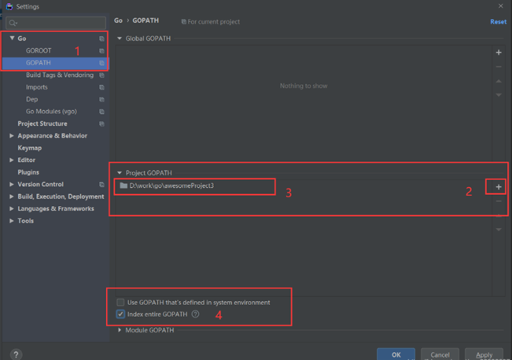
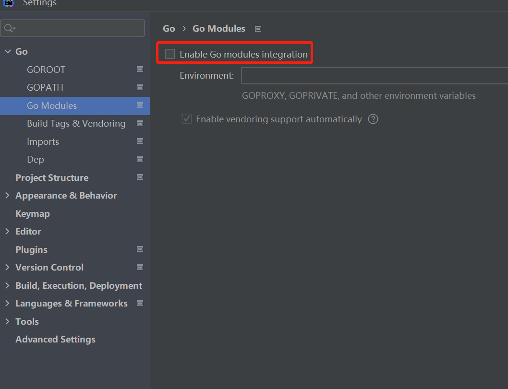
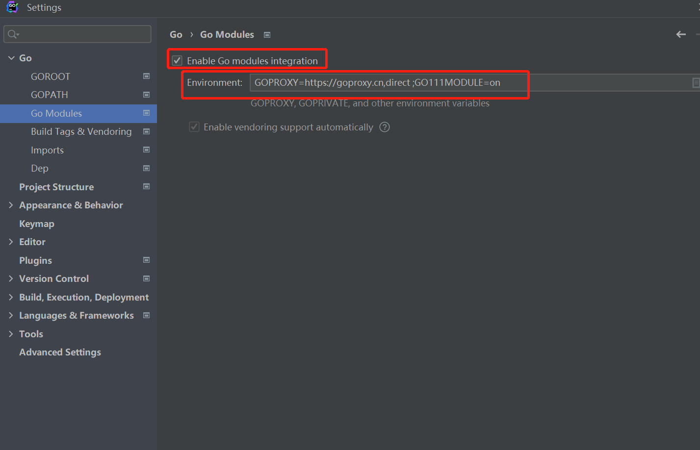
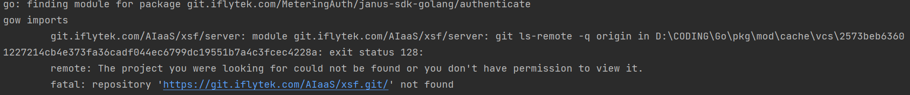

最近公司的一个项目需要从go vendor依赖管理升级到go mod 管理模式，期间也出现过不少问题，借此机会重温学习了go的依赖管理模式，记录升级过程中遇到的部分问题。

本文主要分为以下几个方面阐述：go依赖管理模式、vendor升级Go Module以及常见的问题解决

# go依赖管理模式

对于一个大的项目来说，可能会引用很多的外部依赖包，依赖包可能会有不同的版本，如何对这些依赖管理显得至关重要，类似于java的maven、vue的npm、python的pip等，go也有自己的依赖管理模式。go的依赖管理经历了：GOPATH、vendor&&dep、Go Module等阶段。

目前的主流依赖管理自然是Go Module管理，但是部分公司或者小的项目可能仍然采用GOPATH或者vendor模式，下面对这些模式做具体说明。

## GOPATH模式

GOPATH是go依赖管理的早期模式

> GOPATH
> 
> 1. 在 1.8 版本前必须设置这个环境变量
> 2. 1.8 版本后（含 1.8）如果没有设置，使用默认值
> 
> 在 Unix 上默认为 $HOME/go , 在 Windows 上默认为 %USERPROFILE%/go
> 在 Mac 上 GOPATH 可以通过修改 ～/.bash_profile 来设置

### Workspace 机制

1，**所有go项目（包括依赖包）必须放在工作区中才能执行**，也就是Workspace。工作区其实就是指定一个除了GOROOT之外的Go 代码放置目录，它应包含3个子目录：src目录、pkg目录和bin目录

+ src目录：用来放置以代码包形式组织的代码源文件（比如：.go .c .h .s等），在进行`import`时，是使用这个位置作为根目录的。自己编写的代码也应该放在这下面。

+ pkg目录：用来放置安装包的链接对象 (Object) 的。这个概念有点类似于链接库，Go 会将编译出的可链接库放在这里， 方便编译时链接。不同的系统和处理器架构的对象会在`pkg`存放在不同的文件夹中。**go mod模式下的依赖包也会放在pkg/mod文件夹**

+ bin目录：用来放置编译好的可执行文件，在通过go install命令完成安装后，保存由Go命令源码文件生成的**可执行文件**。

说明：

+ **目录src需要手动创建**，用于包含所有的源代码，是Go命令行工具一个强制的规则，而pkg和bin则无需手动创建，在使用Go命令行工具编译构建过程中会自动创建这些目录；

+ 只有当环境变量GOPATH中只包含一个工作区的目录路径时，go install命令才会把可执行文件到当前工作区的bin目录下。若环境变量GOPATH中包含多个工作区的目录路径，像这样执行go install命令就会失效，此时必须设置环境变量GOBIN。

工作区目录：

```
├── bin
├── pkg
│   └── darwin_amd64
│       └── github.com
│           └── zenazn
│               └── goji
└── src
    ├── code.google.com
    │   └── p
    │       └── go.crypto
    └── github.com
        └── zenazn
            └── goji
```

2，工作区通过`GOPATH`系统环境变量来指定，原则上可以指定多个工作区；

> 当添加多个工作区目录到GOPATH变量时，请注意分隔符，多个目录的时候Windows是分号，Linux系统是冒号，当有多个GOPATH时，默认会将go get的下载依赖放在第一个工作区目录下。

+ `GOPATH`设置方法：
  
  + windows系统中通过属性高级系统设置-->环境变量-->新建系统变量`GOPATH = D:\CODING\Go`(为例)
  
  + 命令行设置环境变量：
    
    ```bash
    # windows
    set GOPATH=D:\CODING\Go  # 临时设置（只对当前bash生效）
    go env -w GOPATH=D:\CODING\Go   # 永久设置
    # linux
      1、在/etc/profile文件中添加变量【对所有用户生效（永久的）】
      例如：编辑/etc/profile文件，添加CLASSPATH变量
    命令：
      vi /etc/profile
      export GOPATH=D:\CODING\Go
    
    注：修改文件后要想马上生效还要运行source /etc/profile不然只能在下次重进此用户时生效。
    
      2、在用户目录下的.bash_profile文件中增加变量【对单一用户生效（永久的）】
      例如：编辑guok用户目录（/home/guok）下的.bash_profile
    命令：
      vi /home/guok/.bash.profile
      export GOPATH=D:\CODING\Go
    
    注：修改文件后要想马上生效还要运行$ source /home/guok/.bash_profile不然只能在下次重进此用户时生效。
    
      3、直接运行export命令定义变量【只对当前shell（BASH）有效（临时的）】
    命令：
      export GOPATH=D:\CODING\Go
    
    注：该变量设置只在当前的shell（BASH）或其子shell（BASH）下是有效的，shell关闭了，变量也就失效了，再打开新shell时就没有这个变量，需要使用的话还需要重新定义。
    ```

+ 实际开发工程中，避免多次修改系统环境变量，系统环境变量`GOPATH` 只设置一个工作区。自己创建的项目代码可以放在`$GOPATH/src`下。也可以放在其他目录下（非工作区），如果放在其他目录，需要在IDE中把该项目根目录设置为工作区，goland中项目工作区的设置如下：



### go get命令

设置好GOPATH工作区之后，对于go项目的依赖包下载安装，需要用到go get命令。

go get 命令可以借助代码管理工具通过远程拉取或更新代码包及其依赖包，并自动完成编译和安装。整个过程就像安装一个 App 一样简单。

说明：

+ go get可以动态获取远程代码包，目前支持的有 BitBucket、GitHub、Google Code 和 Launchpad。在使用 go get 命令前，需要安装与远程包匹配的代码管理工具，如 Git、SVN、HG 等，参数中需要提供一个包名。

+ go get命令在内部实际上分成了两步操作：第一步是下载源码包，第二步是执行 go install（编译、安装）。下载源码包的 go 工具会自动根据不同的域名调用不同的源码工具

+ go get命令下载的依赖包放在`$GOPATH/src`目录下（GOPATH变量第一个工作区）

使用方式：

```bash
# 方式1，默认情况下，go get 可以直接使用，表示下载安装所有依赖包
go get 
# 方式2，go get [options] 远程包，下载安装指定依赖包
go get github.com/davyxu/cellnet
```

附加参数：

- -v  显示操作流程的日志及信息，方便检查错误
- -u 下载丢失的包，但不会更新已经存在的包
- -d 只下载不安装
- -insecure  允许使用不安全的 HTTP 方式进行下载操作
- -t 同时也下载需要为运行测试所需要的包
- -f  仅在使用`-u`标记时才有效。该标记会让命令程序忽略掉对已下载代码包的导入路径的检查。如果下载并安装的代码包所属的项目是你从别人那里Fork过来的，那么这样做就尤为重要了。
- -fix  让命令程序在下载代码包后先执行修正动作，而后再进行编译和安装。

### GOPATH使用设置

1. 在磁盘中创建工作区文件夹，设置GOPATH环境变量；

2. 将个人项目和代码包放到到`$GOPATH/src`目录下，或者在Goland中设置项目所在目录为工作区，如下：


3. 如果使用GOPATH模式管理依赖，则需要禁用Go Modules模式（不勾选**enable go modules integration**），如下：



4. 项目使用到其他的远程依赖包，使用`go get + 远程包`方式下载安装三方依赖包。

5. 最后使用`go build`或者 `go run`编译运行项目代码。

### GOPATH弊端

GOPATH有一些不足，甚至严重的问题：

1. 不能很方便地隔离不同项目的环境——如果需要隔离，需要设置多个GOPATH工作区目录。 可以实现这样的目的的工具有gvp等。
2. 不能很方便地控制某个依赖包的版本——对依赖包更版本更细致的管理，可以配合的工具还有 gpm、godep、gom(Go Manager)
3. 不能管理 Go 本身的版本——一般来说并没有使多个语言版本并存的需求，若遇到非要并存多个版本的时候，gvm就是一个不错的选择

参考资料：

[Go 1.5之前的多种包管理机制简介( (jquerycn.cn)](http://www.jquerycn.cn/a_42398)

## vendor和dep模式

使用 go get 下载依赖的方式简单暴力，伴随了 Go 七年之久，直到 1.6（2016/02/17）才正式支持了 vendor，可以把所有依赖下载到当前项目中，解决可重复构建（reproducible builds）的问题，但是无法管理依赖版本。社区出现了各式各样的包管理工具，来方便开发者固化依赖版本，由于不同管理工具采用不同的元信息格式（比如：godep 的 Godeps.json、Glide 的 glide.yaml），不利于社区发展，所以 Go 官方推出了 dep。

dep 的定位是实验、探索如何管理版本，并不会直接集成到 Go 工具链，Go 核心团队会吸取 dep 使用经验与社区反馈，开发下一代包管理工具 modules，并于 2019/09/03 发布的 1.13 正式支持，并随之发布 Module Mirror, Index, Checksum，用于解决软件分发、中间人攻击等问题。


## Go Module模式

> go module和vendor是两个冲突的设计，二者只能选一，不可混用。
> 
> - vendor依赖的是GOPATH，那么必须设置GOPATH
> 
> - module不使用GOPATH，那么可以不设置GOPATH，成为了一个可选项。

#### GO111MODULE变量

Go modules机制在go 1.11中是experiment feature，按照Go的惯例，在新的experiment feature首次加入时，都会有一个特性开关，go modules也不例外，GO111MODULE这个临时的环境变量就是这个特性开关。

GO111MODULE有三个值：auto、on和off，默认值为auto。影响项目“依赖管理”模式的选择，具体如下：

> + 当GO111MODULE的值为off时，go modules 关闭，go compiler始终使用GOPATH mode， 即即无论要构建的源码目录是否在GOPATH路径下，compiler只会在传统的GOPATH和vendor目录下搜索依赖包；
> 
> + 当GO111MODULE的值为on时，go modules始终开启，go compiler会始终使用go module mode，即无论要构建的源码目录是否在GOPATH路径下，compiler都不会在传统的GOPATH和vendor目录下搜索依赖包，而是在go mod命令的缓存目录($GOPATH/pkg/mod）下搜索对应版本的依赖package；
> 
> + 当GO111MODULE的值为auto时(不显式设置即为auto)，go compiler使用GOPATH mode还是module-aware mode，取决于要构建的源码目录所在位置以及是否包含go.mod文件。
>   
>   + 如果要构建的源码目录不在以GOPATH/src为根的目录体系下，且包含go.mod文件(两个条件缺一不可)，那么使用go module mode；
>   
>   + 否则使用传统的GOPATH mode。

#### 初始化和Module文件

> 官方定义：Module 是多个 package 的集合，版本管理的基本单元

Go Module模式中，在项目根目录下执行命令`go mod init`，项目根目录下会生成两个Module文件（需要加入到 git 中）：

> + 文件 go.mod：包含module名称、go 的版本、该模块的依赖信息（依赖名称），类似 npm 生成的文件 package.json 。
> 
> + 文件 go.sum：记录module的所有依赖包的校验和，确保依赖包没有被篡改。类似 npm 生成的文件 package-lock.json 

go.mod文件 位于项目的根目录。示例文件如下：

```
module github.com/my/repo

replace golang.org/x/crypto v0.0.0-20181127143415-eb0de9b17e85 => github.com/golang/crypto v0.0.0-20181127143415-eb0de9b17e85
require (
    github.com/some/dependency v1.2.3
    github.com/another/dependency/v4 v4.0.0
)
exclude github.com/emicklei/go-restful/v3 v3.0.0
```

go.mod支持 4 条命令编写：`module`、`require`、`replace`、`exclude`

```
module 语句，表示指定包的名字（项目路径），一个 module 内所有 package 的 import path 都以它为前缀
require 语句，表示项目指定的依赖项模块
replace 语句，表示可以替换的依赖项模块，版本信息使用形如 v(major).(minor).(patch) 的语义化版本
exclude 语句，表示可以忽略依赖项模块
```

#### go mod命令

> golang 提供了 `go mod`命令来管理包。

go mod 有以下命令：

| 命令       | 说明                                                      |
| -------- | ------------------------------------------------------- |
| download | download modules to local cache(下载依赖包)                  |
| edit     | edit go.mod from tools or scripts（编辑go.mod）             |
| graph    | print module requirement graph (打印模块依赖图)                |
| init     | initialize new module in current directory（在当前目录初始化mod） |
| tidy     | add missing and remove unused modules(拉取缺少的模块，移除不用的模块)  |
| vendor   | make vendored copy of dependencies(将依赖复制到vendor下)       |
| verify   | verify dependencies have expected content (验证依赖是否正确）    |
| why      | explain why packages or modules are needed(解释为什么需要依赖)   |

使用示例：

```bash
$ go mod tidy # 下载项目所需依赖并整理
```

说明：

+ go.mod文件一旦创建后，它的内容将会被 go toolchain 全面掌控，go toolchain 会在各类命令执行时，比如go get、go build、go mod等修改和维护 go.mod 文件。

+ go module 安装 package 的原则是先拉取最新的 release tag，若无 tag 则拉取最新的 commit，详见 Modules 官方 介绍。——版本选择机制有待研究，暂定为拉取最新版本

+ go mod拉取依赖包的版本选择机制，参考：[【Go mod 学习之版本选择篇】go mod 自动为你的项目选择合适的依赖包版本_go module 版本选择_oceanweave的博客-CSDN博客](https://blog.csdn.net/qq_24433609/article/details/127325267)

在go-mod中指定包的版本号：
在go.mod中，使用replace指定包版本号。
比如将google.golang.org/grpc最新版本替换为指定的v1.26.0，可以在go.mod的最后面，添加如下信息：

```
replace google.golang.org/grpc => google.golang.org/grpc v1.26.0
```

然后，再运行go mod tidy或者go build即可。

#### Go Module使用设置

> 1. 首先将你的版本更新到最新的Go版本(>=1.11)。
> 
> 2. 通过go命令行，进入到你当前的工程目录下，在命令行设置环境变量`GO111MODULE` 、`GOPROXY`、`GOPRIVATE`(根据需要)
> 
> ```
> #方式1：临时设置
> 注意
> # Windows环境用set
> # linux环境用export
> #########Windows#########
> # 开启
> set GO111MODULE=on
> # 1.13 之后才支持多个地址，之前版本只支持一个
> set GOPROXY=https://goproxy.cn,https://mirrors.aliyun.com/goproxy,direct
> # 1.13 开始支持，配置私有module，不去校验 checksum
> set GOPRIVATE=*.corp.example.com,rsc.io/private
> #########Linux#########
> # 开启
> export GO111MODULE=on
> # 1.13 之后才支持多个地址，之前版本只支持一个
> export GOPROXY=https://goproxy.cn,https://mirrors.aliyun.com/goproxy,direct
> # 1.13 开始支持，配置私有 module，不去校验 checksum
> export GOPRIVATE=*.corp.example.com,rsc.io/private
> 
> #方式2：全局设置
> # 设置全局开启 go mod Go1.16版本默认为on，可跳过这一步
> go env -w GO111MODULE=on
> # 设置全局代理地址
> go env -w GOPROXY=https://goproxy.cn,https://mirrors.aliyun.com/goproxy,direct
> # 一次设置
> go env -w GO111MODULE=on && go env -w GOPROXY=https://goproxy.cn,direct
> ```
> 
> 3. 配置Goland，配置设置见下方；
> 
> 4. 在当前目录下执行命令go mod init生成一个go.mod文件，执行这条命令时，当前目录不能存在go.mod文件。如果之前生成过，要先删除；
> 
> 5. 如果你工程中存在一些不能确定版本的包，那么生成的go.mod文件可能就不完整，因此继续执行下面的命令；
> 
> 6. 执行go mod tidy命令，它会添加缺失的模块以及移除不需要的模块。执行后会生成go.sum文件(模块下载条目)。添加参数-v，例如go mod tidy -v可以将执行的信息，即删除和添加的包打印到命令行；
> 
> 7. 执行命令go mod verify来检查当前模块的依赖是否全部下载下来，是否下载下来被修改过。如果所有的模块都没有被修改过，那么执行这条命令之后，会打印all modules verified。
> 
> 8. 执行命令go mod vendor生成vendor文件夹，该文件夹下将会放置你go.mod文件描述的依赖包，文件夹下同时还有一个文件modules.txt，它是你整个工程的所有模块。在执行这条命令之前，如果你工程之前有vendor目录，应该先进行删除。同理go mod vendor -v会将添加到vendor中的模块打印出来；

配置Goland，主要设置如下：

1，Preferences -> Go -> Go Modules ，勾选**enable go modules integration**，设置环境变量environment。



2，Preferences -> Go -> GOPATH，勾选上 Index entire GOPATH 以索引整个 GOPATH，不然无法导入包。如图所示：


常见`GOPROXY`代理地址

> [https://goproxy.cn](https://goproxy.cn) //七牛云赞助支持的开源代理
> 
> [https://goproxy.io](https://goproxy.io) //也是一个开源的go代理
> 
> https://mirrors.aliyun.com/goproxy //阿里云官方维护的go代理

#### go module依赖包下载位置

> 存储下载的依赖包,具体位置在$GOPATH/pkg/mod

在 Go 1.8 版本之前，GOPATH 环境变量默认是空的。从 Go 1.8 版本开始，Go 开发包在安装完成后，将 GOPATH 赋予了一个默认的目录，参见下表。

GOPATH 在不同平台上的安装路径

| 平 台        | GOPATH 默认值       | 举 例             |
| ---------- | ---------------- | --------------- |
| Windows 平台 | %USERPROFILE%/go | C:\Users\用户名\go |
| Unix 平台    | $HOME/go         | /home/用户名/go    |

# vendor升级Go Module

### 升级步骤：

> 1. 首先在原有项目里直接删除 vendor 这个文件夹
> 
> 2. go mod init 生成go.mod文件
> 
> 3. go mod tidy 更新项目依赖文件，等待依赖下载完毕，自动生成go.sum文件
> 
> 4. 运行main.go启动项目会查看运行是否异常

以上步骤中，对于一些较大的项目会有较多的依赖，因此步骤3更新依赖、步骤4启动项目可能会产生一些问题

### 常见问题解决

#### 依赖包下载失败

1. 公司依赖包没有权限下载



go mod tidy和go get命令的底层都是使用相关代码管理工具拉取远程依赖包，如 Git、SVN、HG。对于公司级别的项目可能依赖很多公司内部的依赖包，作为新人可能对于这些依赖包没有相关git读取权限，因此导致下载依赖失败

解决方法：

+ 配置git用户名和邮箱，开通该依赖包的git读取权限——至少是reporter权限

+ 替换成其他有权限的依赖包
2. github依赖包连接失败

这种情况比较常见，由于国内github时不时被墙的原因，github有时候连接不上

解决方法：

+ 更换相关github代理ip地址

+ 多试几次，或者换个时间再试试

#### 依赖包下载版本不对

1. 依赖包版本下载的过新，或者需要指定特定版本的依赖

解决方法：

+ go.mod文件中替换成指定版本依赖：
  
  ```
  
  ```

+ 使用go get下载特定版本依赖
2. 依赖包地址更改，如git.apache.org/thrift合并到github中：github.com/apache/thrift

3. 一些启动运行时异常，可能也是依赖包版本过新导致，如

如果出现报错：

google.golang.org/grpc/naming: looping trying to add package

是因为grpc版本不一样，自动引入的是40版本

google.golang.org/grpc v1.40.0 // indirect

我们需要修改为： google.golang.org/grpc v1.37.0 

然后替换掉：

```
replace google.golang.org/grpc v1.37.0 => google.golang.org/grpc v1.26.0
require (<br>   github.com/chanxuehong/internal v0.0.0-20180430074813-85d6017afbc4 // indirect<br>   github.com/chanxuehong/rand v0.0.0-20201110082127-2f19a1bdd973 // indirect<br>   github.com/chanxuehong/uuid v0.0.0-20180430073920-75ab5e2d8298 // indirect<br>   github.com/coreos/etcd v3.3.25+incompatible // indirect<br>   github.com/coreos/go-semver v0.3.0 // indirect<br>   github.com/coreos/pkg v0.0.0-20180928190104-399ea9e2e55f // indirect<br>   github.com/garyburd/redigo v1.6.2 // indirect<br>   github.com/go-sql-driver/mysql v1.6.0 // indirect<br>   github.com/gogo/protobuf v1.3.2 // indirect<br>   github.com/goinggo/mapstructure v0.0.0-20140717182941-194205d9b4a9 // indirect<br>   github.com/golang/protobuf v1.5.2 // indirect<br>   github.com/google/uuid v1.3.0 // indirect<br>   github.com/honsty/cryptos v0.0.0-20180710074443-22ca856b9265 // indirect<br>   github.com/jinzhu/gorm v1.9.16 // indirect<br>   github.com/jtolds/gls v4.20.0+incompatible // indirect<br>   github.com/labstack/echo v3.3.10+incompatible // indirect<br>   github.com/labstack/gommon v0.3.0 // indirect<br>   go.uber.org/automaxprocs v1.4.0 // indirect<br>   go.uber.org/zap v1.19.1 // indirect<br>   golang.org/x/net v0.0.0-20210924054057-cf34111cab4d // indirect<br>   google.golang.org/grpc v1.37.0 // indirect<br>)
```

-----

# 参考资料

[Go：包管理工具GOPATH、vendor、dep 、go module-阿里云开发者社区 (aliyun.com)](https://developer.aliyun.com/article/790259)

[Go 1.5之前的多种包管理机制简介( (jquerycn.cn)](http://www.jquerycn.cn/a_42398)

[go get命令——一键获取代码、编译并安装 (biancheng.net)](http://c.biancheng.net/view/123.html)

[go vendor 项目迁移到 mod 项目-pudn.com](https://www.pudn.com/news/62ef81a1864d5c73ac67a1e0.html)

<p style="text-align:right">Lastest Updated: {docsify-updated}</p>