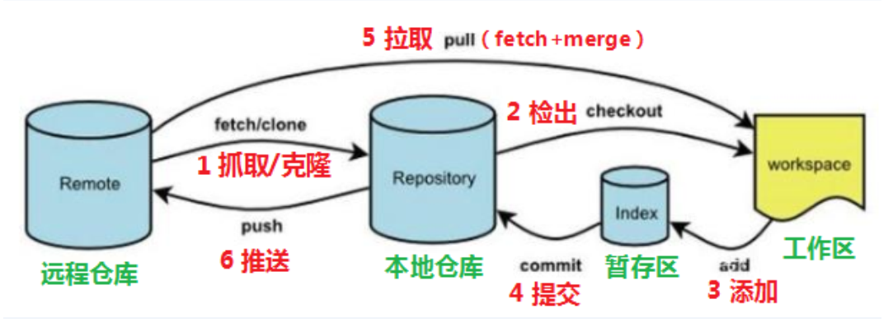
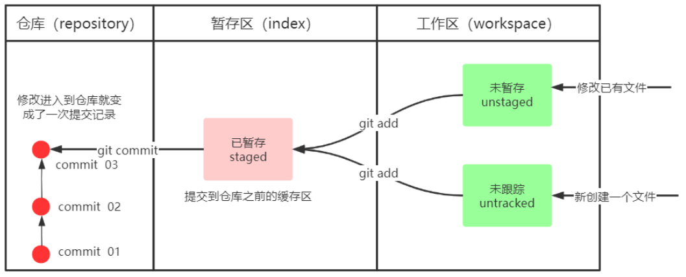
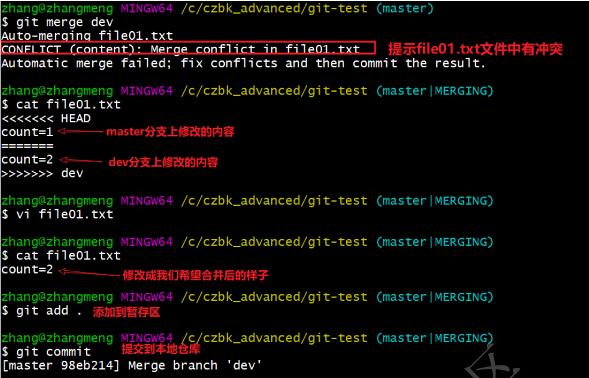
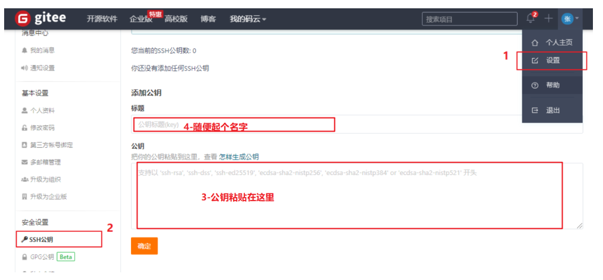
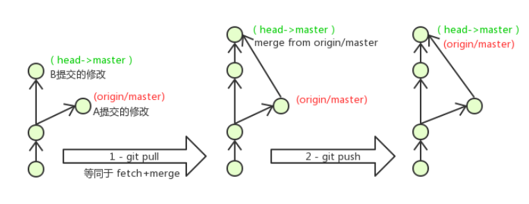

# git命令笔记

前言：git对于软件开发和协作的重要性不言而喻，在企业开发中，git命令和linux命令的使用同样重要。作为开发者，需要牢记并熟练使用常见的git命令

## git工作流程图



命令如下：  

1. clone（克隆）: 从远程仓库中克隆代码到本地仓库
2. checkout （检出）:从本地仓库中检出一个仓库分支然后进行修订  
3. add（添加）: 在提交前先将代码提交到暂存区  
4. commit（提交）: 提交到本地仓库。本地仓库中保存修改的各个历史版本  
5. fetch (抓取) ： 从远程库，抓取到本地仓库，不进行任何的合并动作，一般操作比较少。  
6. pull (拉取) ： 从远程库拉到本地库，自动进行合并(merge)，然后放到到工作区，相当于fetch+merge  
7. push（推送） : 修改完成后，需要和团队成员共享代码时，将代码推送到远程仓库

## git环境配置

1.git下载地址：https://git-scm.com/download

2.配置用户名和邮箱：

```bash
# 设置用户信息
git config --global user.name “itcast”
git config --global user.email “hello@itcast.cn”
# 查看配置信息
git config --global user.name
git config --global user.email
# 查看指令参数和说明(在指令后加上-help参数)，命令帮助
git remote -help
git commit -help
```

3.为常用指令配置别名（可选） 
有些常用的指令参数非常多，每次都要输入好多参数，我们可以使用别名。  

1. 打开用户目录，创建 .bashrc 文件 
   部分windows系统不允许用户创建点号开头的文件，可以打开gitBash,执行 touch ~/.bashrc

2. 在 .bashrc 文件中输入如下内容：
   
   ```
   #用于输出git提交日志，以精简的方式显示提交记录
   alias git-log='git log --pretty=oneline --all --graph --abbrev-commit'
   #用于输出当前目录所有文件及基本信息
   alias ll='ls -al'
   ```

3. 打开gitBash，执行 source ~/.bashrc

4.解决GitBash乱码问题

```bash
# 1. 打开GitBash执行下面命令
git config --global core.quotepath false
# 2. ${git_home}/etc/bash.bashrc 文件最后加入下面两行
export LANG="zh_CN.UTF-8"
export LC_ALL="zh_CN.UTF-8"
```

5.创建本地仓库——git init
要使用Git对我们的代码进行版本控制，首先需要创建本地仓库

1）在电脑的任意位置创建一个空目录（例如test）作为我们的本地Git仓库

2）进入这个目录中，点击右键打开Git bash窗口

3）执行命令git init

4）如果创建成功后可在文件夹下看到隐藏的.git目录

## 本地基础操作指令

本地中主要涉及工作区、暂存区、仓库。Git工作目录下对于文件的修改(增加、删除、更新)会存在几个状态，这些修改的状态会随着我们执行Git的命令而发生变化。



本章节主要讲解如何使用命令来控制这些状态之间的转换：

1. git add (工作区 --> 暂存区)  
2. git commit (暂存区 --> 本地仓库)

常见指令：

```bash
*查看修改的状态（status）
作用：查看的修改的状态（暂存区、工作区）：哪些是未暂存、未跟踪、已暂存文件？
命令形式：git status

*添加工作区到暂存区(add)
作用：添加工作区一个或多个文件的修改到暂存区
命令形式：git add 单个文件名|通配符
将所有修改加入暂存区：git add .


提交暂存区到本地仓库(commit)
作用：提交暂存区内容到本地仓库的当前分支
命令形式：git commit -m '注释内容'


*查看提交日志(log)
在配置的别名 git-log 就包含了这些参数，所以后续可以直接使用指令 git-log
作用:查看提交记录
命令形式：git log [option]
options
--all 显示所有分支
--pretty=oneline 将提交信息显示为一行
--abbrev-commit 使得输出的commitId更简短
--graph 以图的形式显示

退出git log日志：
跟vim退出方式一致，输出冒号 : + q


版本回退
作用：版本切换
命令形式：git reset --hard commitID
    commitID 可以使用 git-log 或 git log 指令查看
如何查看已经删除的记录？
    git reflog
    这个指令可以看到已经删除的提交记录
```

## 分支指令

```
查看本地分支
命令：git branch

基于当前分支创建新分支
命令：git branch 分支名   // 基于当前分支创建新分支


切换分支
命令：git checkout 分支名

我们还可以直接切换到一个不存在的分支（创建并切换）
命令：git checkout -b 分支名

合并分支(merge)
一个分支上的提交可以合并到另一个分支
命令：git merge 分支名称   // 将该分支合并到当前分支上


删除分支
不能删除当前分支，只能删除其他分支
git branch -d b1 删除分支时，需要做各种检查
git branch -D b1 不做任何检查，强制删除
```

## 解决冲突

当两个分支上对文件的修改可能会存在冲突，例如同时修改了同一个文件的同一行，这时就需要手动解决冲突，解决冲突步骤如下：  

1. 处理文件中冲突的地方  
2. 将解决完冲突的文件加入暂存区(add)  
3. 提交到仓库(commit) 
   冲突部分的内容处理如下所示：



## 远程仓库指令

1.注册远程仓库托管中心--github、gitlab、gitee（为例），然后创建远程仓库

2.配置ssh公钥

+ 生成SSH公钥—— ssh-keygen -t rsa 
  不断回车，如果公钥已经存在，则自动覆盖

+ Gitee设置账户ssh公钥 
  
  + 获取公钥—— cat ~/.ssh/id_rsa.pub
  
  + 设置gitee中公钥
  
  
  
  + 验证是否配置成功—— ssh -T git@gitee.com

操作远程仓库命令：

```bash
添加远程仓库
命令：git remote add <远端名称> <仓库路径>
远端名称，默认是origin，取决于远端服务器设置
仓库路径，从远端服务器获取此URL（可以使用https或者ssh地址新建，不过推荐ssh新建）
例如: git remote add origin git@gitee.com:czbk_zhang_meng/git_test.git


查看远程仓库
命令：git remote
git remote -v   // 查看远程仓库详情

删除远程仓库关联
git remote remove origin

推送到远程仓库
命令：git push [-f] [--set-upstream] [远端名称] [本地分支名][:远端分支名]
    如果远程分支名和本地分支名称相同，则可以只写本地分支
        git push origin master
    -f 表示强制覆盖
    --set-upstream 推送到远端的同时并且建立起和远端分支的关联关系，也可以用-u代替(第一次推送时需要加上)
        git push --set-upstream origin master
        git push -u origin master
    如果当前分支已经和远端分支关联，则可以省略分支名和远端名。
        git push  # 将master分支推送到已关联的远端分支


查看本地分支与远程分支的关联关系
命令：git branch -vv


从远程仓库克隆
如果已经有一个远端仓库，我们可以直接clone到本地。
命令: git clone <仓库路径> [本地目录]
    本地目录可以省略，会自动生成一个同名的目录


从远程仓库中抓取和拉取
远程分支和本地的分支一样，我们可以进行merge操作，只是需要先把远端仓库里的更新都下载到本
地，再进行操作。
抓取命令：git fetch [remote name] [branch name]
    抓取指令就是将仓库里的更新都抓取到本地库，但是工作区文件没有更新（不会进行合并）
    如果不指定远端名称和分支名，则抓取所有分支。

拉取命令：git pull [remote name] [branch name]
拉取指令就是将远端仓库的修改拉到本地并自动进行合并，等同于fetch+merge
如果不指定远端名称和分支名，则抓取所有并更新当前分支。
```

解决远程仓库合并冲突
在一段时间，A、B用户修改了同一个文件，且修改了同一行位置的代码，此时会发生合并冲突。A用户在本地修改代码后优先推送到远程仓库，此时B用户在本地修订代码，提交到本地仓库后，也需要推送到远程仓库，此时B用户晚于A用户，故需要先拉取远程仓库的提交，经过合并后才能推送到远端分支,如下图所示。



在B用户拉取代码时，因为A、B用户同一段时间修改了同一个文件的相同位置代码，故会发生合并冲突。 远程分支也是分支，所以合并时冲突的解决方式也和解决本地分支冲突相同。

## 其他指令

### 基于远程分支创建新分支

```bash
方案1
注意：该方式使用前提是，之前已经添加过远程仓库，并且执行过对该仓库的 pull 或者 fetch 操作
直接执行 checkout 命令，检出远程分支
核心命令：
# 直接检出
git checkout -b 新的分支名 远程仓库别名/远程仓库分支名  
# 推送时需要绑定新关系，不然会提交到基于远程的那个分支上！！！
git push --set-upstream origin 新创建的本地分支

方案2
注意：该方案不区分远程仓库是新增还是已有，也不区分本地是否执行过对远程仓库的 pull 或者 fetch 操作
核心命令：
# 抓取远程仓库的远程分支，并在本地创建新的本地分支保存远端分支的所有数据
git fetch 远程仓库别名 远程分支名:本地新分支名
# 切换新分支
git checkout 本地新分支名

方案3
注意：该方案不区分远程仓库是新增还是已有，也不区分本地是否执行过对远程仓库的 pull 或者 fetch 操作
核心命令：
git fetch 远程仓库别名 远程分支名
git checkout -b 本地新分支名 远程仓库别名/远程分支名
```

------

## 开发中分支使用原则与流程

几乎所有的版本控制系统都以某种形式支持分支。 使用分支意味着你可以把你的工作从开发主线上分离开来进行重大的Bug修改、开发新的功能，以免影响开发主线。 
在开发中，一般有如下分支使用原则与流程：

- master （生产） 分支 
  线上分支，主分支，中小规模项目作为线上运行的应用对应的分支；

- develop（开发）分支 
  是从master创建的分支，一般作为开发部门的主要开发分支，如果没有其他并行开发不同期上线要求，都可以在此版本进行开发，阶段开发完成后，需要是合并到master分支,准备上线。

- feature/xxxx分支 
  从develop创建的分支，一般是同期并行开发，但不同期上线时创建的分支，分支上的研发任务完成后合并到develop分支。

- hotfix/xxxx分支， 
  从master派生的分支，一般作为线上bug修复使用，修复完成后需要合并到master、test、 develop分支。 
  还有一些其他分支，在此不再详述，例如test分支（用于代码测试）、pre分支（预上线分支）等等。

## 忽略列表--.gitignore文件

一般我们总会有些文件无需纳入Git 的管理，也不希望它们总出现在未跟踪文件列表。 通常都是些自动生成的文件，比如日志文件，或者编译过程中创建的临时文件等。 在这种情况下，我们可以在工作目录中创建一个名为 .gitignore 的文件（文件名称固定），列出要忽略的文件模式。下面是一个示例：

```
# no .a files
*.a
# but do track lib.a, even though you're ignoring .a files above
!lib.a
# only ignore the TODO file in the current directory, not subdir/TODO
/TODO
# ignore all files in the build/ directory
build/
# ignore doc/notes.txt, but not doc/server/arch.txt
doc/*.txt
# ignore all .pdf files in the doc/ directory
doc/**/*.pdf
```

## Idea中使用git

参考资料：

[黑马程序员--Git详细教程笔记（使用命令）（从安装到入土）_JAVA成神的博客-CSDN博客](https://blog.csdn.net/qq_58168493/article/details/122592304)

----------

<p style="text-align:right">Lastest Updated: {docsify-updated}</p>
