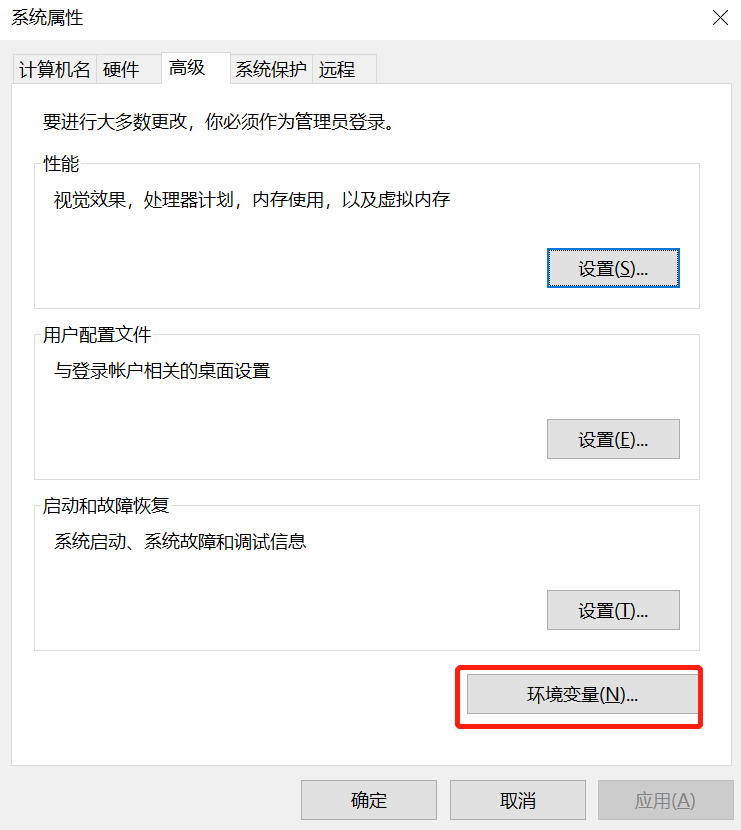
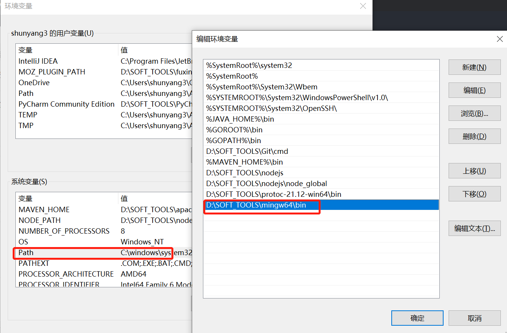

## 解决软件安装和使用过程中的一切问题

#### 相关软件：

开发ide：idea、goland、pycharm等，根据需要安装；

语言安装包：golang安装包、jdk安装包 + 配置环境、MinGW-w64下载与安装

开发工具：git、maven、mysql安装、navicat/workbench/sqlyang、rdm(redis desktop manager)、sourcetree

前端工具：Hbuilder、nodejs

接口测试工具：postman/apipost、jmeter

终端工具：xshell/xftp/tabby/putty/filezilla、mobaXterm、SecureCRT、iterm(mac)、powershell/cmd

抓包工具：wireshark、charles

办公软件：微软office、wpsoffice、pdf阅读器

画图软件：xmind/mindmaster、drawio、flowchart designer、processon(在线)、visio
笔记软件：有道云笔记、映像笔记

压缩软件：7zip

编辑器：vscode（可以用作纯编辑器）、typora/marktext、Sublime Text、editplus/notepad++

浏览器：edge、chrome；

其他：百度网盘

#### 相关教程：

golang安装配置、jdk安装配置、git安装配置、maven安装配置、mysql安装配置、nodejs安装配置
安装和破解：navicat安装破解、xshell安装破解、xmind安装破解、typora安装破解

## MinGW-w64的下载与安装

MinGW-w64是Windows系统的C/C++编译器

方法：下载离线的安装文件，然后手动添加环境变量

步骤：

1、去官网，找到下载页面，进入源的链接

官网链接：[Downloads - MinGW-w64](https://www.mingw-w64.org/downloads/)

2、拉到下面，下载对应版本的离线文件并解压

下面黄色框为安装包下载，笔者用这个下载失败了，因此不推荐；

红色框内就是就是本文介绍的离线下载，当然可以选择不同的GCC版本；

系统架构：x86表示64位，i686表示32位
操作系统接口协议：win32表示windows，posix表示其他
异常处理模型（64位）：seh性能较好，不支持32位；sjlj 稳定性好，支持 32位
异常处理模型（32位）：dwarf 的性能要优于 sjlj ，但不支持 64位 

选择x86_64-win32_seh文件下载，下载完成后解压为文件夹

 3、手动添加环境变量

解压完下载的文件后，在 此电脑（右键） -> 属性 -> 高级系统设置 -> 环境变量 中添加环境变量

在全局变量Path中，添加安装文件中的bin目录的路径，然后一路点击确定

4、检测是否安装成功

进入cmd命令行页面，输入 gcc -v，显示如下信息即安装成功

参考资料：

[MinGW-w64的下载与安装_mingw64下载_dongbidsaxue的博客-CSDN博客](https://blog.csdn.net/dongbidsaxue/article/details/126855476)

[MinGW-w64安装教程 - 简书 (jianshu.com)](https://www.jianshu.com/p/d66c2f2e3537?u_atoken=6f5a05c8-4157-46b2-9436-ed0464604725&u_asession=01VcZA8YDp4TXlia_Oougd_B78ae1H9cllQkuaaamaoe0AU2K0CvZCUCAmUM-FgRFNX0KNBwm7Lovlpxjd_P_q4JsKWYrT3W_NKPr8w6oU7K-YSzOKmZfeKypQDzwsqMCAAJD9xkkjypouMKwP8bE0AWBkFo3NEHBv0PZUm6pbxQU&u_asig=05_XdN3PuBKh5kzXoHuxuBP_HYaI2jn3L1zdValioYKdJKJavMkwaDq1ypEWsjEluusRWrDPTLQqXgrwZSzj3PItUbe8OXJ-4bNaG8N7Cu6Pf78DmpAFsMWL3xkxiGKMusbga_pVoiC4CelL5gmaDzFYEgtlx7H1NlWAUui7hSN_z9JS7q8ZD7Xtz2Ly-b0kmuyAKRFSVJkkdwVUnyHAIJzWQhwajQUz4nHkwJYizmEd_HkTLKsrLA7TEySvilBbIYxLcQCv2QbD8lw_Tf46jchO3h9VXwMyh6PgyDIVSG1W89d8NeQABIjMJFNO1jOP_ez7pGRP4Z_48YKFbopS17xkziM73lBHR5azq2WzsrSoK6znfV3VqHdp8RXJoGR-rxmWspDxyAEEo4kbsryBKb9Q&u_aref=z5xoXghix9XxzLJiCQe5stV%2F9VY%3D)